# Dropbox System Design

This set of projects is based on the helloInterview design question.
The goal is to implement different stages of a system design to understand the trade-offs and benefits of each approach.

## What’s implemented (where)

This repo is split into modules that correspond to the stages below:

- Stage 1: [simplestVersion](simplestVersion/) (naive server-proxied upload)
- Stage 2: [directS3](directS3/) (presigned direct-to-S3 upload + SNS/SQS notifications)
- Stage 3: [chunkS3](chunkS3/) (client-side chunking + content-addressed chunks + retryable completion)
- Stage 4: [rollingChunks](rollingChunks/) (rolling/content-defined chunking + durable DB change feed + SNS/SQS notify example)

Reference implementation (not a “stage”):

- Option A: [multipartUpload](multipartUpload/) (direct multipart upload: browser -> S3 via presigned UploadPart URLs)

## Option A vs Option B (when to use which)

This repo shows two common approaches for uploading/syncing large files:

- **Option A — Direct multipart upload (browser -> S3)**
    - Best when you just need to upload/download large blobs efficiently.
    - Server coordinates `CreateMultipartUpload` / `CompleteMultipartUpload`, client uploads parts via presigned URLs.
    - Production needs: part size constraints (S3: >= 5 MiB except last), retry logic, and cleanup of abandoned uploads.
- **Option B — Chunk-store + manifest (dedup + sync-friendly)**
    - Best when you care about deduplication, resumability, and “small edit -> small upload” behavior.
    - Client sends a manifest of content-addressed chunks; server returns presigned URLs for missing chunks only.
    - Storing chunks as separate S3 objects avoids multipart part-size constraints, but introduces more objects/metadata.

In this repo:

- Option A is demonstrated in [multipartUpload](multipartUpload/).
- Option B is Stage 3 ([chunkS3](chunkS3/)) and Stage 4 ([rollingChunks](rollingChunks/)).
## functional requirements
1. can store file
2. can retrieve files
3. other users can retrieve files (getting permission to access files is Out Of Scope)
4. can sync with changes done on local version
5. can sync with changes done by others
    - currently having multiple devices per user is Out Of Scope

## Nonfunctional Requirements
1. availability >> consistency (we do not care if it takes a few seconds to get an update, but we do not want an error getting something)
2. reasonable download/upload times (size dependant)
3. continue load if load gets stopped in the middle
4. big files

## Simulation Requirements
1. **LocalStack**: Used to simulate AWS Services (S3, etc.).
2. **AOP Delays**: Artificial delays introduced via AOP to simulate network load/processing time, allowing us to observe the impact of architectural decisions.

---

## Stage 1: Simplest Version (Naive Approach)

In this version, the client uploads the file directly to the application server. The server then uploads it to S3 and saves the metadata in the database.

### Design

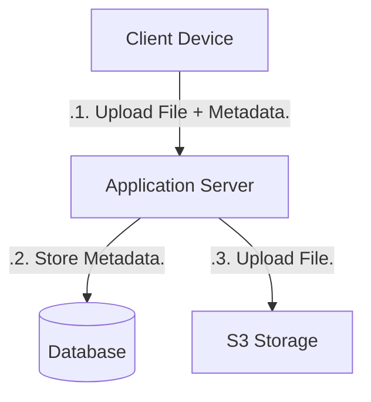

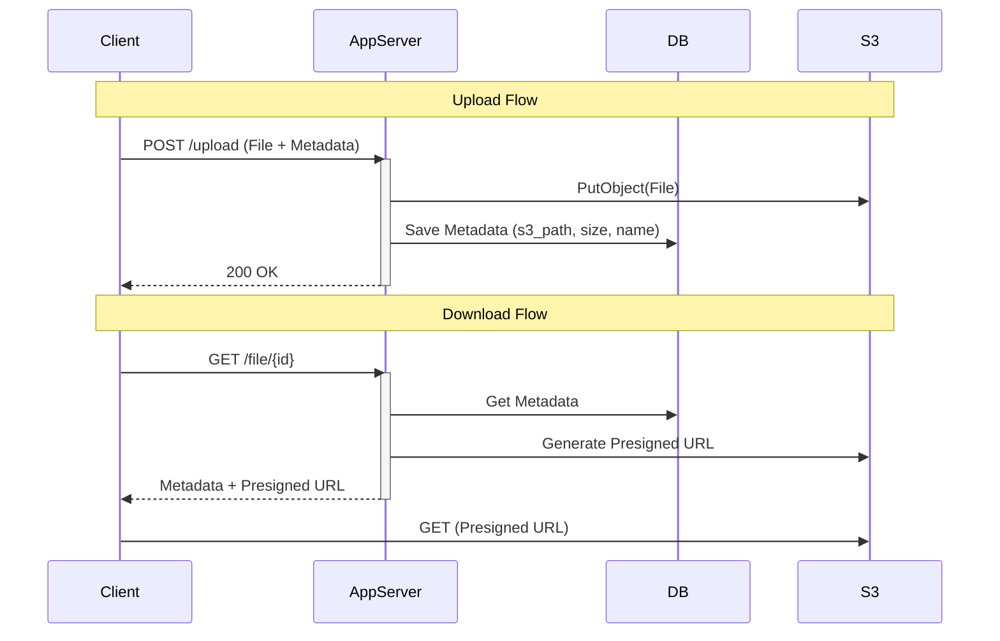

### Problems
1.  **Double Bandwidth**: The file travels `Client -> Server` and then `Server -> S3`. This doubles the network IO on the server.
2.  **Blocking**: Large files block the application server threads/resources while being uploaded to S3.
3.  **Gateway Limits**: API Gateways often have strict payload size limits, preventing large file uploads.

---

## Stage 2: Direct S3 Upload (Presigned URLs)

To solve the double bandwidth and blocking issues, the client uploads files directly to S3 using a presigned URL.

### Design

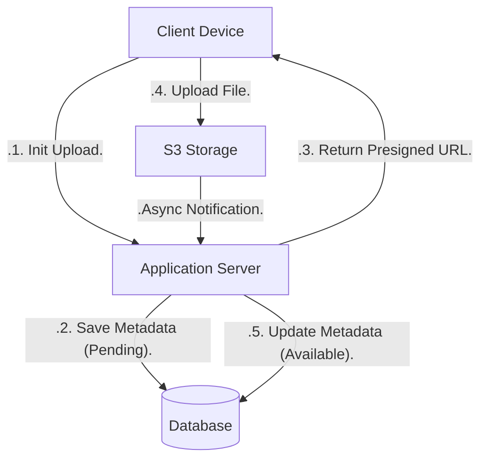

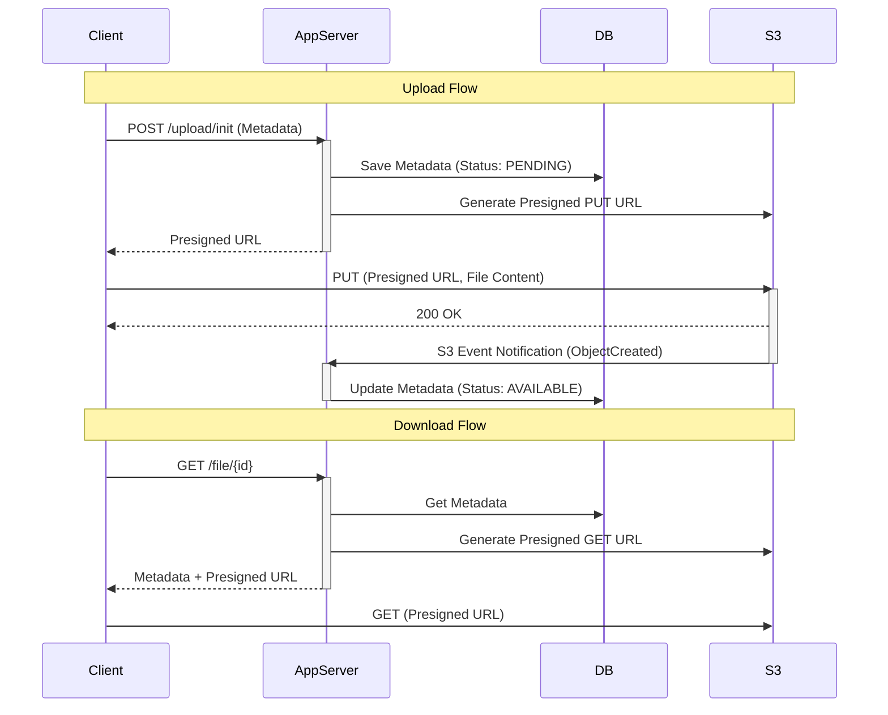

### Solves
*   **Bandwidth**: Server only handles small metadata requests. Heavy lifting is done by S3.
*   **Scalability**: Server can handle many more concurrent users since it's not tied up with streaming bytes.

### Issues
*   **Complexity**: Requires handling async notifications from S3.
*   **Consistency**: What if the upload fails? The DB might have a stale "PENDING" record.

### Recommended Notification Flow (Production)

To make the notification path durable and production-ready we recommend S3 -> SNS -> SQS -> Consumer. This keeps a reliable queue for consumers and allows fan-out via SNS if multiple subscribers are needed.

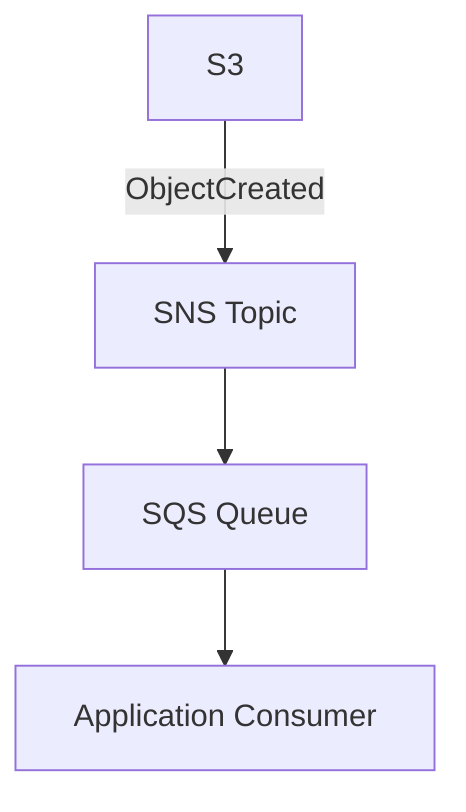

Sequence (S3 -> SNS -> SQS):

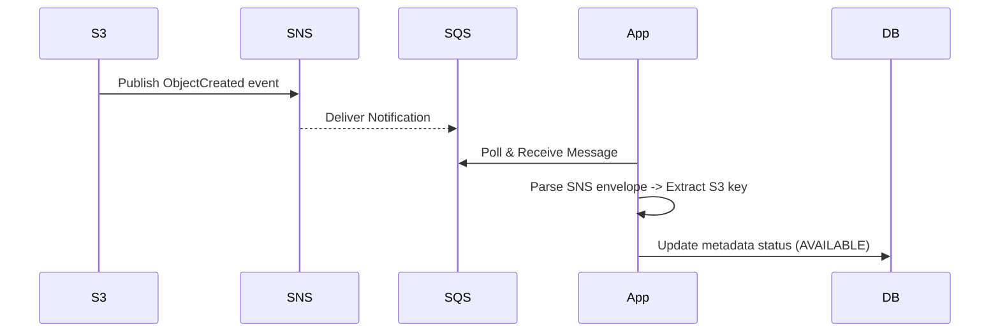

Notification payloads:

 - Direct S3 event (inside `Message` for SNS envelope or as Records for direct SQS):

```json
{
    "Records":[
        {
            "eventVersion":"2.1",
            "eventSource":"aws:s3",
            "awsRegion":"us-east-1",
            "eventName":"ObjectCreated:Put",
            "s3":{
                "bucket":{"name":"test-bucket"},
                "object":{"key":"09ba5a75-c02d-4d57-b020-1d2016ce1d16"}
            }
        }
    ]
}
```

 - SNS envelope (what SQS receives when subscribed to SNS):

```json
{
    "Type":"Notification",
    "MessageId":"...",
    "TopicArn":"arn:aws:sns:...",
    "Message":"{ \"Records\":[ { \"s3\":{ \"object\":{ \"key\":\"...\" } } } ] }"
}
```

You can inspect messages in LocalStack using the AWS CLI with the `--endpoint-url` flag, for example:

```bash
aws --endpoint-url=http://localhost:4566 sns list-topics
aws --endpoint-url=http://localhost:4566 sqs list-queues
aws --endpoint-url=http://localhost:4566 sqs receive-message --queue-url http://localhost:4566/000000000000/your-queue
```

---

## Stage 3: Chunking & Fingerprinting

For large files and sync efficiency, we split files into chunks and hash each chunk so we can detect duplicates.

What’s implemented in [chunkS3](chunkS3/):

*   Text files: normalize CRLF → LF and chunk **by line** (`TEXT_LINES_NORMALIZED_LF`) so editing one line only re-uploads one “chunk”.
    - This is intentionally **not** standard Dropbox-style CDC; it’s a simple educational strategy.
*   Non-text/binary: split into **fixed 256 KiB** chunks (`FIXED_256_KIB`).
*   Rolling / content-defined chunking is covered in Stage 4.

### Design

*   Chunking and reassembly are **client-side**.
*   Client calculates a SHA-256 hash for each chunk.
*   Server stores **metadata only** (the "Recipe" / manifest: ordered list of (hash, length)).
*   Chunks are stored in S3 as **content-addressed objects**: `chunks/sha256/<hash>`.
*   Client calls `POST /api/files/init` with the manifest; server returns presigned PUT URLs for **missing** chunks.
*   Client uploads only missing chunks directly to S3.
*   Client calls `POST /api/files/{fileId}/versions/{versionId}/complete` to finalize.
    - If any expected chunks are still missing, the server returns `409` with presigned URLs for the missing chunk hashes.
*   Status flow: `PENDING` (new) / `UPDATING` (new version) → `AVAILABLE` when all expected chunk events are observed.

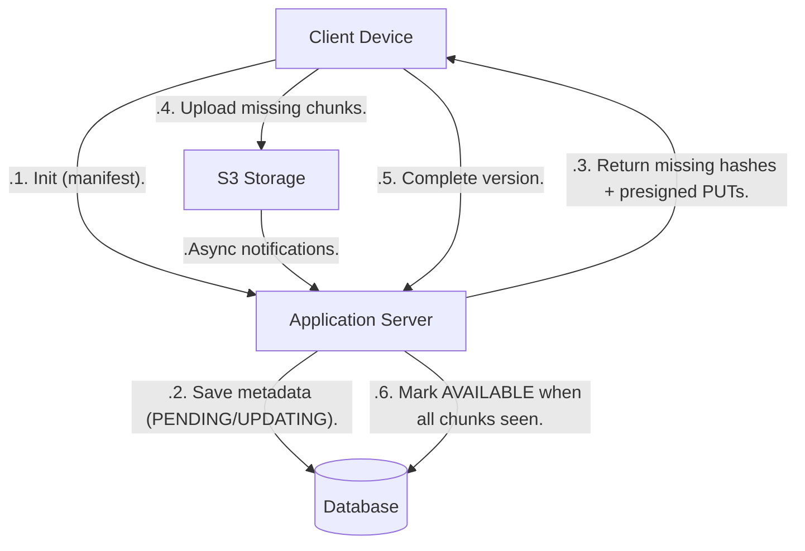

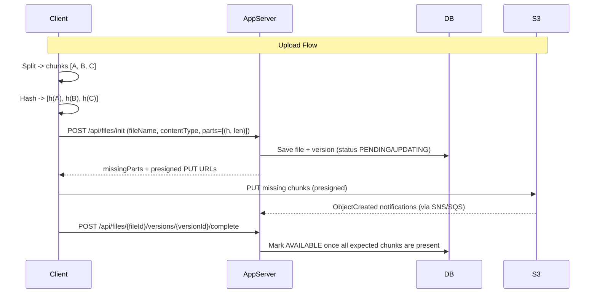

### Solves
*   **Network Efficiency**: Only changes (deltas) are transferred.
*   **Deduplication**: Identical chunks (across files/users) are stored only once.

### Notes
*   **AWS Constraints**: S3 Multipart upload has a 5MB minimum part size (except the last one). This stage stores each chunk as its own S3 object (not multipart-upload parts), so the multipart constraint doesn’t apply.

### Download Flow
1.  Client requests file.
2.  Server retrieves "Recipe" (list of chunks) from DB.
3.  Server generates presigned URLs for each chunk (or checks if client already has them in a local cache - Out of Scope for now).
4.  Client downloads chunks in parallel and reassembles the file.

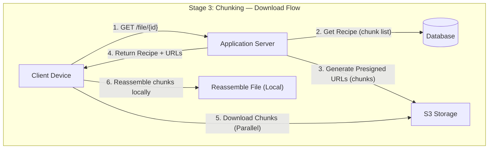

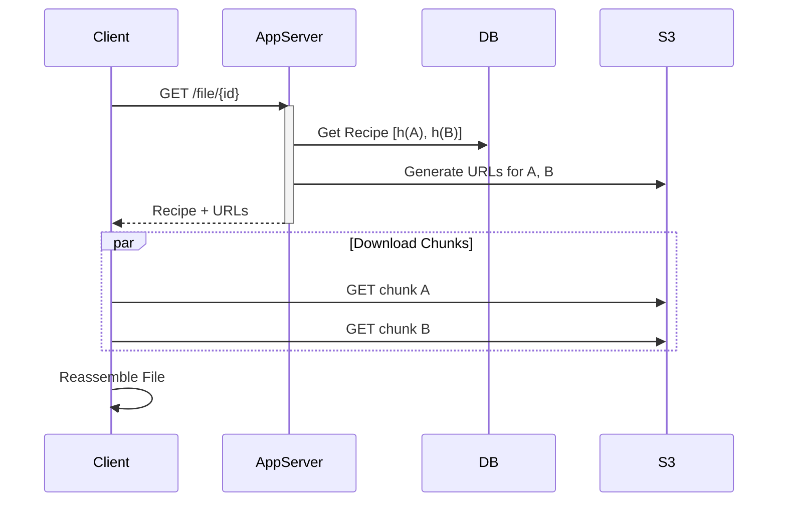

---

## Stage 4: Notification Service (Async Updates)

Implemented in [rollingChunks](rollingChunks/).

Stage 4 adds two ideas:

1) **Rolling/content-defined chunking (CDC)** for text so inserts don’t shift every subsequent chunk.
2) A **durable change feed** in the DB with a **per-device cursor** (“last seen event”), so devices can catch up after being offline.

SNS/SQS is still shown, but only as an **online notification hint**. The DB remains the source-of-truth.

### Durable change feed (source of truth)

- DB tables:
    - `change_event` (append-only ordered feed)
    - `device_checkpoint` (per-device last seen event id)
- API:
    - `GET /api/changes?deviceId=...` (read changes since last seen)
    - `POST /api/changes/ack` (advance last seen)

### SNS/SQS online notify (example)

On “version became AVAILABLE”:

- Persist a `change_event` (durable)
- Publish an SNS message (best effort)
- Deliver to an SQS queue to prompt clients to call `GET /api/changes`

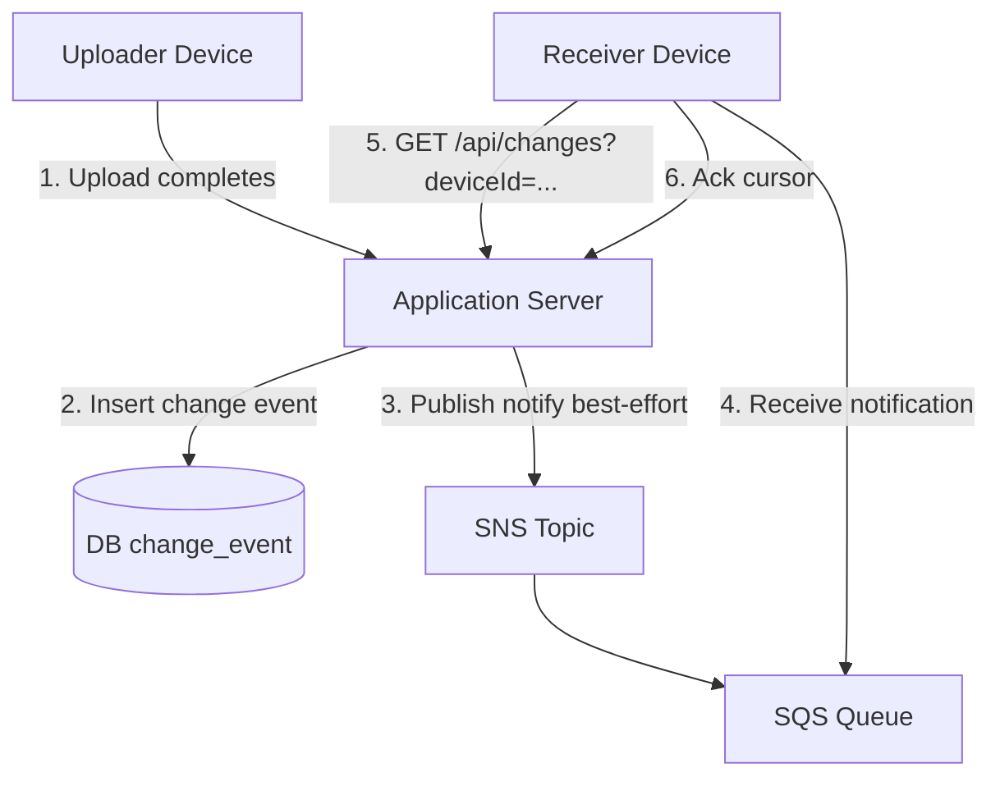

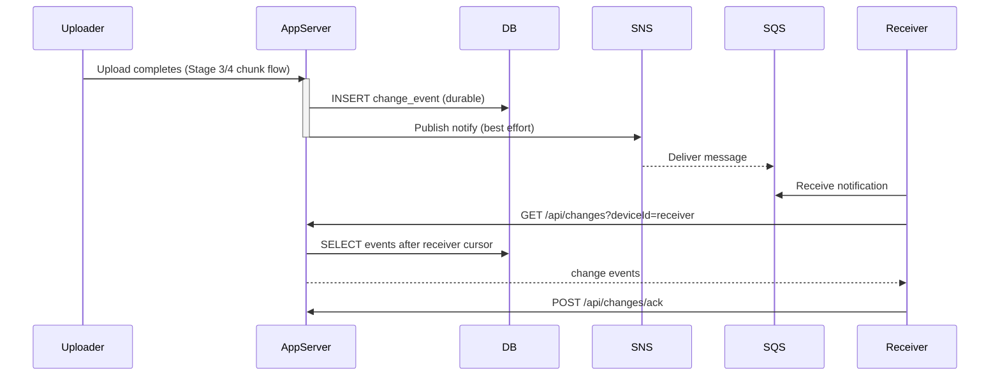

### Solves
*   **Offline tolerance**: devices can always catch up from the DB feed.
*   **Real-time-ish updates**: SNS/SQS can nudge online devices to sync.
*   **Clear correctness boundary**: SNS/SQS is best-effort; DB feed is durable.