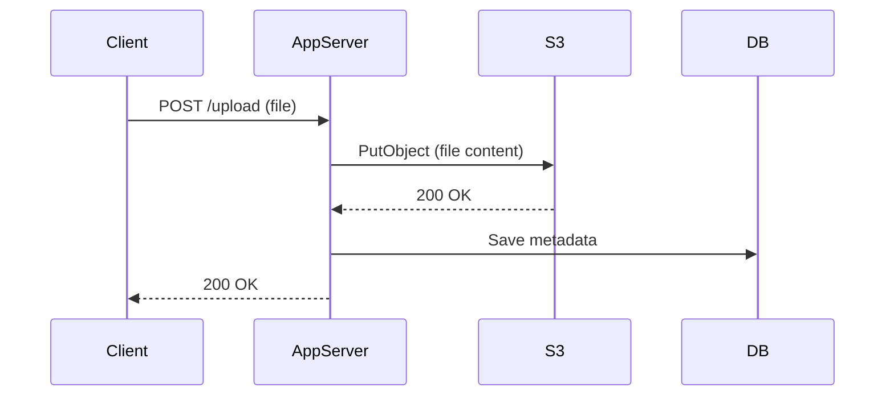
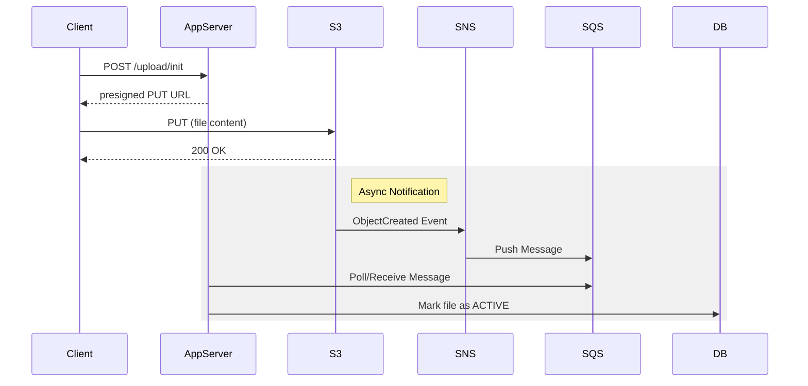
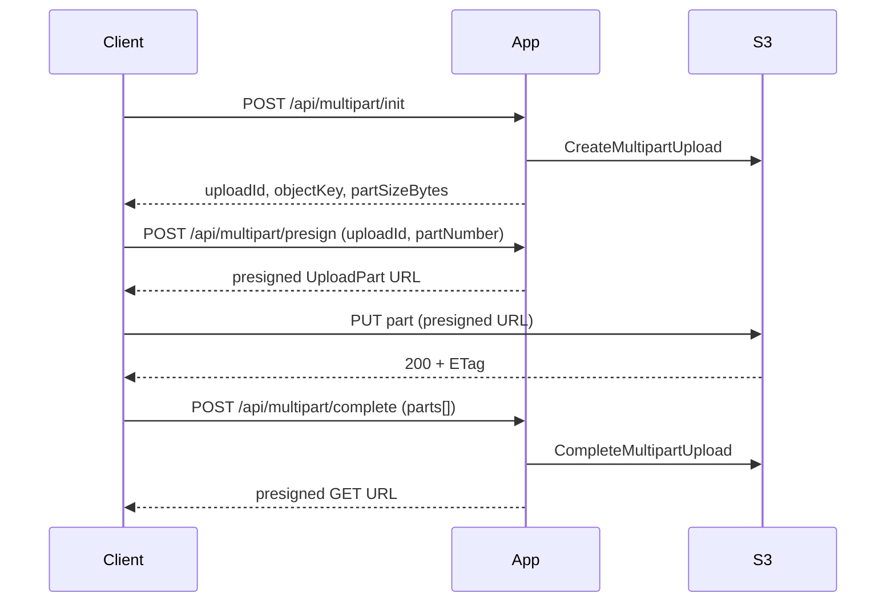
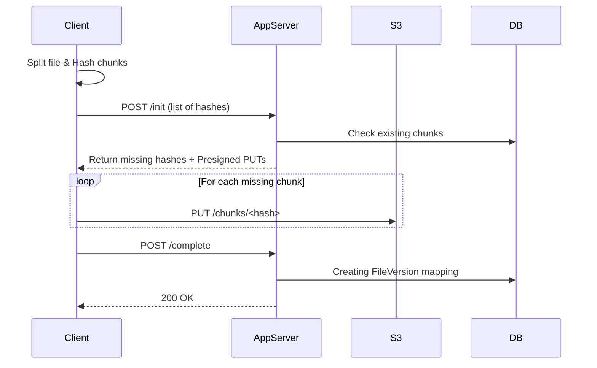
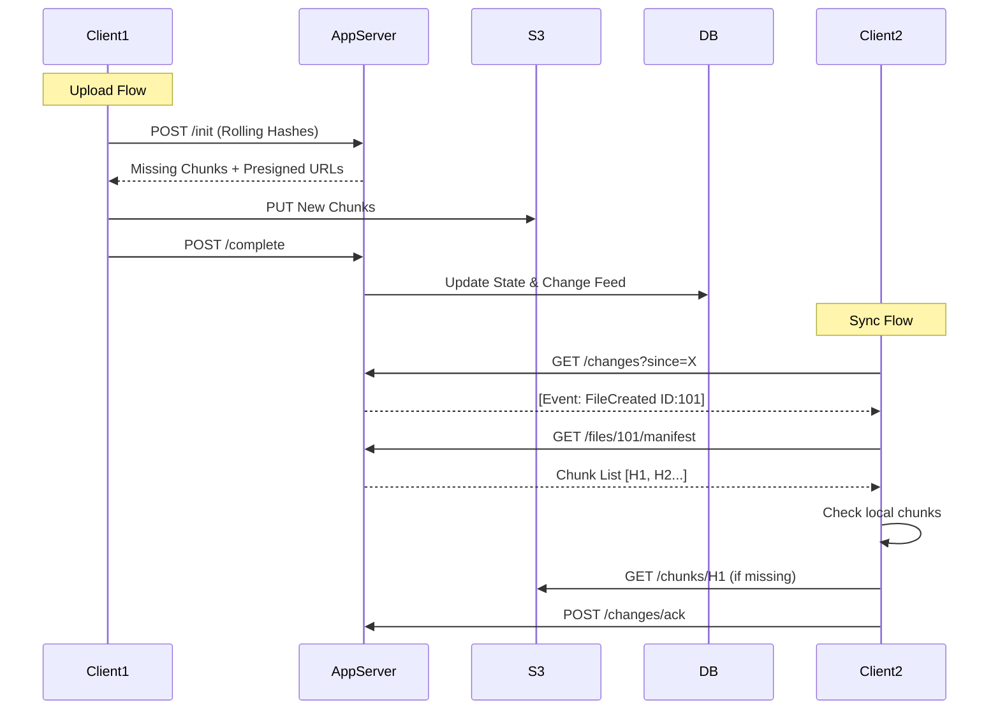

# Dropbox System Design — Examples

This repository contains several small example Spring Boot modules that demonstrate different approaches to browser file upload and sync with S3. The goal is educational: show trade-offs between simple server-proxied uploads, direct-to-S3 presigned flows, chunked/deduplicated storage, and rolling/content‑defined chunking.

Top-level modules

- `simplestVersion/` — Stage 1: naive server-proxied upload
- `directS3/` — Stage 2: presigned direct-to-S3 upload + SNS/SQS examples
- `chunkS3/` — Stage 3: client-side chunking + content-addressed chunks + retryable completion
- `rollingChunks/` — Stage 4: rolling/content-defined chunking + durable DB change feed + SNS/SQS hinting
- `multipartUpload/` — Option A reference: direct multipart uploads using presigned UploadPart URLs

Quick note on terminology

- Option A (direct multipart): server coordinates `CreateMultipartUpload` / presigns `UploadPart` URLs; client uploads parts directly and the server completes the upload. Good for straightforward large-file uploads.
- Option B (chunk-store + manifest): client splits the file into chunks (possibly content‑addressed), server returns presigned URLs for missing chunks only; server assembles or reassembles as needed. Good for deduplication and sync-friendly behavior.

When to use which

- Use Option A when you just need an efficient large-file upload path and don't care about cross-file deduplication or sync granularity. Note: real S3 multipart parts must be >= 5 MiB (except the last part).
- Use Option B when you want deduplication, lower delta upload sizes for small edits, or better resumability across devices/versions.

Module summaries and key flows

**Stage 1 — simplestVersion (Naive server-proxied upload)**

Client → App → S3 (server receives full object and writes to S3). This is the simplest pattern but doubles server bandwidth and ties up server resources for large uploads.

Mermaid (flowchart):

```mermaid
flowchart TD
  Client[Client Device] -->|1. POST /upload (file)| AppServer[Application Server]
  AppServer -->|2. PutObject| S3[(S3)]
  AppServer -->|3. Save metadata| DB[(Database)]
```

Sequence diagram:



**Stage 2 — directS3 (Presigned PUT / notification via SNS->SQS)**

Client asks server for a presigned PUT URL; client uploads directly to S3. The server uses SNS->SQS for durable asynchronous notifications of ObjectCreated events to update the database.

Mermaid (flowchart):

```mermaid
flowchart TD
  Client -->|1. init metadata| AppServer
  AppServer -->|2. presign PUT| Client
  Client -->|3. PUT (presigned)| S3
  S3 -->|4. ObjectCreated -> SNS| SNS[SNS]
  SNS --> SQS[SQS]
  SQS --> AppServer
  AppServer --> DB[(Database)]
```

Sequence diagram:



**Option A — multipartUpload (Direct multipart upload with presigned UploadPart URLs)**

This module implements the pattern where the server coordinates a multipart upload. The client requests separate presigned URLs for each part.

Mermaid (flowchart):

```mermaid
flowchart TD
  Client -->|1. POST /api/multipart/init| AppServer
  AppServer -->|2. CreateMultipartUpload| S3
  AppServer -->> Client: uploadId + objectKey + partSizeBytes

  loop For each part
    Client -->|3. POST /api/multipart/presign| AppServer
    AppServer -->> Client: presigned UploadPart URL
    Client -->|4. PUT part| S3
    S3 -->> Client: 200 OK + ETag
  end

  Client -->|5. POST /api/multipart/complete| AppServer
  AppServer -->|6. CompleteMultipartUpload| S3
  AppServer -->> Client: download URL
```

Sequence diagram:



**Stage 3 — chunkS3 (Client-side chunking + content-addressed chunks)**

Client splits files into chunks and computes a hash for each chunk. The server returns presigned PUT URLs *only* for missing chunk hashes (deduplication). Chunks are stored as separate S3 objects (e.g., `chunks/sha256/<hash>`).

Mermaid (flowchart):

```mermaid
flowchart TD
  Client -->|1. Hash chunks & Init| AppServer
  AppServer -->|2. Check DB for existing hashes| DB[(Database)]
  AppServer -->>|3. Presigned URLs for MISSING chunks| Client
  
  loop For missing chunks
    Client -->|4. PUT chunk| S3
  end
  
  Client -->|5. Complete Upload| AppServer
  AppServer -->|6. Link chunks to file version| DB
```

Sequence diagram:



Important note about demo vs production chunk sizes

- The demo modules expose a property `app.chunk.binary.size-bytes` to control the binary chunk size. For local demos we intentionally use small sizes (e.g., 64 bytes) so the behavior is easy to observe. In production choose larger sizes (for example 256 KiB or larger) and be mindful of S3 multipart constraints if adapting this model to multipart parts.

**Stage 4 — rollingChunks (Rolling/content-defined chunking + durable DB change feed)**

Stage 4 improves on Stage 3 by using rolling hashes (CDC) to align chunks better for edits. It also adds a **Change Feed** for reliable client synchronization.

Mermaid (flowchart):

```mermaid
flowchart TD
  subgraph Upload
    Client -->|1. Init (CDC Hashes)| AppServer
    AppServer -->>|2. Missing Chunks| Client
    Client -->|3. PUT Chunks| S3
    Client -->|4. Complete| AppServer
  end
  
  subgraph Sync
    Client2[Client 2] -->|5. Poll /changes| AppServer
    AppServer -->>|6. New File Events| Client2
    Client2 -->|7. Get Manifest| AppServer
    AppServer -->>|8. Chunk List| Client2
  end
```

Sequence diagram (Upload & Sync):



Running locally

These examples are designed to be run with LocalStack for S3/SNS/SQS emulation. The repo contains `run-local.sh` at the root which will start LocalStack (if needed) and create/configure the demo buckets used by the modules.

From the repository root (WSL recommended):

```bash
# Start LocalStack and bootstrap demo buckets (script may take a minute)
./run-local.sh

# Run a module (example: rollingChunks)
cd rollingChunks
mvn -DskipTests spring-boot:run
```

Tests

- Each module contains unit/integration tests using JUnit and Testcontainers LocalStack where appropriate. Some modules intentionally disable SQS listeners in the test profile to avoid noisy connection errors during test shutdown.

Contributing / Notes

- These modules are intended as reference implementations and educational material. They are not hardened for production use. See module READMEs for per-module implementation notes and production limitations (CORS, part size minimums, cleanup of abandoned multipart uploads, etc.).

---

If you'd like, I can also extract this README into a shorter quickstart and a longer design doc; or I can open a PR with these changes. Which would you prefer?