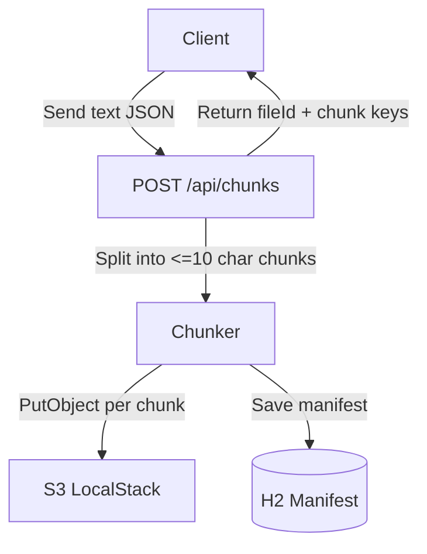
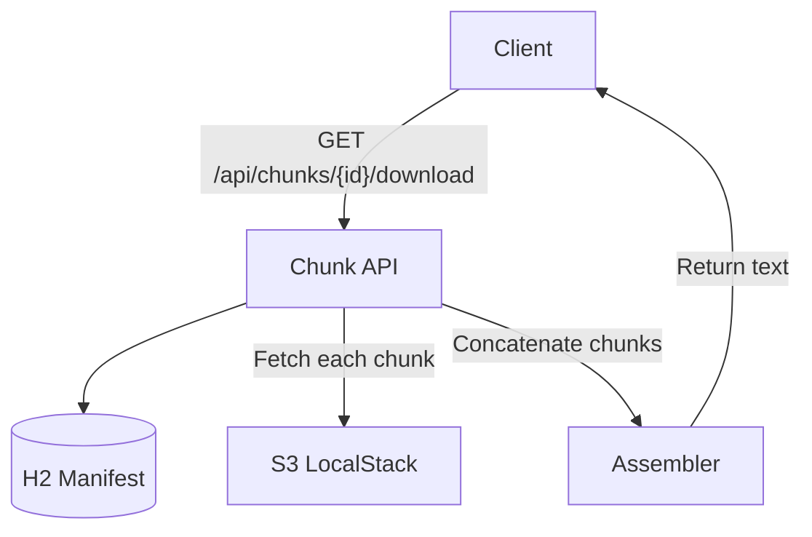
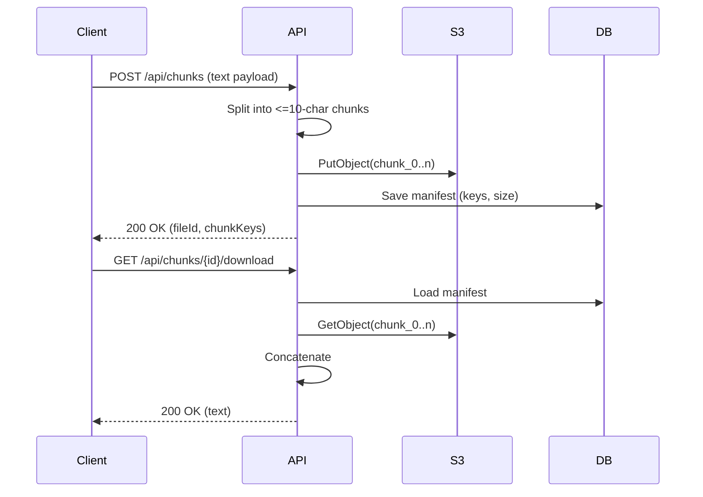

# chunkS3 – Stage 3 (Chunked uploads with LocalStack)

This module demonstrates chunked uploads to S3 (simulated by LocalStack) with tiny, human-readable chunks. It reuses the Stage 2 direct-S3 ideas but keeps everything intentionally simple and transparent.

## How it works
- A client sends text content to `POST /api/chunks`.
- The service splits the content into newline-delimited chunks; any line longer than 10 characters is further split into 10-character pieces.
- Each chunk is stored as a separate S3 object under `chunks/{fileId}/{index}.txt`.
- A manifest is persisted in H2 with the chunk keys and metadata.
- `GET /api/chunks/{id}` returns the manifest; `GET /api/chunks/{id}/download` reassembles the text in order.

## Flow (Upload)


## Flow (Download)


## Sequence (Upload then Download)


## Running locally
Local prerequisites: Java 21, Maven, and LocalStack (Docker).

```bash
# From chunkS3/
mvn test   # runs with LocalStack testcontainer
mvn spring-boot:run
```

By default, the app points to `http://localhost:4566` for LocalStack and uses bucket `dropbox-stage3` (see `src/main/resources/application.properties`).

## API quickstart (curl)
```bash
TEXT="Chunking shows how data is split across multiple small pieces so you can verify every chunk easily."

# Upload
UPLOAD=$(curl -s -X POST http://localhost:8080/api/chunks \
  -H "Content-Type: application/json" \
  -d "{\"fileName\":\"notes.txt\",\"content\":\"$TEXT\",\"contentType\":\"text/plain\"}")
FILE_ID=$(echo $UPLOAD | jq -r '.fileId')

# Download
curl -s http://localhost:8080/api/chunks/$FILE_ID/download | jq
```

## Tests
- `ChunkServiceTest` spins up `localstack:latest` via Testcontainers, creates the bucket, uploads ~100 chars of readable text, verifies every chunk is <=10 chars, and reassembles back to the original string.

## Notes
- Chunk size is configurable via `app.chunk.size` (default 10 chars).
- This example targets clarity over throughput; in production you would stream data, handle checksums, retries, and multi-part coordination.
