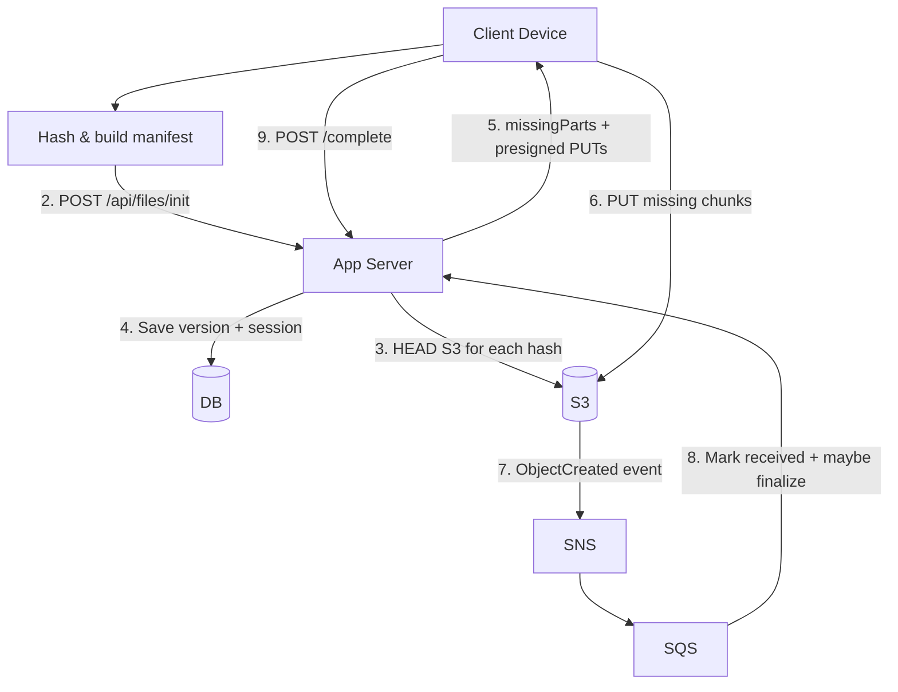

# chunkS3 – Stage 3 (Client-side chunking + fingerprinting)

This module demonstrates a Dropbox-style approach where:

- Chunking and reassembly are done on the **client**.
- The server manages **metadata only** (file records + versions + the chunk manifest/"recipe").
- Chunks are stored in S3 as **content-addressed objects**: `chunks/sha256/<hash>`.
- Small edits re-upload only the chunks that changed.

It’s designed to build on the Stage 2 “direct-to-S3 via presigned URLs” idea while adding dedup + update efficiency.

## Key constraints (intentional)

- Text files: normalize CRLF → LF before hashing/chunking.
- Non-text/binary: chunk into fixed 64-byte pieces (so the flow is easy to observe).
- Manifest stores per-chunk `lengthBytes`.

## Data model

- `FileMetadata`: stable file identity + current status + pointer to current version.
- `FileVersion`: immutable-ish version with ordered `parts` (`(hash, lengthBytes)`), chunking strategy, newline flags.
- `UploadSession`: tracks expected unique chunk hashes and which have been received.

Statuses:

- `PENDING`: first upload in progress
- `UPDATING`: new version in progress
- `AVAILABLE`: all expected chunks for current version are present

## API overview

- `POST /api/files/init`
    - Input: fileId (optional for updates), fileName, contentType, chunkingStrategy, newline flags, `reassembledSizeBytes`, `parts[]`.
    - Output: `missingParts[]` containing presigned PUT URLs for missing chunks.

- `POST /api/files/{fileId}/versions/{versionId}/complete`
    - Marks the upload “client complete”.
    - Defensive check: verifies all expected unique chunk hashes exist in S3.
    - If anything is missing, returns **409** with presigned PUT URLs for the missing chunk hashes.

- `GET /api/files/{fileId}/manifest`
    - When `AVAILABLE`, returns ordered parts + presigned GET URLs so the client can download and reassemble.

## Upload flow


## Download flow

```mermaid
flowchart TD
    Client[Client] -->|1". GET /api/files/{id}/manifest"| App[App Server]
    App -->|2. Presign GET per chunk| S3[(S3)]
    App -->|3. Manifest + URLs| Client
    Client -->|4. GET chunks (parallel)| S3
    Client -->|5. Reassemble locally| Client
```

## UI

This module includes a tiny Thymeleaf UI to demonstrate end-to-end behavior:

- `/` upload new file
- `/files` list
- `/files/{id}` download + upload new version

The UI will automatically retry completion if the server reports missing chunks (HTTP 409).

## Tests

- The Stage 3 integration test verifies that changing only line 2 of a text file causes only **1** chunk to be uploaded for the new version.

## Running locally

Prereqs: Java 21, Maven, Docker.

```bash
cd chunkS3
mvn test
mvn spring-boot:run
```

## What could be better (production notes)

- Stronger chunking: content-defined chunking (rolling hash) so inserts don’t shift all subsequent chunks.
- Parallelism + retries: bounded parallel PUTs, retry with exponential backoff, and resumable sessions.
- Trust model: server-side verification of chunk sizes/content (e.g., store expected length + verify ETag/content-MD5) if you don’t fully trust clients.
- Encryption: envelope encryption per user/device, with chunk-level encryption keys.
- Garbage collection: reference counting or mark-and-sweep for unreferenced chunks.
- Cost controls: cache existence checks (HEAD), batch HEAD via inventory, or maintain a chunk index for hot objects.

## CORS and Presigned URLs (Local vs Production)

Why you saw CORS errors

- Browsers enforce the Same-Origin Policy. Your app is served from http://localhost:8080, while presigned PUTs go to the S3 endpoint (http://localhost:4566). Browsers treat different ports as different origins, so before allowing the PUT the browser checks the S3 bucket's CORS policy. If the bucket does not allow your origin/method/headers, the browser blocks the request (you will see a CORS error in DevTools). Server-side uploads (curl, server processes) are not blocked by browser CORS.

Local development fix

- For convenience the app automatically sets a permissive CORS policy on startup when running locally (AllowedOrigins="*"). This makes browser PUT tests work without manual bucket setup. This is safe only for local development and testing with LocalStack.

Production recommendations

- Do NOT use a wildcard CORS policy in production. Instead:
    - Restrict `AllowedOrigins` to your app's canonical origin(s) (for example, https://app.example.com).
    - Only allow the minimal methods you need (usually `PUT`, `GET`, `HEAD`, and `POST` if you use form uploads).
    - Keep `AllowedHeaders` narrowly scoped (e.g. `Content-Type`, `x-amz-acl` if used) and `ExposeHeaders` to the small set you require (e.g. `ETag`).

- Use short-lived presigned URLs: keep TTL small (the app default is 10 minutes). Shorter TTLs reduce risk if a URL leaks.

- Constrain object keys and upload prefixes server-side: generate presigned URLs only for well-formed keys (e.g., under a per-user prefix or content-addressed path `chunks/sha256/...`). This prevents arbitrary writes into your bucket.

- Prefer signed POST forms when you need richer server-side constraints in the browser upload flow (POST policies can include conditions on content-length, key prefix, content-type).

- Consider using a CDN or reverse-proxy (CloudFront, ALB) in front of S3 and issue signed URLs/cookies via the CDN. With CloudFront you can apply origin policies and avoid exposing S3 directly to arbitrary origins.

- As an alternative to exposing S3 directly to browsers, proxy the upload through your application server for sensitive uploads (server acts as an authenticated gateway). This reintroduces server bandwidth cost but can simplify security.

Server-side verification

- Always verify uploaded content/manifest server-side before marking a version AVAILABLE: check sizes, expected chunk hashes (HEAD/GET), and that all parts are present. Use short TTLs and re-check at `/complete` time to avoid relying solely on client behavior.

Summary

- For local testing it's acceptable to relax CORS; for production lock CORS to known origins and use presigned URLs or signed POST forms with tight constraints, short TTLs, and server-side verification.
