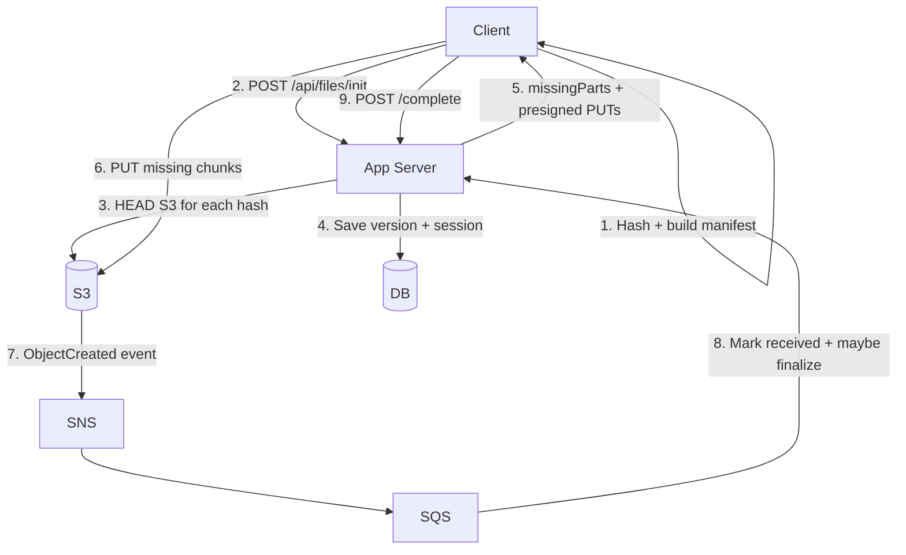

# chunkS3 – Stage 3 (Client-side chunking + fingerprinting)

This module demonstrates a Dropbox-style approach where:

- Chunking and reassembly are done on the **client**.
- The server manages **metadata only** (file records + versions + the chunk manifest/"recipe").
- Chunks are stored in S3 as **content-addressed objects**: `chunks/sha256/<hash>`.
- Small edits re-upload only the chunks that changed.

It’s designed to build on the Stage 2 “direct-to-S3 via presigned URLs” idea while adding dedup + update efficiency.

## Key constraints (intentional)

- Text files: normalize CRLF → LF before hashing/chunking.
- Non-text/binary: chunk into fixed 64-byte pieces (so the flow is easy to observe).
- Manifest stores per-chunk `lengthBytes`.

## Data model

- `FileMetadata`: stable file identity + current status + pointer to current version.
- `FileVersion`: immutable-ish version with ordered `parts` (`(hash, lengthBytes)`), chunking strategy, newline flags.
- `UploadSession`: tracks expected unique chunk hashes and which have been received.

Statuses:

- `PENDING`: first upload in progress
- `UPDATING`: new version in progress
- `AVAILABLE`: all expected chunks for current version are present

## API overview

- `POST /api/files/init`
    - Input: fileId (optional for updates), fileName, contentType, chunkingStrategy, newline flags, `reassembledSizeBytes`, `parts[]`.
    - Output: `missingParts[]` containing presigned PUT URLs for missing chunks.

- `POST /api/files/{fileId}/versions/{versionId}/complete`
    - Marks the upload “client complete”.
    - Defensive check: verifies all expected unique chunk hashes exist in S3.
    - If anything is missing, returns **409** with presigned PUT URLs for the missing chunk hashes.

- `GET /api/files/{fileId}/manifest`
    - When `AVAILABLE`, returns ordered parts + presigned GET URLs so the client can download and reassemble.

## Upload flow



## Download flow

```mermaid
flowchart TD
    Client[Client] -->|1. GET /api/files/{id}/manifest| App[App Server]
    App -->|2. Presign GET per chunk| S3[(S3)]
    App -->|3. Manifest + URLs| Client
    Client -->|4. GET chunks (parallel)| S3
    Client -->|5. Reassemble locally| Client
```

## UI

This module includes a tiny Thymeleaf UI to demonstrate end-to-end behavior:

- `/` upload new file
- `/files` list
- `/files/{id}` download + upload new version

The UI will automatically retry completion if the server reports missing chunks (HTTP 409).

## Tests

- The Stage 3 integration test verifies that changing only line 2 of a text file causes only **1** chunk to be uploaded for the new version.

## Running locally

Prereqs: Java 21, Maven, Docker.

```bash
cd chunkS3
mvn test
mvn spring-boot:run
```

## What could be better (production notes)

- Stronger chunking: content-defined chunking (rolling hash) so inserts don’t shift all subsequent chunks.
- Parallelism + retries: bounded parallel PUTs, retry with exponential backoff, and resumable sessions.
- Trust model: server-side verification of chunk sizes/content (e.g., store expected length + verify ETag/content-MD5) if you don’t fully trust clients.
- Encryption: envelope encryption per user/device, with chunk-level encryption keys.
- Garbage collection: reference counting or mark-and-sweep for unreferenced chunks.
- Cost controls: cache existence checks (HEAD), batch HEAD via inventory, or maintain a chunk index for hot objects.
