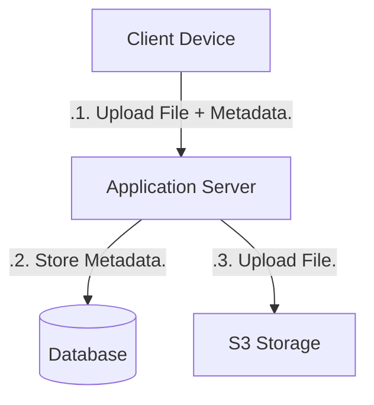
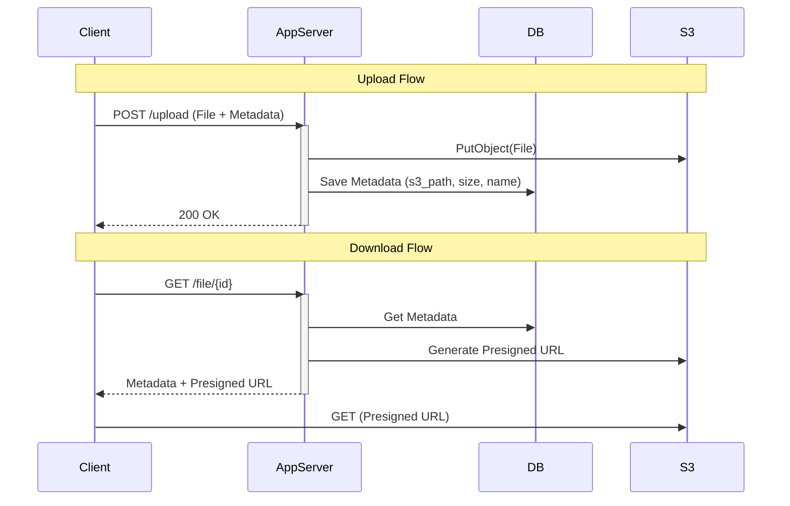
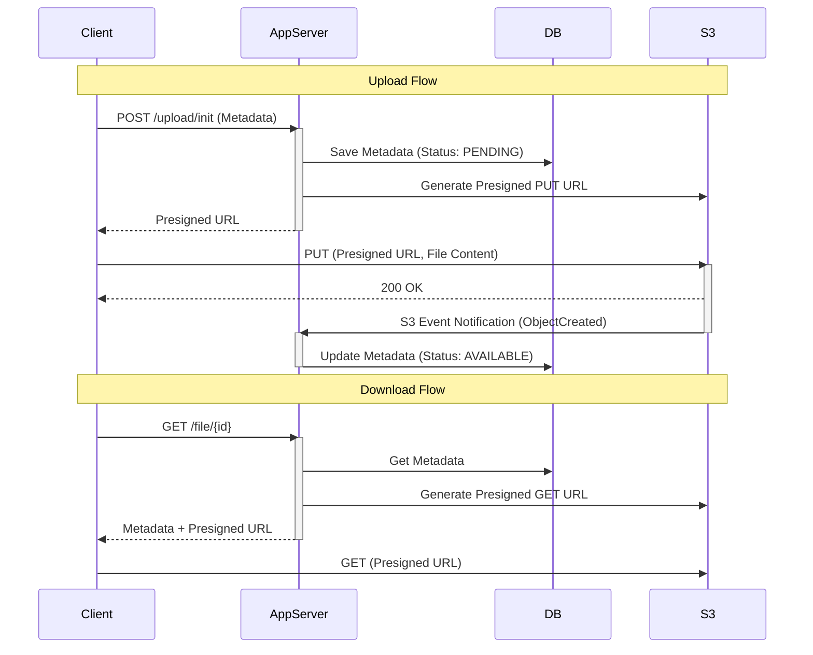
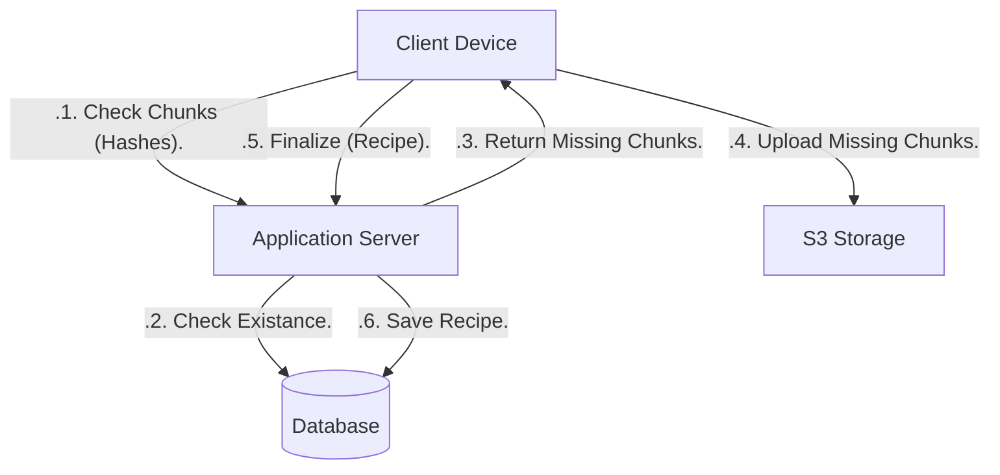
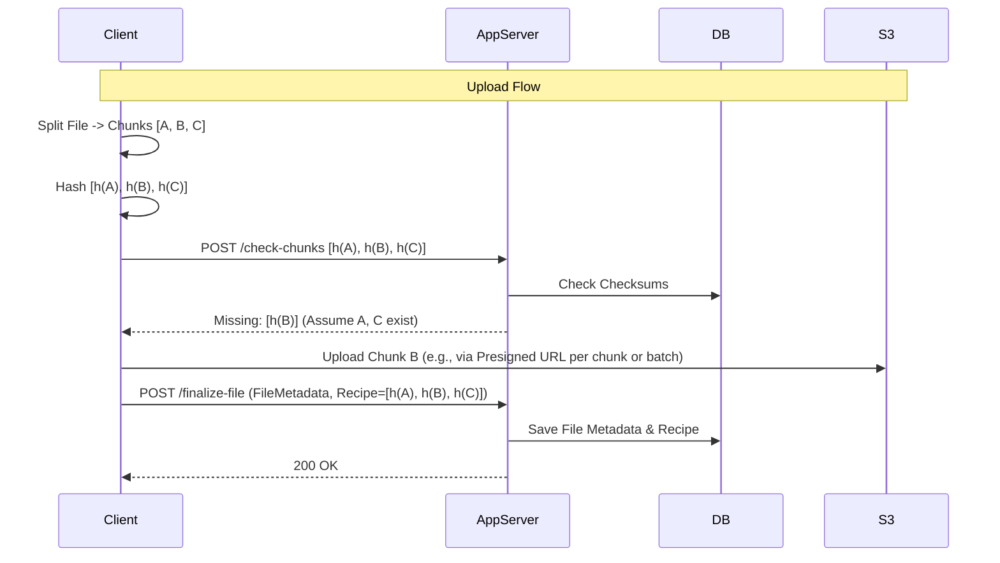
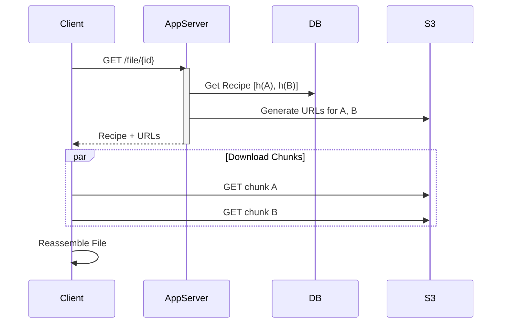
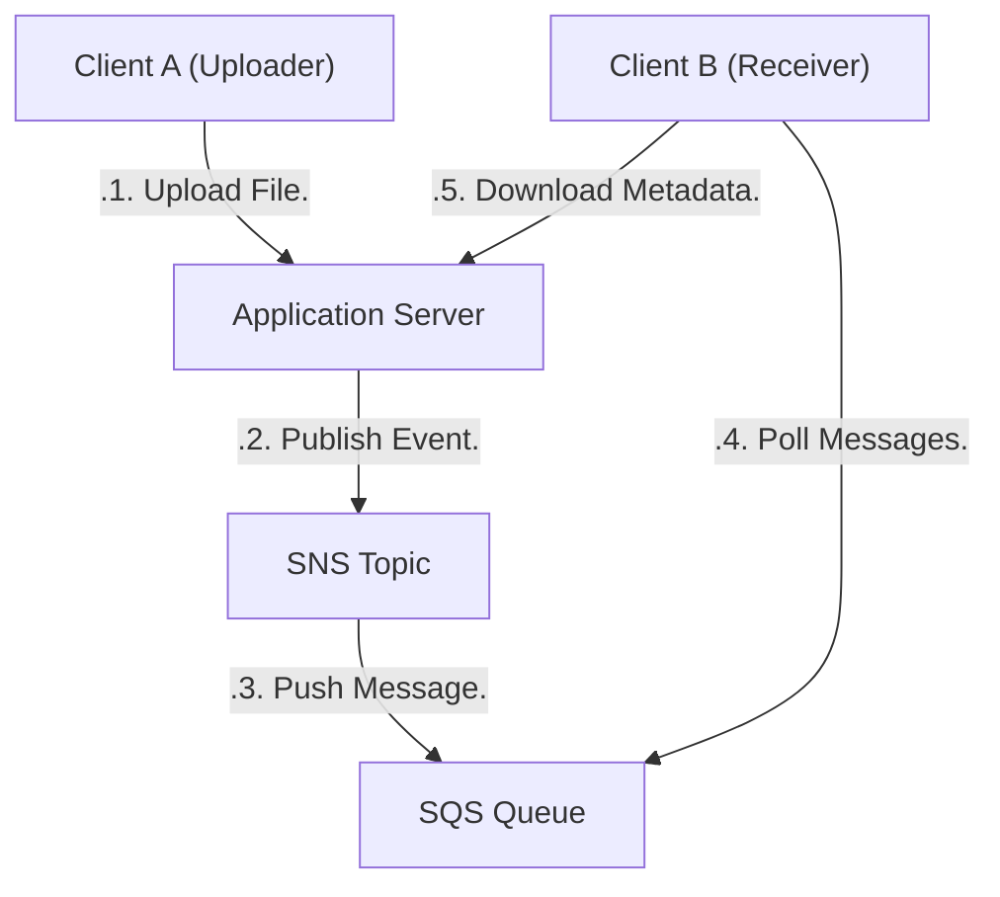
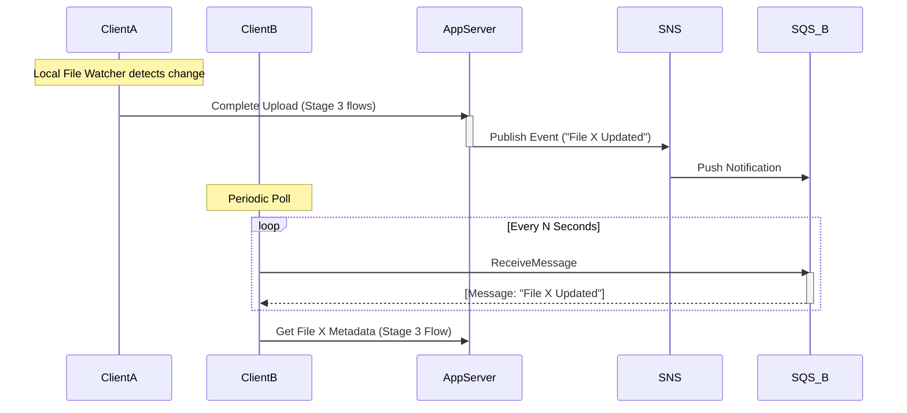

# Dropbox System Design

This set of projects is based on the helloInterview design question.
The goal is to implement different stages of a system design to understand the trade-offs and benefits of each approach.

## functional requirements
1. can store file
2. can retrieve files
3. other users can retrieve files (getting permission to access files is Out Of Scope)
4. can sync with changes done on local version
5. can sync with changes done by others
    - currently having multiple devices per user is Out Of Scope

## Nonfunctional Requirements
1. availability >> consistency (we do not care if it takes a few seconds to get an update, but we do not want an error getting something)
2. reasonable download/upload times (size dependant)
3. continue load if load gets stopped in the middle
4. big files

## Simulation Requirements
1. **LocalStack**: Used to simulate AWS Services (S3, etc.).
2. **AOP Delays**: Artificial delays introduced via AOP to simulate network load/processing time, allowing us to observe the impact of architectural decisions.

---

## Stage 1: Simplest Version (Naive Approach)

In this version, the client uploads the file directly to the application server. The server then uploads it to S3 and saves the metadata in the database.

### Design





### Problems
1.  **Double Bandwidth**: The file travels `Client -> Server` and then `Server -> S3`. This doubles the network IO on the server.
2.  **Blocking**: Large files block the application server threads/resources while being uploaded to S3.
3.  **Gateway Limits**: API Gateways often have strict payload size limits, preventing large file uploads.

---

## Stage 2: Direct S3 Upload (Presigned URLs)

To solve the double bandwidth and blocking issues, the client uploads files directly to S3 using a presigned URL.

### Design

```mermaid
flowchart TD
    Client[Client Device]
    AppServer[Application Server]
    DB[(Database)]
    S3[S3 Storage]

    Client -- .1. Init Upload. --> AppServer
    AppServer -- .2. Save Metadata (Pending). --> DB
    AppServer -- .3. Return Presigned URL. --> Client
    Client -- .4. Upload File. --> S3
    S3 -. .Async Notification. .-> AppServer
    AppServer -- .5. Update Metadata (Available). --> DB
```



### Solves
*   **Bandwidth**: Server only handles small metadata requests. Heavy lifting is done by S3.
*   **Scalability**: Server can handle many more concurrent users since it's not tied up with streaming bytes.

### Issues
*   **Complexity**: Requires handling async notifications from S3.
*   **Consistency**: What if the upload fails? The DB might have a stale "PENDING" record.

---

## Stage 3: Chunking & Fingerprinting

For large files and sync efficiency, we split files into chunks. We use fingerprinting (rolling hash or simple chunk hash) to detect duplicates.

### Design

*   File is split into chunks (e.g., 10 bytes for testing, usually 4MB+).
*   Client calculates hash of each chunk.
*   Client asks Server: "Do you have these chunks?"
*   Server replies with list of missing chunks.
*   Client uploads only missing chunks.
*   Metadata stores the "Recipe" (list of chunks) for the file.





### Solves
*   **Network Efficiency**: Only changes (deltas) are transferred.
*   **Deduplication**: Identical chunks (across files/users) are stored only once.

### Notes
*   **AWS Constraints**: S3 Multipart upload has a 5MB minimum part size (except the last one). For this simulation (10 byte chunks), we might need to store chunks as individual small objects or ignore S3 multipart constraints by using putting individual objects.

### Download Flow
1.  Client requests file.
2.  Server retrieves "Recipe" (list of chunks) from DB.
3.  Server generates presigned URLs for each chunk (or checks if client already has them in a local cache - Out of Scope for now).
4.  Client downloads chunks in parallel and reassembles the file.



---

## Stage 4: Notification Service (Async Updates)

To satisfy the requirement of "syncing with changes done by others" without inefficient blocking or high-latency long-polling.

### Design

**Client-Side Change Detection**:
The client runs a local file watcher. When a file is modified locally:
1.  Client recalculates hashes.
2.  Follows Stage 3 flow (Upload missing chunks, Finalize).

**Server-Side Notification**:
We use a Polling model for the simulation (Simulating a message queue buffer).
*   When a file is updated, the Server publishes an event to an SQS Queue unique to the client (or filtered).
*   Clients periodically **poll** their queue for updates.





### Solves
*   **Real-time Updates**: Clients know about changes quickly.
*   **Efficiency**: Polling an empty SQS queue is cheaper/faster than querying a full database for "changes since X".
*   **Offline Tolerance**: SQS queues persist messages (default retention is 4 days). If a client is offline, the message waits in the queue until the client comes back online and polls.