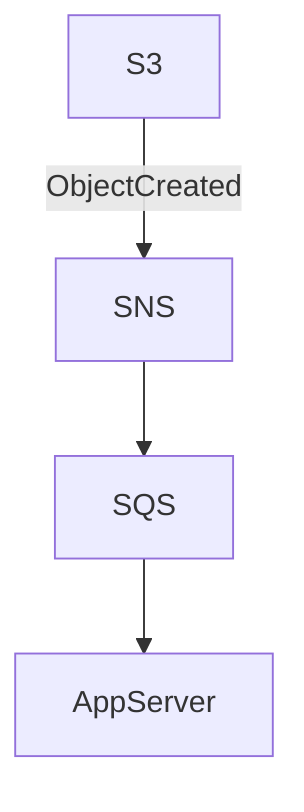

# Dropbox Stage 2: Direct S3 Upload (directS3)

## What this module contains
This module implements Stage 2 of the Dropbox design: the application issues presigned S3 URLs so clients upload directly to S3. It includes:

- Server-side presigner logic (`FileService`) that issues presigned PUT URLs and presigned GET URLs (the latter include response headers for content-type and filename).
- Metadata storage (H2/JPA `FileMetadata`) with `PENDING`/`AVAILABLE` states.
- An SQS-based notification consumer (`SqsNotificationListener`) that polls SQS, parses SNS envelopes, and marks files AVAILABLE.
- A `MessagingInitializer` that creates SNS topics, SQS queues and configures S3 -> SNS notifications (used for LocalStack bootstrap in dev).
- A small Thymeleaf UI under `/ui` for listing, uploading (client-side PUT to presigned URL), downloading and viewing files.
- `run-local.sh` script to start LocalStack with required services, create the bucket and configure CORS for browser PUTs.
- Unit and integration tests demonstrating the flows and edge cases (e.g. reconciliation when init is skipped).

## Key design points

- Direct uploads: the client calls `POST /api/files/upload/init` to reserve metadata and receive a presigned PUT URL. The client then PUTs the file directly to S3.
- Notifications: the production-like flow uses `S3 -> SNS -> SQS -> App` to make notification delivery durable and decoupled.
- Reconciliation: if a client uploads directly without calling `/upload/init`, the SQS consumer will create a minimal metadata record when it observes the S3 event.
- Content-type handling: the upload init may include `contentType` so the server can later presign GETs with the correct `responseContentType` and `Content-Disposition`.

## Technologies

- Java 21, Spring Boot
- Maven
- AWS SDK v2 (S3, S3Presigner, SNS, SQS)
- LocalStack (for local AWS emulation)
- Thymeleaf (simple UI)
- H2 database (in-memory for tests/dev)

## Running locally (developer flow)

This project includes `run-local.sh` to bootstrap LocalStack and the bucket used by the app. Typical steps:

```bash
# start localstack and configure bucket/CORS (script will wait for health)
./run-local.sh

# build and run app
mvn -pl directS3 spring-boot:run
```

Notes:
- `run-local.sh` starts LocalStack with services `s3,sns,sqs` enabled, creates the bucket configured by `application.properties` and applies a permissive CORS policy so browser PUTs to presigned URLs succeed.
- If you run LocalStack manually, ensure services include S3, SNS and SQS and that the bucket exists with the CORS policy set.

## HTTP endpoints (high-level)

- `POST /api/files/upload/init` — body: `{ "fileName": "test.txt", "size": 123, "contentType": "text/plain" }` — returns `{ "fileId": "...", "uploadUrl": "..." }`.
- Client: `PUT [uploadUrl]` — upload file directly to S3 (browser or programmatic client).
- `GET /api/files/{id}` — returns metadata and presigned GET URL (server presigns GET with `responseContentType` and `Content-Disposition`).

UI:
- `GET /ui` — list files
- `GET /ui/upload` — upload form (client uses presigned PUT)
- `GET /ui/view/{id}` — view file content

## Tests and notable behaviors

- Integration tests verify presigned PUT/GET flows. A prior test failure caused by HTTP client re-encoding presigned query parameters was fixed by ensuring presigned PUTs are used via `URI`/raw URLs in tests.
- `SqsNotificationListenerTest` verifies parsing of SNS envelopes and uses a reflection-based injection of `bucketName` so the listener can find the mocked queue URL.

## Implementation notes / gotchas

- The server stores optional `contentType` during init; if missing, `FileService` will infer a type from the filename when generating presigned GETs.
- Browser uploads require the S3 bucket CORS to allow `PUT` and appropriate headers — `run-local.sh` configures this for LocalStack.

## Diagrams

Upload flow (simplified):

```mermaid
flowchart TD
    Client[Client] -->|1. POST /upload/init| AppServer[App Server]
    AppServer -->|2. Save PENDING| DB[(Database)]
    AppServer -->|3. Presign PUT| Client
    Client -->|4. PUT (presigned)| S3[S3]
    S3 -->|5. Notify| SNS[SNS Topic]
    SNS -->|6. Deliver| SQS[SQS Queue]
    AppServer -->|7. Poll & update| DB
```

Notification pipeline recommended for production:



## Where to look in the code

- `com.example.directS3.service.FileService` — presign logic, metadata handling, reconciliation
- `com.example.directS3.service.SqsNotificationListener` — SQS poller and SNS envelope parsing
- `com.example.directS3.util.MessagingInitializer` — topic/queue creation and S3 notification wiring (used for local bootstrap)
- `src/main/resources/templates/ui` — Thymeleaf UI pages
- `run-local.sh` — LocalStack bootstrap and CORS setup for browser uploads

---

