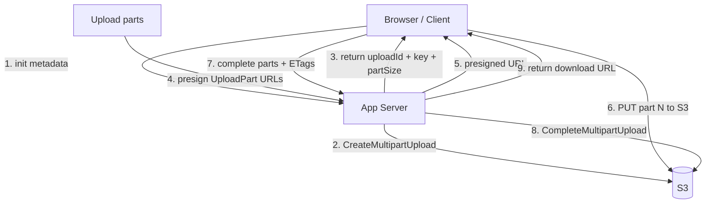
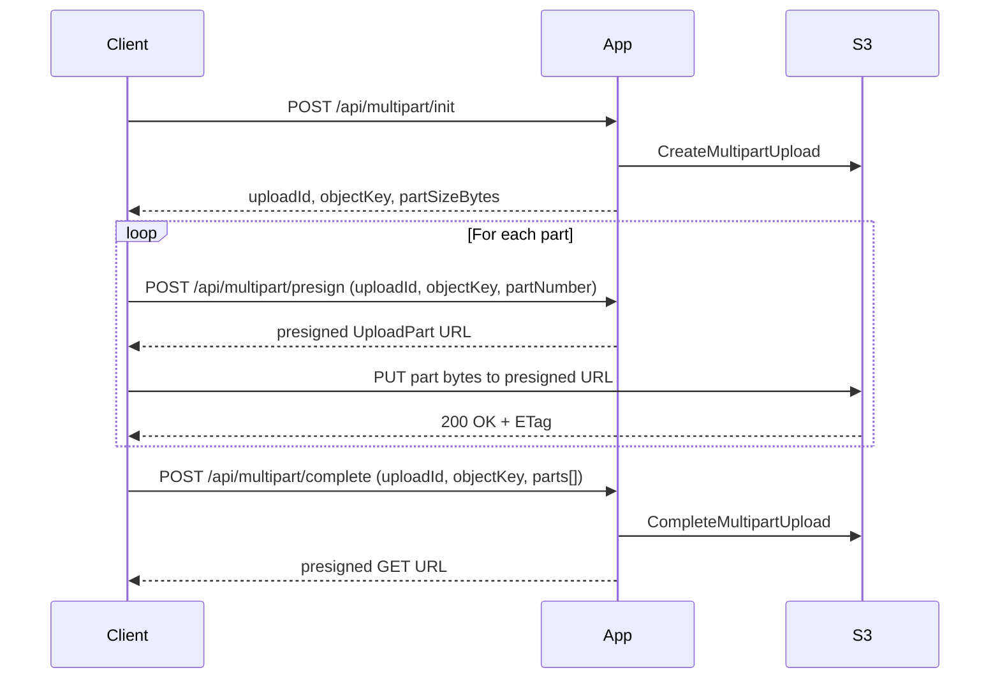

# Multipart Upload (Option A)

This module is a minimal reference implementation of **direct-to-S3 multipart upload** using:

- `CreateMultipartUpload` (server)
- `UploadPart` via **presigned URLs** (client/browser)
- `CompleteMultipartUpload` (server)

It is intentionally small and educational, designed as a “copy this architecture” starting point.

## When to use this (Option A)

Use Option A when:

- You want the **simplest production upload architecture** for large files.
- You want the client to send bytes **directly to S3** (no app-server streaming).
- You don’t need cross-file/version **deduplication**.

This is the most common pattern for “upload a file to S3 from a browser”.

## When not to use this

If you need Dropbox-style sync efficiency (small edits upload only a few chunks), use **Option B** (content-addressed chunk store + manifest), implemented in `rollingChunks`.

## Flow

## Running locally (UI)

This repo has a shared runner that starts LocalStack and creates the bucket.

From WSL:

- `cd /mnt/c/projects/learn/examples/dropbox/multipartUpload && ./run-local.sh`

UI:

- `http://localhost:8080`

## Notes / Production considerations

- **Part size**: real AWS S3 requires each part to be at least **5 MiB**, except the last part.
  - For local demos we allow smaller part sizes.
- **Abandoned uploads cleanup**: you must implement a TTL-based cleanup that calls `AbortMultipartUpload`.
- **ETags are opaque**: treat them as identifiers required by `CompleteMultipartUpload`.

