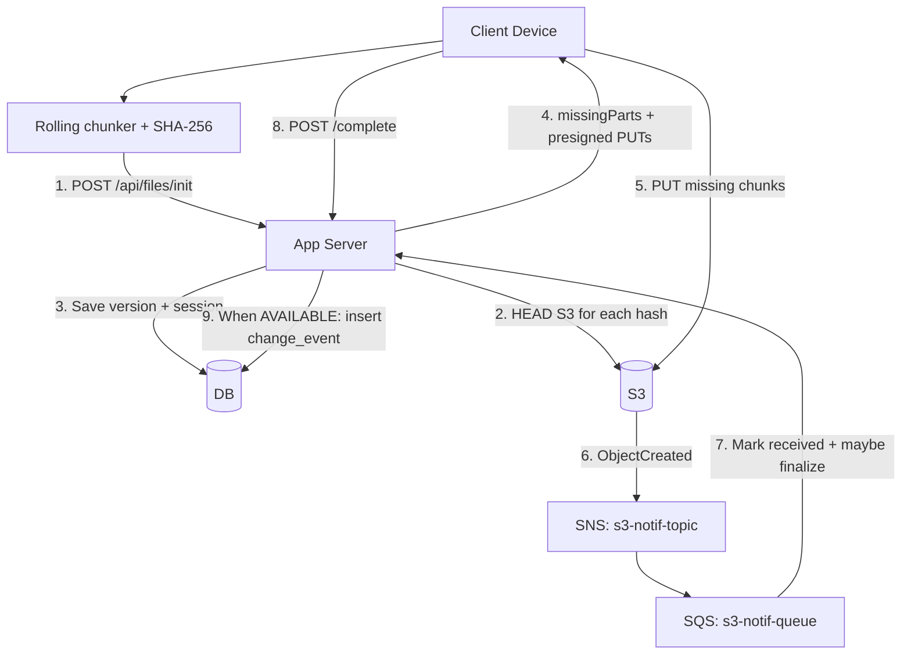
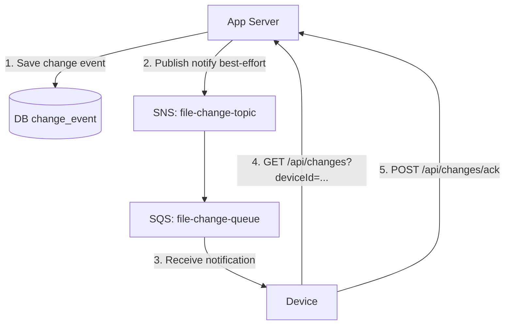
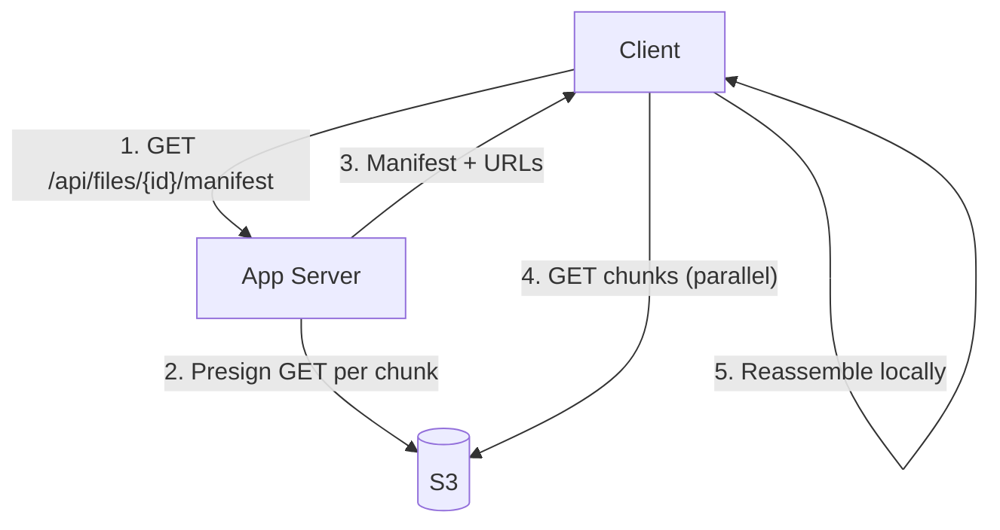

# rollingChunks – Stage 4 (Rolling/CDC chunks + durable change feed)

This module extends Stage 3 by adding two Stage 4 ideas:

- **Rolling / content-defined chunking (CDC) for text** so small inserts don’t shift every subsequent chunk boundary.
- A **durable DB change feed** (with per-device cursor) so devices can sync changes even after being offline.

S3/SNS/SQS are still used, but with a different split of responsibilities:

- **S3 -> SNS -> SQS** continues to drive the *chunk-received* bookkeeping (like Stage 3).
- The **DB change feed** is the durable source-of-truth for “file version became available”.
- An **optional** SNS->SQS “online notify” pipeline publishes change-feed events as a hint for clients to fetch `/api/changes`.

## Chunking strategies

- Text: normalize CRLF -> LF, then chunk with a rolling/content-defined chunker: `ROLLING_TEXT_NORMALIZED_LF`.
- Non-text/binary: split into fixed-size chunks (configured via `app.chunk.binary.size-bytes`; demos use small sizes such as 64 bytes for visibility; production may prefer larger chunk sizes or follow S3 5 Mib the AWS minimum for S3 multipart part-size constraints).

Local demo sizing vs AWS multipart constraints:

- This example stores chunks as **individual S3 objects** (`chunks/sha256/<hash>`), not multipart-upload parts.
- If you adapt the idea to multipart upload in real AWS, part sizes must be **min 5 MiB** (except last), **max 5 GiB**, and **max 10,000 parts** per object.
- For LocalStack/demo we intentionally use tiny sizes so behavior is visible.

## Durable change feed (Stage 4)

New DB tables:

- `change_event`: append-only ordered events (monotonic id).
- `device_checkpoint`: per-device cursor of last acknowledged event id.

API:

- `GET /api/changes?deviceId=...&limit=100`
  - Returns events with id > the device’s last seen id.
  - Returns a `nextCursor` you can ack.
- `POST /api/changes/ack`
  - Body: `{ "deviceId": "...", "lastSeenEventId": 123 }`

Conceptually, the DB feed is the durable source-of-truth; SQS is only an “online hint”.

## Upload flow (chunks + finalize + change feed)



## Change propagation (durable DB + optional SNS/SQS)



## Download flow



## UI

This module includes a tiny Thymeleaf UI to demonstrate end-to-end behavior:

- `/` upload new file
- `/files` list
- `/files/{id}` download + upload new version

Text files use rolling/CDC chunking in the browser; non-text uses fixed-size chunks.

## Running locally

Prereqs: Java 21, Maven, Docker (LocalStack).

```bash
cd rollingChunks
mvn test
mvn spring-boot:run
```

## CORS and Presigned URLs (Local vs Production)

Why you saw CORS errors

- Browsers enforce the Same-Origin Policy. Your app is served from http://localhost:8080, while presigned PUTs go to the S3 endpoint (http://localhost:4566). Browsers treat different ports as different origins, so before allowing the PUT the browser checks the S3 bucket's CORS policy. If the bucket does not allow your origin/method/headers, the browser blocks the request (you will see a CORS error in DevTools). Server-side uploads (curl, server processes) are not blocked by browser CORS.

Local development fix

- For convenience the app automatically sets a permissive CORS policy on startup when running locally (AllowedOrigins="*"). This makes browser PUT tests work without manual bucket setup. This is safe only for local development and testing with LocalStack.

Production recommendations

- Do NOT use a wildcard CORS policy in production. Instead:
    - Restrict `AllowedOrigins` to your app's canonical origin(s) (for example, https://app.example.com).
    - Only allow the minimal methods you need (usually `PUT`, `GET`, `HEAD`, and `POST` if you use form uploads).
    - Keep `AllowedHeaders` narrowly scoped (e.g. `Content-Type`, `x-amz-acl` if used) and `ExposeHeaders` to the small set you require (e.g. `ETag`).

- Use short-lived presigned URLs: keep TTL small (the app default is 10 minutes). Shorter TTLs reduce risk if a URL leaks.

- Constrain object keys and upload prefixes server-side: generate presigned URLs only for well-formed keys (e.g., under a per-user prefix or content-addressed path `chunks/sha256/...`). This prevents arbitrary writes into your bucket.

- Prefer signed POST forms when you need richer server-side constraints in the browser upload flow (POST policies can include conditions on content-length, key prefix, content-type).

- Consider using a CDN or reverse-proxy (CloudFront, ALB) in front of S3 and issue signed URLs/cookies via the CDN. With CloudFront you can apply origin policies and avoid exposing S3 directly to arbitrary origins.

- As an alternative to exposing S3 directly to browsers, proxy the upload through your application server for sensitive uploads (server acts as an authenticated gateway). This reintroduces server bandwidth cost but can simplify security.

Server-side verification

- Always verify uploaded content/manifest server-side before marking a version AVAILABLE: check sizes, expected chunk hashes (HEAD/GET), and that all parts are present. Use short TTLs and re-check at `/complete` time to avoid relying solely on client behavior.

Summary

- For local testing it's acceptable to relax CORS; for production lock CORS to known origins and use presigned URLs or signed POST forms with tight constraints, short TTLs, and server-side verification.
