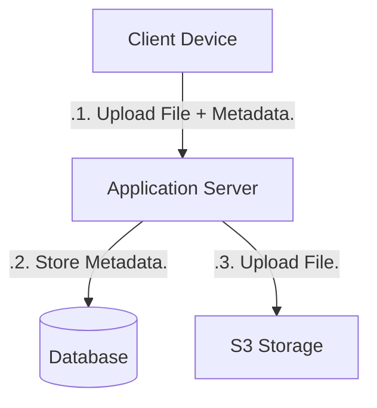
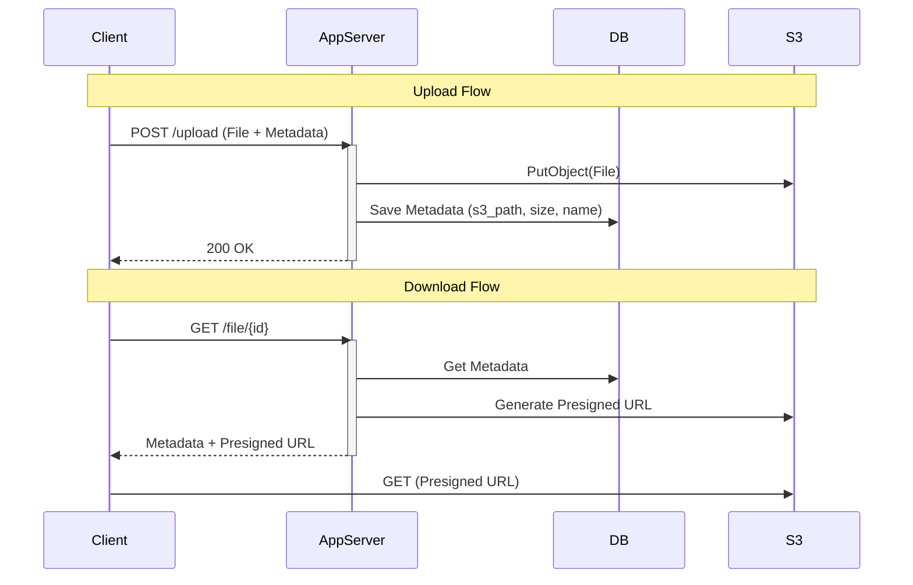

# simplestVersion — Stage 1 (Naive server-proxied upload)

This module demonstrates the simplest approach: the browser uploads the full file to the application server, which then stores the blob in S3 and records metadata in the database. It is intentionally minimal and useful for illustrating the trade-offs of a proxying approach.

## Design (high level)





## Pros / Cons

- Pros: trivial to implement; no client-side complexity.
- Cons: doubles server bandwidth (Client -> Server -> S3), ties up server threads/resources for large uploads, and may hit gateway size limits.

## Running locally

Prereqs: Java 21, Maven, Docker (for LocalStack if you want to run S3 locally).

```bash
cd simplestVersion
mvn test
mvn spring-boot:run
```

When running with LocalStack, make sure the shared `run-local.sh` from the repo root has been executed to create the demo bucket and configure CORS if you plan to exercise browser uploads.

## When to use

Use this approach only for the smallest projects or where server-side processing of the file is mandatory. For large files or high concurrency, prefer direct-to-S3 or chunked approaches (see other modules in this repo).
# Simplest Version — Stage 1 (Naive Server-proxied Upload)

This module demonstrates the most straightforward upload approach:

- The browser uploads the file to the application server.
- The application server writes the object to S3 and stores metadata in the DB.

When to use

- Useful as the simplest, easiest-to-understand starting point or for very small files.

Limitations

- Double bandwidth: file bytes travel Client → App → S3 (server uploads the file), which doubles server egress costs.
- Blocking: server threads/resources may be tied up during large uploads.
- Gateway / proxy size limits can prevent very large uploads.

Endpoints

- `POST /upload` — Server endpoint that accepts a file and metadata, stores in S3 and records metadata in DB.
- `GET /file/{id}` — Returns metadata + a presigned GET URL so the client may download from S3.

Run locally

This repository has a shared `run-local.sh` that brings up LocalStack and bootstraps the bucket for demos.

From the repo root:

```bash
# start local infra (LocalStack, create bucket, etc)
./run-local.sh

# run this module
cd simplestVersion
mvn -DskipTests spring-boot:run
```

Notes

- For real production uploads, prefer a direct-to-S3 pattern (Option A) or a chunked/dedup approach (Option B) to avoid server bandwidth overhead.
