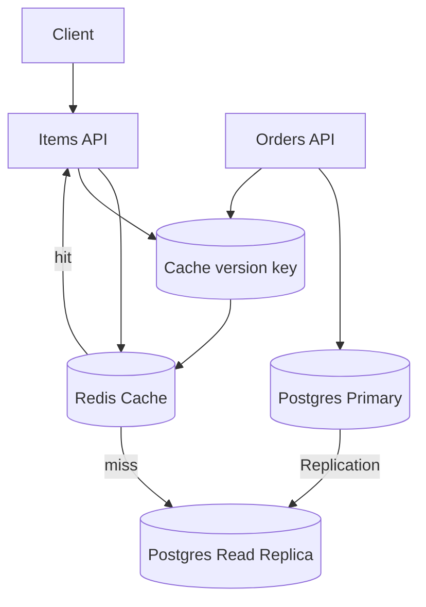

# cacheWithReadReplicas

This subproject demonstrates combining:
- **PostgreSQL read replicas** (read scaling)
- **Redis caching** (latency reduction)

It also introduces **cache versioning** to reduce stale reads when replicas lag.

## Architecture



## What this is demonstrating

- Read path uses cache first, then read replicas
- Write path updates primary and bumps an item/version key to prevent clients from reading too-stale cached data

## How to Run

Prereqs:
- Docker
- Java 21+
- Maven

Start infra:

```bash
docker compose up -d
```

Run the app:

```bash
mvn spring-boot:run
```

Quick smoke tests (after the app is running)

- Get items for a grid/location (uses cache + replica reads):

```bash
curl -sS "http://localhost:8080/items?lat=40.7128&lon=-74.0060" | jq .
```

- Place an order (this writes to primary and bumps cache version):

```bash
curl -sS -X POST http://localhost:8080/orders \
  -H 'Content-Type: application/json' \
  -d '{ "customerId":"<customer-uuid>", "lines":[{ "itemId":"<item-uuid>", "quantity":1 }] }' | jq .
```

- Confirm payment for an order:

```bash
curl -sS -X POST http://localhost:8080/orders/<order-uuid>/confirm-payment \
  -H 'Content-Type: application/json' \
  -d '{ "success": true }' | jq .
```

Expect the cache to be bumped on order placement/confirmation to avoid stale reads.

## Trade-offs / Notes

- Adds operational complexity (Redis + replica topology).
- Versioning reduces stale cache reads but introduces extra reads/writes to Redis.

## Task list

See [plan/TASKS.md](./plan/TASKS.md).
