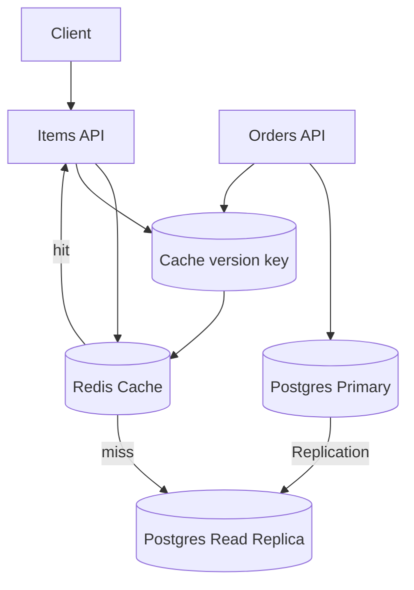

# cacheWithReadReplicas

This subproject demonstrates combining:
- **PostgreSQL read replicas** (read scaling)
- **Redis caching** (latency reduction)

It also introduces **cache versioning** to reduce stale reads when replicas lag.

## Architecture



```

Note: the service normally reads from a read-replica for better read throughput, but to avoid returning stale data immediately after a write it will temporarily bypass the replica and read from the primary. Concretely, if a write to a geographic grid happened very recently (the code uses a short "replica-lag guard" window), the service reads warehouses/inventory from the primary database for correctness; otherwise it reads from replicas for performance.


## What this is demonstrating

- Read path uses cache first, then read replicas
- Write path updates primary and bumps an item/version key to prevent clients from reading too-stale cached data

## How to Run

Prereqs:
- Docker
- Java 21+
- Maven

Start infra:

```bash
docker compose up -d
```

If you previously ran this project (or changed replication passwords/scripts), reset volumes:

```bash
docker compose down -v
docker compose up -d
```

Run the app:

```bash
mvn spring-boot:run
```

The API listens on `http://localhost:8095`.

Quick smoke tests (after the app is running)

### 1) Verify you really have primary + replica

This confirms the app is connected to **two different Postgres instances**:

```bash
curl -sS "http://localhost:8095/debug/db" | jq .
```

Expected:
- `primary_is_in_recovery` is `false`
- `replica_is_in_recovery` is `true`

You can also check replication lag (bytes):

```bash
curl -sS "http://localhost:8095/debug/lsn" | jq .
```

### 2) Verify caching (timed curls)

Make the same request twice. The second call should typically be faster due to Redis cache.

**bash / WSL**

```bash
curl -sS -o /dev/null -w "first  total=%{time_total}s\n" "http://localhost:8095/items?lat=40.730610&lon=-73.935242"
curl -sS -o /dev/null -w "second total=%{time_total}s\n" "http://localhost:8095/items?lat=40.730610&lon=-73.935242"
```

**Windows (PowerShell / CMD)**

```bat
curl.exe -sS -o NUL -w "first  total=%{time_total}s\n" "http://localhost:8095/items?lat=40.730610&lon=-73.935242"
curl.exe -sS -o NUL -w "second total=%{time_total}s\n" "http://localhost:8095/items?lat=40.730610&lon=-73.935242"
```

- Get items for a grid/location (uses cache + replica reads):

```bash
curl -sS "http://localhost:8095/items?lat=40.7128&lon=-74.0060" | jq .
```

- Place an order (this writes to primary and bumps cache version):

```bash
curl -sS -X POST http://localhost:8095/orders \
  -H 'Content-Type: application/json' \
  -d '{
    "customerId":"20000000-0000-0000-0000-000000000001",
    "lines":[{"itemId":"10000000-0000-0000-0000-000000000001","qty":1}]
  }' | jq .
```

You can time the POST to observe latency (bash/WSL):

```bash
curl -sS -o /dev/null -w "post total=%{time_total}s\n" -X POST http://localhost:8095/orders \
  -H 'Content-Type: application/json' \
  -d '{
    "customerId":"20000000-0000-0000-0000-000000000001",
    "lines":[{"itemId":"10000000-0000-0000-0000-000000000001","qty":1}]
  }'
```

On Windows (PowerShell / CMD):

```bat
curl.exe -sS -o NUL -w "post total=%{time_total}s\n" -X POST http://localhost:8095/orders \
  -H "Content-Type: application/json" \
  -d "{\"customerId\":\"20000000-0000-0000-0000-000000000001\",\"lines\":[{\"itemId\":\"10000000-0000-0000-0000-000000000001\",\"qty\":1}]}"
```

Immediately after placing an order, call `/items` again. The cache version bump + replica-lag guard avoids caching results computed from a stale replica:

```bash
curl -sS -o /dev/null -w "after-write total=%{time_total}s\n" "http://localhost:8095/items?lat=40.730610&lon=-73.935242"
curl -sS "http://localhost:8095/debug/lsn" | jq .
```

- Confirm payment for an order:
 - Confirm payment for an order (capture `orderId` from the POST response then use it):

**Bash / WSL**

```bash
# 1) Place an order and capture full JSON response
resp=$(curl -sS -X POST http://localhost:8095/orders \
  -H 'Content-Type: application/json' \
  -d '{"customerId":"20000000-0000-0000-0000-000000000001","lines":[{"itemId":"10000000-0000-0000-0000-000000000001","qty":1}] }')

# Inspect the response
echo "$resp" | jq .

# 2) Extract the order UUID into a shell variable
orderId=$(echo "$resp" | jq -r '.orderId')
echo "orderId=$orderId"

# 3) Confirm payment using the captured UUID (timed)
curl -sS -o /dev/null -w "confirm total=%{time_total}s\n" -X POST "http://localhost:8095/orders/$orderId/confirm-payment" \
  -H 'Content-Type: application/json' \
  -d '{ "success": true }'

# 1-line: place -> extract -> confirm
curl -sS -X POST http://localhost:8095/orders -H 'Content-Type: application/json' -d '{"customerId":"20000000-0000-0000-0000-000000000001","lines":[{"itemId":"10000000-0000-0000-0000-000000000001","qty":1}] }' \
  | jq -r '.orderId' \
  | xargs -I{} curl -sS -o /dev/null -w "confirm total=%{time_total}s\n" -X POST "http://localhost:8095/orders/{}/confirm-payment" -H 'Content-Type: application/json' -d '{ "success": true }'
```

**Windows (PowerShell / CMD)**

```bat
REM Place order, capture JSON to a temporary file and inspect
curl.exe -sS -o resp.json -X POST http://localhost:8095/orders -H "Content-Type: application/json" -d "{\"customerId\":\"20000000-0000-0000-0000-000000000001\",\"lines\":[{\"itemId\":\"10000000-0000-0000-0000-000000000001\",\"qty\":1}]}"
type resp.json

REM Extract orderId (PowerShell):
powershell -Command "(Get-Content resp.json | ConvertFrom-Json).orderId"

REM Confirm payment (replace <order-id> with the extracted id):
curl.exe -sS -o NUL -w "confirm total=%{time_total}s\n" -X POST "http://localhost:8095/orders/<order-id>/confirm-payment" -H "Content-Type: application/json" -d "{ \"success\": true }"
```

Expect the cache to be bumped on order placement/confirmation to avoid stale reads.

## Trade-offs / Notes

- Adds operational complexity (Redis + replica topology).
- Versioning reduces stale cache reads but introduces extra reads/writes to Redis.

## Task list

See [plan/TASKS.md](./plan/TASKS.md).
