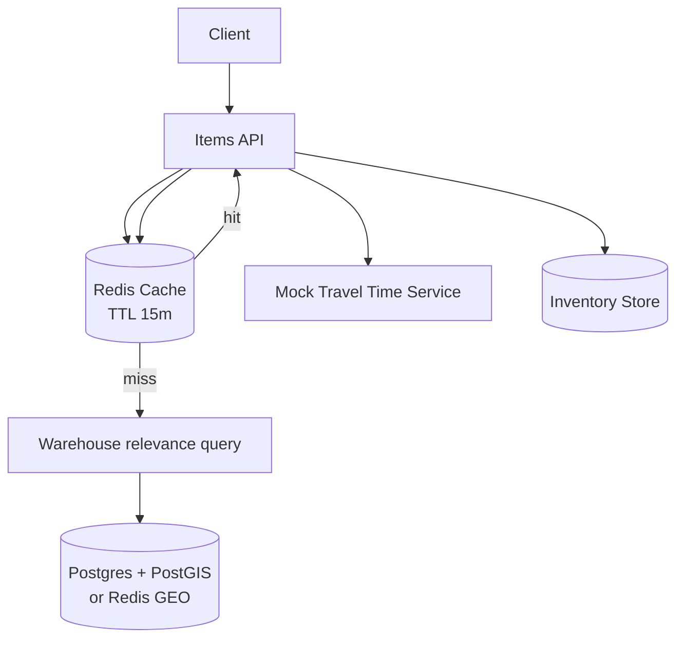

# cachingWithRedisGeo

This subproject demonstrates **caching deliverable items per location** using Redis.

Key idea:
- Users should get “items deliverable within 1 hour” in ~100ms.
- We cache by **location grid** (1km x 1km) with a TTL of **15 minutes**.
- Cache value is computed from:
  - Warehouses relevant to the grid (geo query)
  - Inventory in those warehouses
  - Travel-time estimate (mock service based on distance)

## Architecture



## How to Run

Prereqs:
- Docker
- Java 21+
- Maven

Start infra:

```bash
docker compose up -d
```

Run the app:

```bash
mvn spring-boot:run
```

## Trade-offs / Notes

- Great for fast reads, but cache introduces staleness.
- 1km grid makes cache keys stable and limits cache cardinality, but adds boundary effects (users near grid edges).

## Task list

See [plan/TASKS.md](./plan/TASKS.md).
