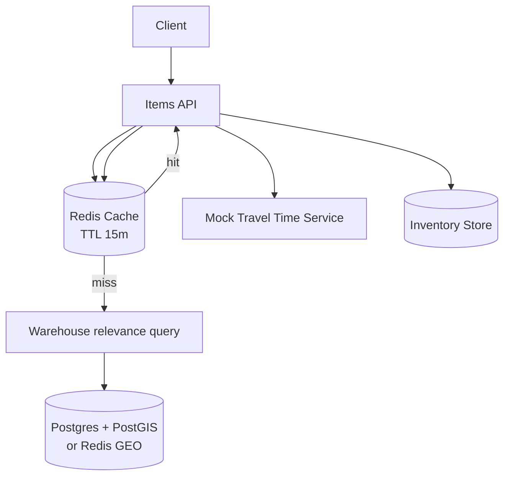

# cachingWithRedisGeo

This subproject demonstrates **caching deliverable items per location** using Redis.

Key idea:
- Users should get “items deliverable within 1 hour” in ~100ms.
- We cache by **location grid** (1km x 1km) with a TTL of **15 minutes**.
- Cache value is computed from:
  - Warehouses relevant to the grid (geo query)
  - Inventory in those warehouses
  - Travel-time estimate (mock service based on distance)

## Architecture



## How to Run

Prereqs:
- Docker
- Java 21+
- Maven

Start infra:

```bash
docker compose up -d
```

Run the app:

```bash
mvn spring-boot:run
```

## Trade-offs / Notes

- Great for fast reads, but cache introduces staleness.
- 1km grid makes cache keys stable and limits cache cardinality, but adds boundary effects (users near grid edges).

## Task list

See [plan/TASKS.md](./plan/TASKS.md).

## Additional Run & Test Details (from RUN_INSTRUCTIONS)

Append: Detailed run steps, ports, and expected output used by the project.

- Infrastructure (docker-compose):
  - Redis container exposes host port `6379` (container 6379)
  - PostGIS/Postgres container is expected on host port `5433` (container 5432)

- Application configuration (see `src/main/resources/application.yml`):
  - `server.port`: 8093
  - `spring.data.redis.port`: 6379
  - Postgres JDBC URL expects host `localhost:5433` (database `local_delivery`)

- Run commands (from repo root `localDelivery/cachingWithRedisGeo`):
```bash
docker compose up -d
mvn clean install
mvn spring-boot:run
```

- Test the API (manual):
```bash
# Measure elapsed time and observe caching by running twice:
time curl "http://localhost:8093/items?lat=40.7128&lon=-74.0060" | jq

# Run the same request twice to see cache effect (first = cold, second = hot):
time curl "http://localhost:8093/items?lat=40.7128&lon=-74.0060" | jq

Expected response (Downtown - `lat=40.7128&lon=-74.0060`):
```json
[
  { "itemId": "item1", "name": "Milk",  "warehouseId": "wh1", "travelTimeSeconds": 0 },
  { "itemId": "item2", "name": "Bread", "warehouseId": "wh1", "travelTimeSeconds": 0 },
  { "itemId": "item3", "name": "Eggs",  "warehouseId": "wh1", "travelTimeSeconds": 0 },
  { "itemId": "item4", "name": "Cheese", "warehouseId": "wh2", "travelTimeSeconds": 533 },
  { "itemId": "item5", "name": "Butter", "warehouseId": "wh2", "travelTimeSeconds": 533 },
  { "itemId": "item6", "name": "Yogurt", "warehouseId": "wh3", "travelTimeSeconds": 649 }
]
```
```

Additional quick curl checks:

```bash
# Midtown (Times Square / Midtown)
time curl "http://localhost:8093/items?lat=40.7580&lon=-73.9855" | jq
time curl "http://localhost:8093/items?lat=40.7580&lon=-73.9855" | jq

Expected response (Midtown - `lat=40.7580&lon=-73.9855`):
```json
[
  { "itemId": "item1", "name": "Milk",  "warehouseId": "wh2", "travelTimeSeconds": 0 },
  { "itemId": "item4", "name": "Cheese","warehouseId": "wh2", "travelTimeSeconds": 0 },
  { "itemId": "item5", "name": "Butter","warehouseId": "wh2", "travelTimeSeconds": 0 },
  { "itemId": "item2", "name": "Bread", "warehouseId": "wh1", "travelTimeSeconds": 533 },
  { "itemId": "item3", "name": "Eggs",  "warehouseId": "wh1", "travelTimeSeconds": 533 },
  { "itemId": "item6", "name": "Yogurt", "warehouseId": "wh3", "travelTimeSeconds": 955 }
]
```


# Brooklyn (expect different travel times / warehouses)
time curl "http://localhost:8093/items?lat=40.6782&lon=-73.9442" | jq
time curl "http://localhost:8093/items?lat=40.6782&lon=-73.9442" | jq

Expected response (Brooklyn - `lat=40.6782&lon=-73.9442`):
```json
[
  { "itemId": "item2", "name": "Bread", "warehouseId": "wh3", "travelTimeSeconds": 0 },
  { "itemId": "item3", "name": "Eggs",  "warehouseId": "wh3", "travelTimeSeconds": 0 },
  { "itemId": "item6", "name": "Yogurt", "warehouseId": "wh3", "travelTimeSeconds": 0 },
  { "itemId": "item1", "name": "Milk",  "warehouseId": "wh1", "travelTimeSeconds": 650 },
  { "itemId": "item4", "name": "Cheese","warehouseId": "wh2", "travelTimeSeconds": 955 },
  { "itemId": "item5", "name": "Butter","warehouseId": "wh2", "travelTimeSeconds": 955 }
]
```

# Far away (no warehouses nearby) — useful to check empty results
time curl "http://localhost:8093/items?lat=34.0522&lon=-118.2437" | jq

Expected response (Far away - `lat=34.0522&lon=-118.2437`):
```json
[]
```
```

- Unit test: a `GridKey` JUnit test is available at `src/test/java/com/example/localdelivery/cachingredisgeo/GridKeyTest.java`. Run with `mvn test`.


