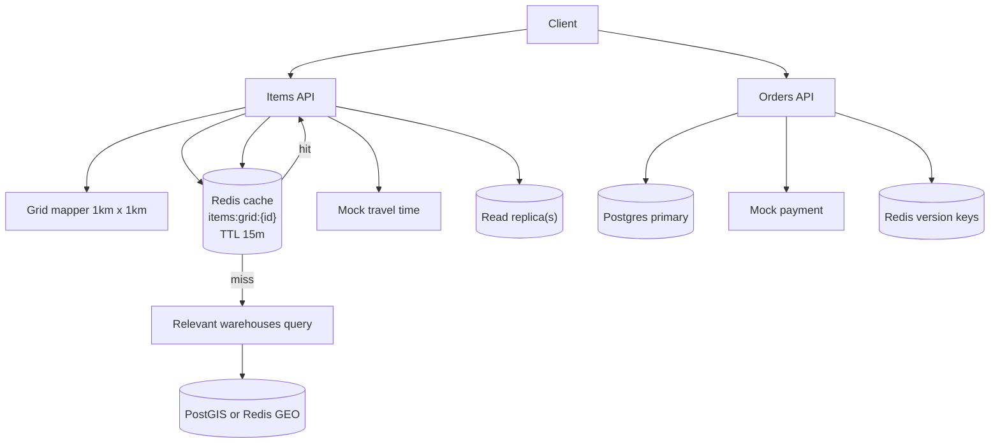

# optimizedLocalDeliveryService

This subproject is an optimized version of the local delivery service.

Target behaviors:
- `GET /items` aims for ~100ms by using:
  - 1km x 1km **grid clustering** for location-based keys
  - Redis caching for “deliverable items per grid” (TTL 15 minutes)
  - Redis GEO / PostGIS to find relevant warehouses quickly
  - Postgres read replicas for scaling reads

- `POST /orders` aims for ~2s and stays consistent by using primary DB transactions for inventory reservations.

## Architecture



## How to Run

Prereqs:
- Docker
- Java 21+
- Maven

Start infra:

```bash
docker compose up -d
```

Run the app:

```bash
mvn spring-boot:run
```

Quick smoke tests (after the app is running)

- Get deliverable items for a grid/location (cache + geo):

```bash
curl -sS "http://localhost:8097/items?lat=40.7128&lon=-74.0060" | jq .
```

- Place an order (writes to primary, bumps version):

```bash
# Seeded demo IDs (see src/main/resources/db/migration/V1__init.sql):
# - Customer (Alice): 20000000-0000-0000-0000-000000000001
# - Item (Milk):     10000000-0000-0000-0000-000000000001

ORDER_ID=$(curl -sS -X POST http://localhost:8097/orders \
  -H 'Content-Type: application/json' \
  -d '{"customerId":"20000000-0000-0000-0000-000000000001","lines":[{"itemId":"10000000-0000-0000-0000-000000000001","qty":1}]}' | jq -r '.orderId')

echo "Created order: $ORDER_ID"
```

- Confirm payment for an order:

```bash
# Confirm the order using the ORDER_ID returned above
curl -sS -X POST "http://localhost:8097/orders/$ORDER_ID/confirm-payment" \
  -H 'Content-Type: application/json' \
  -d '{"success": true}' | jq .
```

Notes:
- Cache TTL: 15 minutes for `items:grid:{id}:v{ver}` keys.
- Warehouses are indexed into Redis GEO at startup by `WarehouseGeoIndexer`.

## Trade-offs / Notes

- Optimizes for the read SLA using cache + precomputation.
- Writes remain consistent but require careful locking / reservation patterns.
- Versioned caching reduces stale reads but adds complexity.

## Task list

See [plan/TASKS.md](./plan/TASKS.md).
