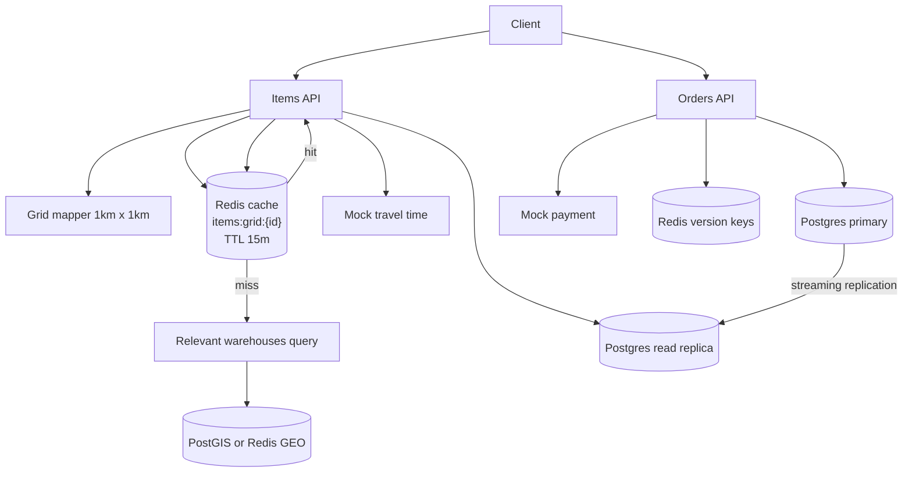

# optimizedLocalDeliveryService

This subproject is an optimized version of the local delivery service.

Target behaviors:
- `GET /items` aims for ~100ms by using:
  - 1km x 1km **grid clustering** for location-based keys
  - Redis caching for “deliverable items per grid” (TTL 15 minutes)
  - Redis GEO / PostGIS to find relevant warehouses quickly
  - Postgres read replica(s) for scaling reads

- `POST /orders` aims for ~2s and stays consistent by using primary DB transactions for inventory reservations.

## Architecture



### What this example demonstrates

This project is meant to be read like a “system design cookbook”:

- **Geo index in Redis GEO**: warehouses are indexed once at startup (fast proximity search)
- **Inventory reads from a replica**: the heavy read endpoint (`GET /items`) uses the replica datasource
- **Redis cache for computed results**: cache the computed deliverable-items result per grid
- **Cache versioning**: writes bump a version so reads never accidentally use stale cached results

Cache keys (read path):

- Version key: `items:grid:{gridId}:version`
- Data key (versioned): `items:grid:{gridId}:v{version}` (TTL 15 minutes)

## How to Run

Prereqs:
- Docker
- Java 21+
- Maven

Start infra:

```bash
docker compose up -d
```

Or use the helper scripts (recommended):

- Bash/WSL: `./scripts/infra-up.sh`
- PowerShell: `./scripts/infra-up.ps1`

Infra notes:

- The compose file starts **Redis**, **Postgres primary**, and a **Postgres replica**.
- The replica is created via streaming replication. On first boot it will wait until the primary has a schema.
  That happens when you run the app the first time (Flyway migrations).

Run the app:

```bash
mvn spring-boot:run
```

## Tests (unit + integration)

This subproject uses:

- Unit tests: run with `mvn test`
- Integration tests: run with `mvn verify` (tests named `*IT.java`)

Integration tests expect the docker-compose infra to be running.

Copy/paste:

```bash
./scripts/run-tests.sh
```

PowerShell:

```powershell
./scripts/run-tests.ps1
```

## Smoke script

Runs infra + builds a jar + starts the app + executes a few curl requests:

```bash
./scripts/smoke.sh
```

PowerShell:

```powershell
./scripts/smoke.ps1
```

## Verify Redis + both Postgres nodes are running

See containers:

```bash
docker compose ps
```

Check Postgres roles (copy/paste):

```bash
# Primary should say: f
docker exec -it optimized-postgres-primary psql -U local -d local_delivery -c "select pg_is_in_recovery();"

# Replica should say: t
docker exec -it optimized-postgres-replica psql -U local -d local_delivery -c "select pg_is_in_recovery();"
```

Optional: see replication status on primary:

```bash
docker exec -it optimized-postgres-primary psql -U local -d local_delivery -c "select client_addr, state, sync_state from pg_stat_replication;"
```

Verify Redis is reachable:

```bash
docker exec -it optimized-redis redis-cli PING
```

Quick smoke tests (after the app is running)

- Get deliverable items for a grid/location (cache + geo):

```bash
curl -sS "http://localhost:8097/items?lat=40.7128&lon=-74.0060" | jq .
```

Show the app is connecting to the **replica** for reads:

```bash
docker exec -it optimized-postgres-replica psql -U local -d local_delivery -c "select usename, state, client_addr, left(query, 80) as query from pg_stat_activity where usename = 'local' order by state;"
```

- Place an order (writes to primary, bumps version):

```bash
# Seeded demo IDs (see src/main/resources/db/migration/V1__init.sql):
# - Customer (Alice): 20000000-0000-0000-0000-000000000001
# - Item (Milk):     10000000-0000-0000-0000-000000000001

ORDER_ID=$(curl -sS -X POST http://localhost:8097/orders \
  -H 'Content-Type: application/json' \
  -d '{"customerId":"20000000-0000-0000-0000-000000000001","lines":[{"itemId":"10000000-0000-0000-0000-000000000001","qty":1}]}' | jq -r '.orderId')

echo "Created order: $ORDER_ID"
```

Show the app is connecting to the **primary** for writes:

```bash
docker exec -it optimized-postgres-primary psql -U local -d local_delivery -c "select usename, state, client_addr, left(query, 80) as query from pg_stat_activity where usename = 'local' order by state;"
```

- Confirm payment for an order:

```bash
# Confirm the order using the ORDER_ID returned above
curl -sS -X POST "http://localhost:8097/orders/$ORDER_ID/confirm-payment" \
  -H 'Content-Type: application/json' \
  -d '{"success": true}' | jq .
```

Notes:
- Cache TTL: 15 minutes for `items:grid:{id}:v{ver}` keys.
- Warehouses are indexed into Redis GEO at startup by `WarehouseGeoIndexer`.

## When to use these patterns

- **Redis GEO**: good when you need fast “nearest X locations” queries at high QPS and can tolerate eventual refresh of the geo index.
- **Read replicas**: good when reads massively exceed writes (e.g., browse/search traffic). Expect replication lag.
- **Replica + cache + versioning**: helps when lag could otherwise cause stale computations. Versioning makes old cached results unreachable after a write.

Rough “when it’s worth it” examples (ballpark):

- Move to **read replicas** when reads are saturating primary (CPU/IO) and you can tolerate lag for read endpoints.
- Add **Redis caching** when you have repeated identical computations (same gridId/location) and want predictable low latency.
- Add **versioned cache keys** when you must avoid serving stale cached reads after writes (even if replicas lag).

## Trade-offs / Notes

- Optimizes for the read SLA using cache + precomputation.
- Writes remain consistent but require careful locking / reservation patterns.
- Versioned caching reduces stale reads but adds complexity.

## Task list

See [plan/TASKS.md](./plan/TASKS.md).
