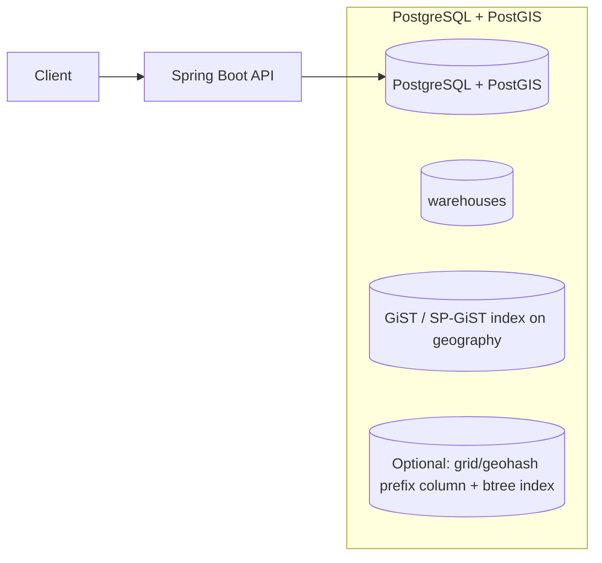

# postgresGeo

This subproject demonstrates **basic geospatial functionality in PostgreSQL using PostGIS**.

Focus:
- Store warehouse locations (lat/lon)
- Query “warehouses within radius” and “nearest warehouses”
- Show the shape of a “prefix-like” approach for narrowing search space (grid/geohash prefix) before exact distance filtering

## Architecture



## What this is demonstrating

- PostGIS `geography(Point, 4326)` (or `geometry`) columns
- Distance queries such as “within X meters”
- Indexing:
  - Spatial index (GiST/SP-GiST) for distance filtering
  - Optional “prefix” narrowing (grid key / geohash prefix) to reduce candidate set before calling exact distance

## How to Run

Prereqs:
- Docker (or Docker Desktop)
- Java 21+
- Maven

Start Postgres + PostGIS:

```bash
docker compose up -d
```

Run the app:

```bash
mvn spring-boot:run
```

Quick smoke tests (after the app is running)

- Start the app (background) or run in another terminal:

```bash
# from project root
cd localDelivery/postgresGeo
mvn spring-boot:run
```

- List all warehouses:

```bash
curl -sS http://localhost:8091/warehouses | jq .
```

- Find warehouses within a radius (meters):

```bash
curl -sS "http://localhost:8091/warehouses/nearby?lat=40.7128&lon=-74.0060&radiusMeters=5000" | jq .
```

- Find nearest warehouses (limit):

```bash
curl -sS "http://localhost:8091/warehouses/nearest?lat=40.7128&lon=-74.0060&limit=3" | jq .
```

- Use the two-phase (grid-prefilter) option for the nearby query:

```bash
curl -sS "http://localhost:8091/warehouses/nearby?lat=40.7128&lon=-74.0060&radiusMeters=5000&twoPhase=true" | jq .
```

Note: `jq` is optional but makes JSON output readable. Adjust `lat`, `lon`, and parameters as needed.

## Trade-offs / Notes

- PostGIS gives accurate distance filtering and rich geospatial operators.
- Adding a grid/geohash prefix column can reduce expensive distance checks at very high scale, but adds extra modeling and edge-case handling at grid boundaries.

## Task list

See `plan/TASKS.md`.
