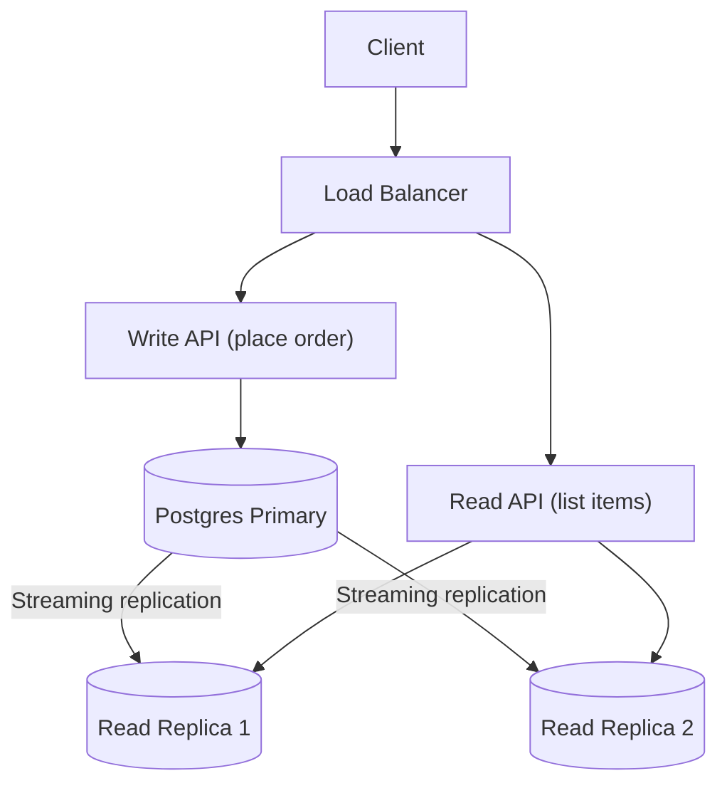

# postgresReadReplicas

This subproject demonstrates **PostgreSQL streaming replication** to create **read replicas** for read-heavy operations.

Goal:
- Route read-heavy endpoints (like listing items) to replicas
- Keep write endpoints (placing orders) on the primary for correctness

## Architecture



## How to Run

Prereqs:
- Docker
- Java 21+
- Maven

Start primary + replicas:

```bash
docker compose up -d
```

Run the sample app:

```bash
mvn spring-boot:run
```

Quick smoke tests (after the app is running)

- List deliverable items for a customerId
```bash
time curl "http://localhost:8094/items?customerId=20000000-0000-0000-0000-000000000001" | jq
```

### Replication debugging endpoints

I added a small debug endpoint to inspect WAL positions on the primary and replica:

- `GET /debug/lsn` — returns JSON with `primary_lsn`, `replica_lsn`, and `lag_bytes` (difference in bytes between primary and replica replay positions).

Example:

```bash
curl -sS http://localhost:8094/debug/lsn | jq
```

You can use this to observe replication lag after performing writes.

example result

```bash
[
  {
    "itemId": "10000000-0000-0000-0000-000000000001",
    "name": "Milk",
    "warehouseId": "00000000-0000-0000-0000-000000000002",
    "travelTimeSeconds": 522
  },
  {
    "itemId": "10000000-0000-0000-0000-000000000004",
    "name": "Cheese",
    "warehouseId": "00000000-0000-0000-0000-000000000002",
    "travelTimeSeconds": 522
  },
  {
    "itemId": "10000000-0000-0000-0000-000000000002",
    "name": "Bread",
    "warehouseId": "00000000-0000-0000-0000-000000000003",
    "travelTimeSeconds": 588
  },
  {
    "itemId": "10000000-0000-0000-0000-000000000003",
    "name": "Eggs",
    "warehouseId": "00000000-0000-0000-0000-000000000003",
    "travelTimeSeconds": 588
  }
]

real    0m0.025s
user    0m0.012s
sys     0m0.018s
```

- Place an order (example):

```bash
time curl -sS -X POST http://localhost:8094/orders   -H 'Content-Type: application/json'   -d '{ "customerId":"20000000-0000-0000-0000-000000000001", "lines":[{ "itemId":"10000000-0000-0000-0000-000000000003", "qty":1 }] }' | jq
```

example result

```bash
{
  "orderId": "500648fc-8e61-47b6-b113-5af9d9e1cd59",
  "customerId": "20000000-0000-0000-0000-000000000001",
  "status": "PENDING_PAYMENT",
  "createdAt": "2025-12-17T20:16:50.263790865Z",
  "lines": [
    {
      "orderId": "500648fc-8e61-47b6-b113-5af9d9e1cd59",
      "itemId": "10000000-0000-0000-0000-000000000003",
      "warehouseId": "00000000-0000-0000-0000-000000000003",
      "qty": 1
    }
  ]
}

real    0m0.141s
user    0m0.005s
sys     0m0.012s
```

- Confirm payment: (take the orderId from the previous stage)

```bash
time curl -sS -X POST http://localhost:8094/orders/500648fc-8e61-47b6-b113-5af9d9e1cd59/confirm-payment \
  -H 'Content-Type: application/json' \
  -d '{ "success": true }' | jq .
```

example result

```bash
{
  "orderId": "500648fc-8e61-47b6-b113-5af9d9e1cd59",
  "customerId": "20000000-0000-0000-0000-000000000001",
  "status": "PAID",
  "createdAt": "2025-12-17T20:16:50.263791Z",
  "lines": [
    {
      "orderId": "500648fc-8e61-47b6-b113-5af9d9e1cd59",
      "itemId": "10000000-0000-0000-0000-000000000003",
      "warehouseId": "00000000-0000-0000-0000-000000000003",
      "qty": 1
    }
  ]
}

real    0m0.049s
user    0m0.004s
sys     0m0.007s
```

Note: replica reads are used for `GET /items` by default; expect possible eventual consistency after writes.

## How replication is implemented in this repo

- The app is wired for read/write split: `WriteDao` uses the `primary` datasource, `ReadDao` uses the `replica` datasource. The beans are defined in `src/main/java/.../config/DataSourceConfig.java` and configured by `src/main/resources/application.yml`.
- The Docker Compose setup in this folder now brings up:
  - `postgres-primary` on host port `5440`
  - `postgres-replica` on host port `5441`

What the scripts do:
- On primary startup an init script (`docker/postgres/init-primary.sh`) creates a `replicator` role with replication rights and sets `wal_level`, `max_wal_senders`, etc.
- The replica image performs a base backup (`pg_basebackup -R`) from the primary (uses the `replicator` user) and starts in standby mode.

## Show replication and lag (step-by-step)

1. Start infra and app:

```bash
docker compose up -d
mvn -f localDelivery/postgresReadReplicas/pom.xml spring-boot:run
```

2. Get initial WAL positions:

```bash
curl -sS http://localhost:8094/debug/lsn | jq
```

3. Perform a write (place an order):

```bash
ORDER_ID=$(curl -sS -X POST http://localhost:8094/orders \
  -H 'Content-Type: application/json' \
  -d '{ "customerId":"20000000-0000-0000-0000-000000000001", "lines":[{ "itemId":"10000000-0000-0000-0000-000000000003", "qty":1 }] }' | jq -r '.orderId')
echo "created order $ORDER_ID"
```

4. Immediately check LSNs again (replica may lag):

```bash
curl -sS http://localhost:8094/debug/lsn | jq
```

If `lag_bytes` is 0 the replica has applied the WAL up to the current primary LSN. If it's >0 you can poll until it drops.

## Notes and caveats

- This demo uses simple passwords and open pg_hba rules for convenience — do not use this in production.
- The replica startup uses `pg_basebackup -R` to create a standby. That is sufficient for demo purposes; for production consider backup strategies, monitoring, and proper failover tooling.
- For strict read-your-writes semantics you must read from primary or use synchronous replication with appropriate configuration.

## Demo: write then read until replica catches up

Use these commands to create a write on the primary and repeatedly read the replica until the new data is visible.

1. Start infra and app (if not already running):

```bash
docker compose up -d
mvn -f localDelivery/postgresReadReplicas/pom.xml spring-boot:run &
```

2. Create a write (place an order) and capture the `ORDER_ID`:

```bash
ORDER_ID=$(curl -sS -X POST http://localhost:8094/orders \
  -H 'Content-Type: application/json' \
  -d '{ "customerId":"20000000-0000-0000-0000-000000000001", "lines":[{ "itemId":"10000000-0000-0000-0000-000000000003", "qty":1 }] }' | jq -r '.orderId')
echo "created order $ORDER_ID"
```

3. Watch WAL LSNs / lag while the replica catches up:

```bash
curl -sS http://localhost:8094/debug/lsn | jq
```

4. Poll until `lag_bytes` reaches zero (replica caught up):

```bash
while [ "$(curl -sS http://localhost:8094/debug/lsn | jq -r .lag_bytes)" -ne 0 ]; do
  curl -sS http://localhost:8094/debug/lsn | jq
  sleep 1
done
echo "replica caught up (lag_bytes == 0)"
```

5. Verify the order appears on the replica (direct DB check):

```bash
until docker exec -i postgres-replica psql -U local -d local_delivery -tAc \
  "SELECT 1 FROM orders WHERE order_id = '$ORDER_ID';" | grep -q 1; do
  echo "waiting for order to appear on replica..."
  sleep 1
done
echo "order present on replica"
```

Notes:
- You can correlate the `debug/lsn` output with the DB poll to observe how `lag_bytes` decreases as WAL is replayed.
- Alternatively, add an HTTP read endpoint that queries `orders` via the replica datasource if you prefer a pure curl-based demo.

## Trade-offs / Notes

- Replication is eventually consistent (replica lag).
- Read-your-writes is not guaranteed when reading from replicas immediately after a write.

## Task list

See [plan/TASKS.md](./plan/TASKS.md).
