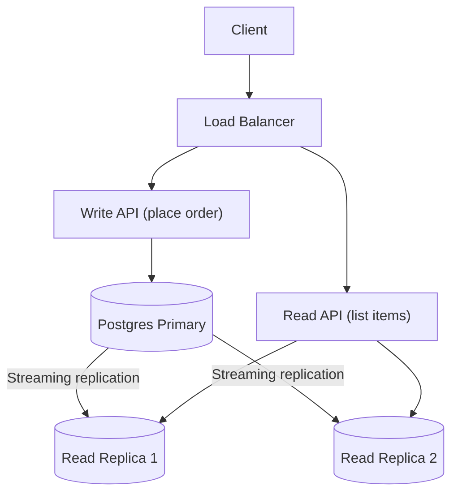

# postgresReadReplicas

This subproject demonstrates **PostgreSQL streaming replication** to create **read replicas** for read-heavy operations.

Goal:
- Route read-heavy endpoints (like listing items) to replicas
- Keep write endpoints (placing orders) on the primary for correctness

## Architecture



## How to Run

Prereqs:
- Docker
- Java 21+
- Maven

Start primary + replicas:

```bash
docker compose up -d
```

Run the sample app:

```bash
mvn spring-boot:run
```

Quick smoke tests (after the app is running)

- List deliverable items for a customerId
```bash
time curl "http://localhost:8094/items?customerId=20000000-0000-0000-0000-000000000001" | jq
```

example result

```bash
[
  {
    "itemId": "10000000-0000-0000-0000-000000000001",
    "name": "Milk",
    "warehouseId": "00000000-0000-0000-0000-000000000002",
    "travelTimeSeconds": 522
  },
  {
    "itemId": "10000000-0000-0000-0000-000000000004",
    "name": "Cheese",
    "warehouseId": "00000000-0000-0000-0000-000000000002",
    "travelTimeSeconds": 522
  },
  {
    "itemId": "10000000-0000-0000-0000-000000000002",
    "name": "Bread",
    "warehouseId": "00000000-0000-0000-0000-000000000003",
    "travelTimeSeconds": 588
  },
  {
    "itemId": "10000000-0000-0000-0000-000000000003",
    "name": "Eggs",
    "warehouseId": "00000000-0000-0000-0000-000000000003",
    "travelTimeSeconds": 588
  }
]

real    0m0.025s
user    0m0.012s
sys     0m0.018s
```

- Place an order (example):

```bash
time curl -sS -X POST http://localhost:8094/orders   -H 'Content-Type: application/json'   -d '{ "customerId":"20000000-0000-0000-0000-000000000001", "lines":[{ "itemId":"10000000-0000-0000-0000-000000000003", "qty":1 }] }' | jq
```

example result

```bash
{
  "orderId": "500648fc-8e61-47b6-b113-5af9d9e1cd59",
  "customerId": "20000000-0000-0000-0000-000000000001",
  "status": "PENDING_PAYMENT",
  "createdAt": "2025-12-17T20:16:50.263790865Z",
  "lines": [
    {
      "orderId": "500648fc-8e61-47b6-b113-5af9d9e1cd59",
      "itemId": "10000000-0000-0000-0000-000000000003",
      "warehouseId": "00000000-0000-0000-0000-000000000003",
      "qty": 1
    }
  ]
}

real    0m0.141s
user    0m0.005s
sys     0m0.012s
```

- Confirm payment: (take the orderId from the previous stage)

```bash
time curl -sS -X POST http://localhost:8094/orders/500648fc-8e61-47b6-b113-5af9d9e1cd59/confirm-payment \
  -H 'Content-Type: application/json' \
  -d '{ "success": true }' | jq .
```

example result

```bash
{
  "orderId": "500648fc-8e61-47b6-b113-5af9d9e1cd59",
  "customerId": "20000000-0000-0000-0000-000000000001",
  "status": "PAID",
  "createdAt": "2025-12-17T20:16:50.263791Z",
  "lines": [
    {
      "orderId": "500648fc-8e61-47b6-b113-5af9d9e1cd59",
      "itemId": "10000000-0000-0000-0000-000000000003",
      "warehouseId": "00000000-0000-0000-0000-000000000003",
      "qty": 1
    }
  ]
}

real    0m0.049s
user    0m0.004s
sys     0m0.007s
```

Note: replica reads are used for `GET /items` by default; expect possible eventual consistency after writes.

## Trade-offs / Notes

- Replication is eventually consistent (replica lag).
- Read-your-writes is not guaranteed when reading from replicas immediately after a write.

## Task list

See [plan/TASKS.md](./plan/TASKS.md).
