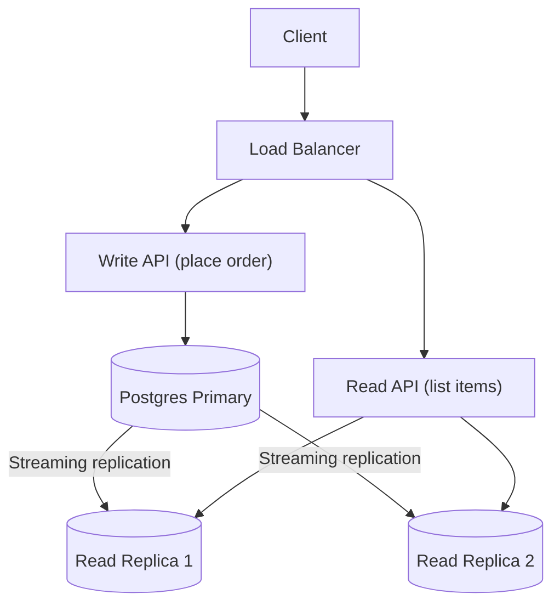

# postgresReadReplicas

This subproject demonstrates **PostgreSQL streaming replication** to create **read replicas** for read-heavy operations.

Goal:
- Route read-heavy endpoints (like listing items) to replicas
- Keep write endpoints (placing orders) on the primary for correctness

## Architecture



## How to Run

Prereqs:
- Docker
- Java 21+
- Maven

Start primary + replicas:

```bash
docker compose up -d
```

Run the sample app:

```bash
mvn spring-boot:run
```

## Trade-offs / Notes

- Replication is eventually consistent (replica lag).
- Read-your-writes is not guaranteed when reading from replicas immediately after a write.

## Task list

See `plan/TASKS.md`.
