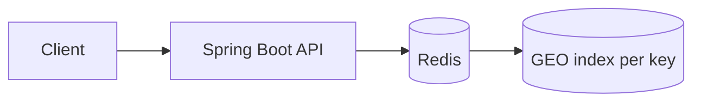

# redisGeo

This subproject demonstrates **basic geospatial functionality in Redis** using GEO commands.

Focus:
- Store warehouse locations with `GEOADD`
- Query nearby warehouses via `GEOSEARCH` / `GEORADIUS`
- Use key design that supports “prefix-like” access patterns (e.g., city/region prefixes)

## Architecture



## How to Run

Prereqs:
- Docker
- Java 21+
- Maven

Start Redis:

```bash
docker compose up -d
```

Run the app:

```bash
mvn spring-boot:run
```

Quick smoke tests (after the app is running)

- List all warehouses:

```bash
curl -sS http://localhost:8080/warehouses | jq .
```

- Find nearby warehouses (radius in meters):

```bash
curl -sS "http://localhost:8080/warehouses/nearby?lat=40.7128&lon=-74.0060&radiusMeters=5000" | jq .
```

- Find nearest warehouses (limit):

```bash
curl -sS "http://localhost:8080/warehouses/nearest?lat=40.7128&lon=-74.0060&limit=3" | jq .
```

Adjust `lat`/`lon` as needed.

## Trade-offs / Notes

- Redis GEO queries are fast and easy to operationalize.
- Redis GEO uses geohash internally; accuracy is “good enough” for proximity queries, but you still need to think about units, radius cutoffs, and bounding.

## Task list

See `plan/TASKS.md`.
