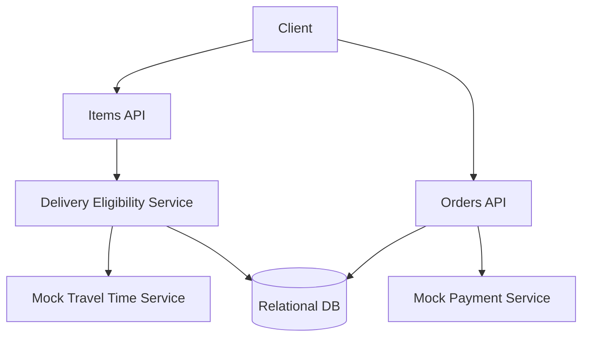

# simpleLocalDeliveryService

This subproject is a **simple, correct** local delivery service.

Scope:
- Warehouses with inventory
- Customers can place orders
- Orders reserve inventory while payment is pending (mock payment)
- Deliverability is computed with a **mock travel time** service based on distance (no caching yet)

Non-functional goals (in this simplified version):
- Keep the code clean and testable
- Demonstrate the baseline behavior before applying caching/geo optimizations

## Architecture



## How to Run

Prereqs:
- Docker
- Java 21+
- Maven

Start Postgres:

```bash
docker compose up -d
```

Run the app:

```bash
mvn spring-boot:run
```

## Trade-offs / Notes

- No caching yet: item listing might not meet 100ms in worst cases.
- Prioritizes correctness for orders: use transactions/locking to avoid overselling.

## Task list

See `plan/TASKS.md`.
