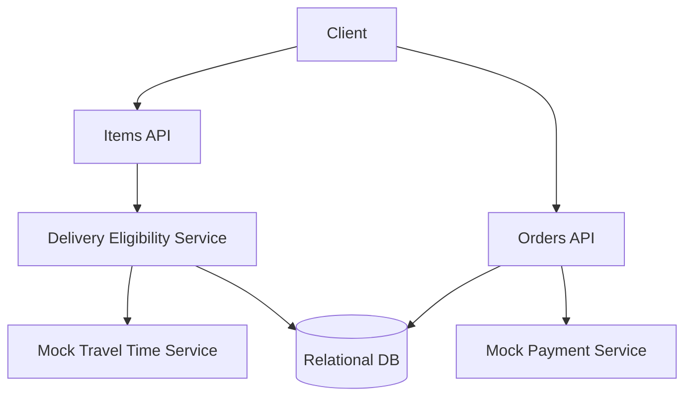

# simpleLocalDeliveryService

This subproject is a **simple, correct** local delivery service.

Scope:
- Warehouses with inventory
- Customers can place orders
- Orders reserve inventory while payment is pending (mock payment)
- Deliverability is computed with a **mock travel time** service based on distance (no caching yet)

Non-functional goals (in this simplified version):
- Keep the code clean and testable
- Demonstrate the baseline behavior before applying caching/geo optimizations

## Architecture



## How to Run

Prereqs:
- Docker
- Java 21+
- Maven

Start Postgres:

```bash
docker compose up -d
```

Run the app:

```bash
mvn spring-boot:run
```

Quick smoke tests (after the app is running)

- List deliverable items for a location (lat/lon):

```bash
curl -sS "http://localhost:8080/items?lat=40.7128&lon=-74.0060" | jq .
```

- List deliverable items for a customer (customerId):

```bash
curl -sS "http://localhost:8080/items?customerId=<customer-uuid>" | jq .
```

- Place a simple order (replace UUIDs):

```bash
curl -sS -X POST http://localhost:8080/orders \
  -H 'Content-Type: application/json' \
  -d '{ "customerId":"<customer-uuid>", "lines":[{ "itemId":"<item-uuid>", "quantity":1 }] }' | jq .
```

- Confirm payment for an order:

```bash
curl -sS -X POST http://localhost:8080/orders/<order-uuid>/confirm-payment \
  -H 'Content-Type: application/json' \
  -d '{ "success": true }' | jq .
```

Replace `<customer-uuid>`, `<item-uuid>`, and `<order-uuid>` with values from the DB or earlier responses.

## Trade-offs / Notes

- No caching yet: item listing might not meet 100ms in worst cases.
- Prioritizes correctness for orders: use transactions/locking to avoid overselling.

## Task list

See [plan/TASKS.md](./plan/TASKS.md).
