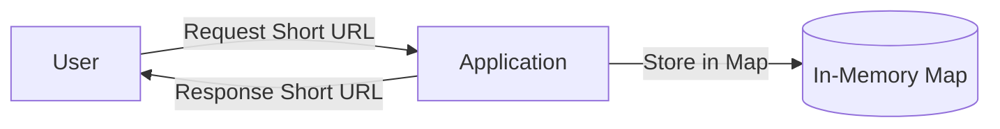
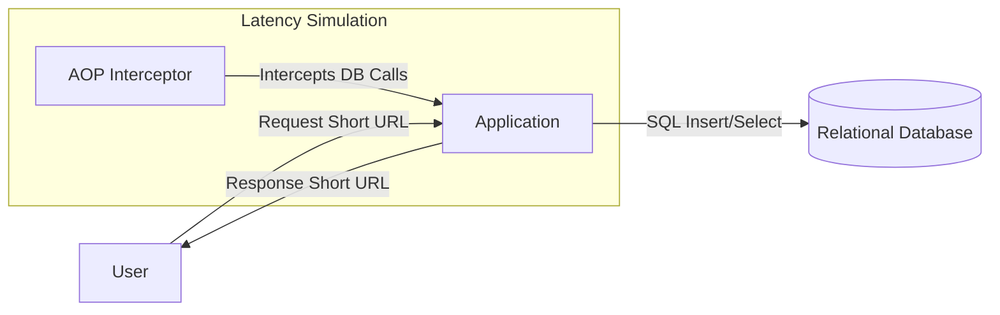
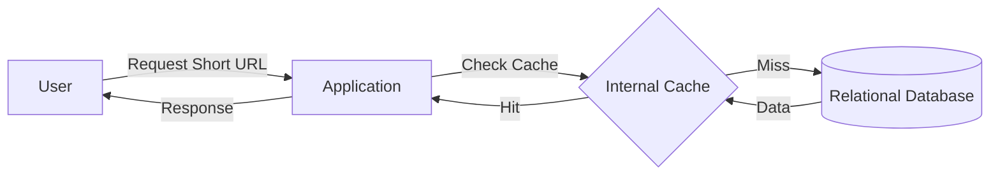
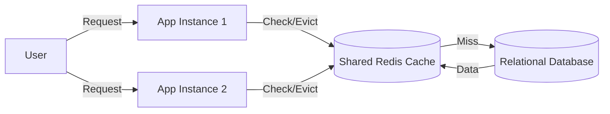

# ShortURL Implementation Evolution

This repository contains a series of sub-projects, each implementing a URL shortening service. The goal is to demonstrate the evolution of a system architecture from a naive implementation to a robust, high-performance solution. We start with the simplest possible version and incrementally address limitations like persistence, latency, and scalability.

## 1. Simplest Version (In-Memory)

The first iteration is a basic implementation that stores URL mappings in memory. It is fast but data is lost when the application restarts.

[Link to Project](./simplestVersion)

**Pros:**
* Extremely fast.
* Simple to implement.

**Cons:**
* **Data Loss:** All mappings are lost on restart.
* **Scalability:** Limited by server RAM.

---

## 2. Database Version (Persistence)

To solve the data loss problem, we introduce a persistent database. However, accessing a database introduces network latency. In this specific implementation, we also simulate random latency via Aspect-Oriented Programming (AOP) to mimic real-world slow queries or network issues.

[Link to Project](./databaseVersion)

**Improvements:**
* **Persistence:** Data survives application restarts.

**Remaining Issues:**
* **Latency:** Database calls are significantly slower than memory access.
* **Bottleneck:** The database becomes a central point of failure and a performance bottleneck under high load.

---

## 3. Internal Cached Version

To mitigate the latency introduced by the database, we add an **Internal (In-Memory) Cache**. Frequently accessed URLs are stored in the application's memory.

[Link to Project](./internalCachedVersion)

**Improvements:**
* **Performance:** Read operations are fast (Memory speed) for cached items.
* **Reduced DB Load:** Fewer requests hit the database.

**Remaining Issues:**
* **Consistency:** If multiple application instances are running, one might update/delete a record (clearing its own cache), but other instances will still hold the **stale** data in their caches until the TTL expires.
* **Memory Limit:** Cache size is limited by the application's heap.

---

## 4. External Cached Version (Redis)

To solve the consistency issue in a multi-server environment, we replace the internal cache with an **External Shared Cache** (Redis). All application instances connect to the same Redis instance.

[Link to Project](./externalCachedVersion)

**Improvements:**
* **Consistency:** When one instance updates/deletes data, it invalidates the cache in Redis, so all other instances immediately see the change (or get a cache miss and fetch from DB).
* **Scalability:** Cache size is independent of application heap.

**Remaining Issues:**
* **Availability:** Redis becomes another critical component. If Redis goes down, load spikes on the DB.
* **Network Latency:** Accessing Redis is slower than internal memory (but much faster than DB).

