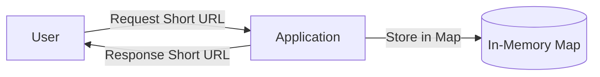
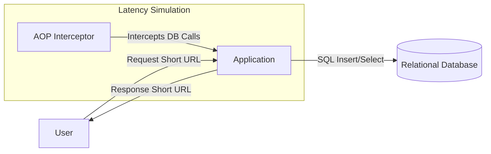

# ShortURL Implementation Evolution

This repository contains a series of sub-projects, each implementing a URL shortening service. The goal is to demonstrate the evolution of a system architecture from a naive implementation to a robust, high-performance solution. We start with the simplest possible version and incrementally address limitations like persistence, latency, and scalability.

## 1. Simplest Version (In-Memory)

The first iteration is a basic implementation that stores URL mappings in memory. It is fast but data is lost when the application restarts.

[Link to Project](./simplestVersion)

**Pros:**
* Extremely fast.
* Simple to implement.

**Cons:**
* **Data Loss:** All mappings are lost on restart.
* **Scalability:** Limited by server RAM.

---

## 2. Database Version (Persistence)

To solve the data loss problem, we introduce a persistent database. However, accessing a database introduces network latency. In this specific implementation, we also simulate random latency via Aspect-Oriented Programming (AOP) to mimic real-world slow queries or network issues.

[Link to Project](./databaseVersion)

**Improvements:**
* **Persistence:** Data survives application restarts.

**Remaining Issues:**
* **Latency:** Database calls are significantly slower than memory access.
* **Bottleneck:** The database becomes a central point of failure and a performance bottleneck under high load.
