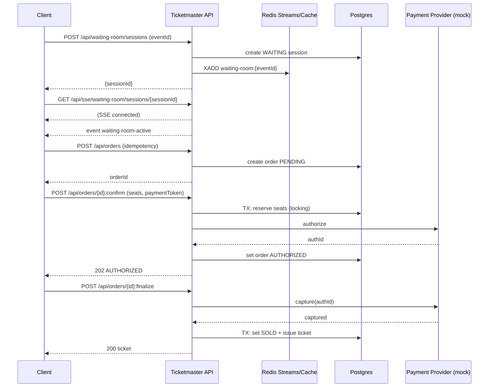

# Real Ticketmaster implementation (design)

This is the “real implementation” design aligned to the HelloInterview Ticketmaster breakdown:
https://www.hellointerview.com/learn/system-design/problem-breakdowns/ticketmaster

## Alignment with HelloInterview

Functional requirements (core):
- View event details and seat availability.
- Purchase tickets without double booking.
- Handle high-demand spikes.

Non-functional requirements (design intent):
- Reads: low latency, availability-first.
- Writes/booking: correctness-first.
- Extreme burst capacity: waiting room + caching.

## Tech choices (chosen for “simple but real” + easy to test here)

- Spring Boot 3.5.9 (Spring MVC), Java 21
- Postgres (source of truth for seat inventory + orders)
- Redis:
  - external cache
  - reservation TTL support
  - Redis Streams (waiting room) with consumer groups
- SSE (Spring MVC `SseEmitter`) for user updates
- Payment provider mocked behind an interface, but modeled like real authorize/capture

## Why these choices

- Postgres + Spring Data JPA makes transactional correctness straightforward and testable with Testcontainers.
- Redis is already a core technology in this repo and keeps the waiting room + cache simple to run locally.
- Redis Streams consumer groups give a real queueing model without Kafka’s operational overhead.
- SSE in Spring MVC is practical and easy to demonstrate with curl.

## API sketch

Browse:
- `GET /api/events`
- `GET /api/events/{eventId}`
- `GET /api/events/{eventId}/availability`

Waiting room:
- `POST /api/waiting-room/sessions` → `{sessionId}`
- `GET /api/waiting-room/sessions/{sessionId}` → `{status}` (poll fallback)
- `GET /api/sse/waiting-room/sessions/{sessionId}` (SSE preferred)

Ordering + payment (two-phase):
- `POST /api/orders` (create intent) — idempotent
- `POST /api/orders/{orderId}:confirm` (reserve + authorize) — idempotent
- `POST /api/orders/{orderId}:finalize` (capture + issue) — idempotent

## High-level architecture

- Ticketmaster API (Spring MVC)
- Waiting-room granter worker (can run inside same app initially)
- Postgres for `SeatInventory` and `Order`
- Redis for caches + streams + ephemeral reservation state

## End-to-end flow

### Browse
- Read-heavy: serve from caches when possible.

### Join waiting room
- User receives `waitingRoomSessionId`.
- User is notified when `ACTIVE` via SSE (preferred) or polling (fallback).

### Reserve + pay (two-phase)

## Correctness rules

- Seat inventory is the source of truth in Postgres.
- All mutation endpoints are idempotent (`Idempotency-Key`).
- Reservation has a TTL; if payment is not finalized, seats return to AVAILABLE.

## Caching strategy (minimal but effective)

- Use internal cache (Caffeine) with very short TTL for ultra-hot reads.
- Use Redis cache with slightly longer TTL.
- Use versioned hot keys for availability to avoid mass invalidation.

## How to test (once implemented)

Example flow:
1) Join waiting room
2) Wait for SSE event `waiting-room-active`
3) Create order, confirm, finalize

Commands (placeholders):
- `curl -XPOST localhost:8080/api/waiting-room/sessions -H "content-type: application/json" -d '{"eventId":"E1"}'`
- `curl -N localhost:8080/api/sse/waiting-room/sessions/<sessionId>`
