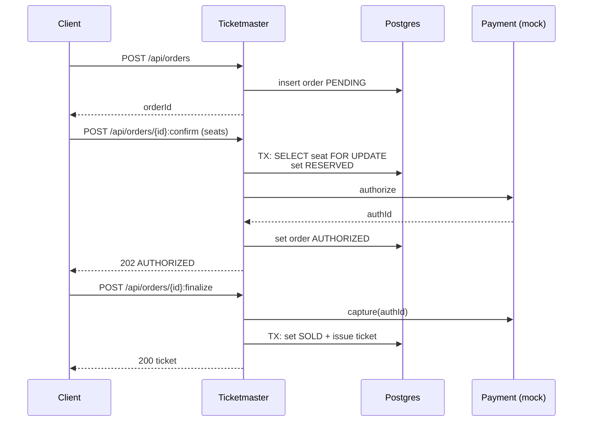

# Simplest Ticketmaster implementation

This is the smallest end-to-end Ticketmaster that “works”, even if it cannot scale.

## Tech choices
- Single Spring MVC application (Java 21, Spring Boot 3.5.9)
- Single Postgres database
- Pessimistic locking (`SELECT ... FOR UPDATE`) for seat reservation
- Payments mocked (still modeled as two-phase: authorize then capture)

## Scope
- Browse event + seat availability (no caching)
- Create order, reserve seats, authorize, finalize (capture + issue ticket)
- No waiting room (optionally an in-memory queue for demos)

## API sketch
- `GET /api/events` (list)
- `GET /api/events/{eventId}` (details)
- `GET /api/events/{eventId}/seats` (availability)
- `POST /api/orders` (create intent)
- `POST /api/orders/{orderId}:confirm` (select seats + authorize)
- `POST /api/orders/{orderId}:finalize` (capture + issue)

## Diagram

## What it cannot handle
- Massive spikes: no waiting room, no caching.
- High contention: pessimistic locking reduces concurrency.
