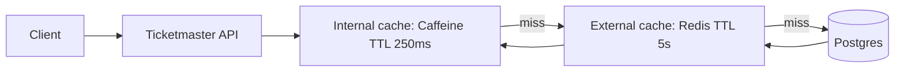
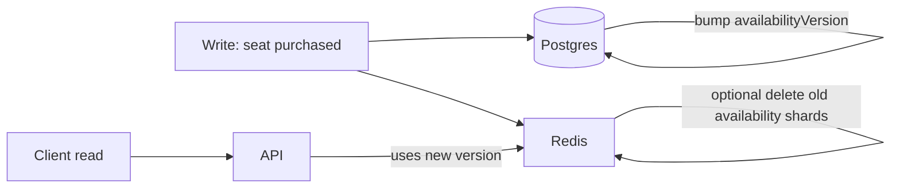

# Caching, pipelining, hot keys

Ticketmaster is read-heavy and spike-heavy. This subproject documents caching patterns to keep reads fast and protect databases.

## Tech choices
- Spring MVC (Java 21, Spring Boot 3.5.9)
- Caffeine (internal cache, short TTL)
- Redis (external cache, longer TTL)

## API sketch

Typical endpoints that benefit from caching:
- `GET /api/events` (list events)
- `GET /api/events/{eventId}` (event details)
- `GET /api/events/{eventId}/availability` (availability summary)
- `GET /api/events/{eventId}/seatmap` (seat map / section counts)

## What to cache
- Event details: name, startsAt, venue
- Seat map summary: counts per section/price band
- Availability summary: remaining seats

## Redis pipelining (reduce round trips)

When a request needs many keys, pipeline them:

Pseudo-code:
```text
pipeline:
  GET event:{eventId}
  GET availability:{eventId}:{version}:{shard}
  GET seatmap:{eventId}
```

## Two-tier cache: internal short TTL → external longer TTL



## Hot-key sharding + eviction on change

High-demand event keys can become hot. Spread reads across shards:

- Key scheme: `availability:{eventId}:{version}:{shard}`
- `shard = hash(userId) % N`

Eviction strategy on write:
- On seat purchase, increment `availabilityVersion` for the event in Postgres.
- New reads use the new `version` (so old keys stop being used).
- Old keys naturally expire by TTL; optionally delete known shards proactively.



## Trade-offs
- Versioned keys reduce coordination and avoid scanning/deleting many keys under load.
- Short TTLs reduce staleness but increase cache misses.
