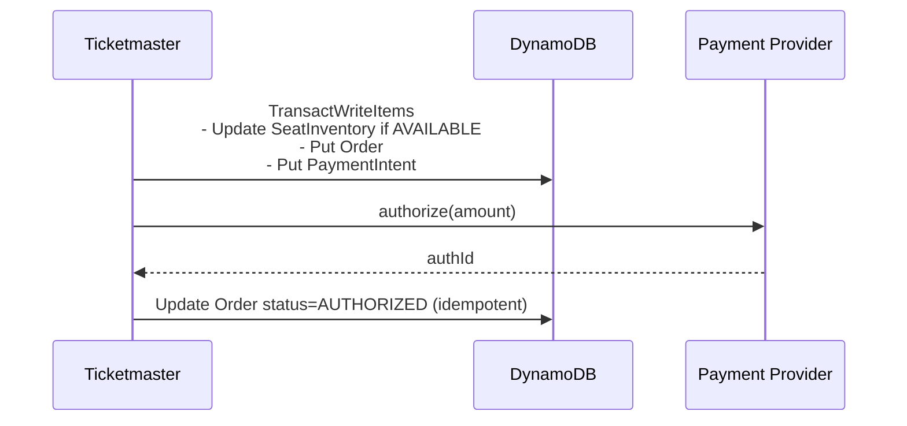

# DynamoDB locking (conditional updates + transactions)

DynamoDB supports correctness via conditional writes and transactional write batches.

## Tech choices
- Spring MVC
- DynamoDB (LocalStack later) or AWS

## Conditional update (optimistic)

Reserve a seat only if it is currently AVAILABLE:
- `UpdateItem` with `ConditionExpression` like `status = :available AND version = :expectedVersion`.

## Transactional writes

Use `TransactWriteItems` to ensure order + seat updates happen together:
- Update seat item (condition: AVAILABLE)
- Put/update order item
- Put payment intent item (idempotency key)

## Diagram

## Trade-offs
- Pros: scales write throughput; conditional writes are explicit.
- Cons: different ergonomics than SQL; careful item design is required.
