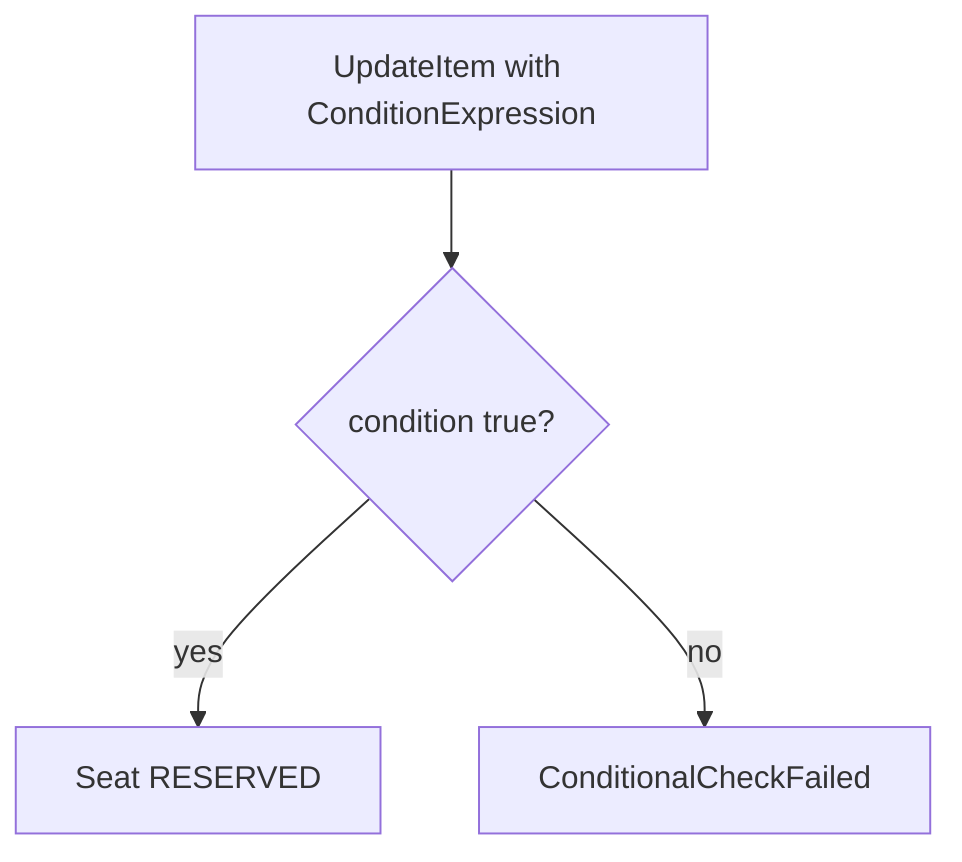
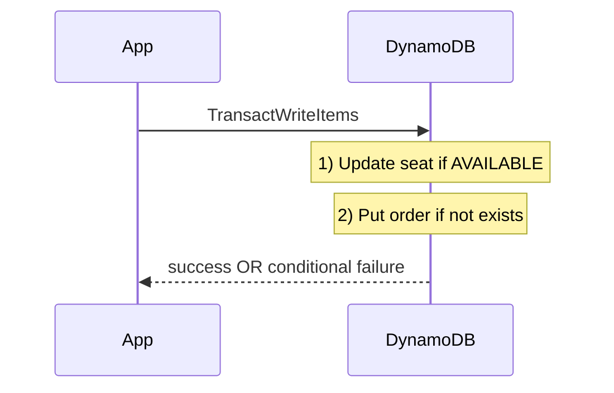

# DynamoDB locking (conditional writes + transactions)

Smallest possible demo of **how DynamoDB prevents double-booking**.

We use DynamoDB Local in tests and two tables:
- `seat_inventory(seat_id, status, order_id)`
- `orders(order_id, seat_id)`

## Tech choices
- Spring Boot 3.5.9 (no web server)
- AWS SDK v2 (DynamoDB)
- Testcontainers (DynamoDB Local)

## How to run

```bash
mvn test
```

## Conditional write

Guarantee: only one caller can transition `status` from `AVAILABLE` → `RESERVED`.



## Transactional write

Guarantee: reserve seat + create order happen together.


