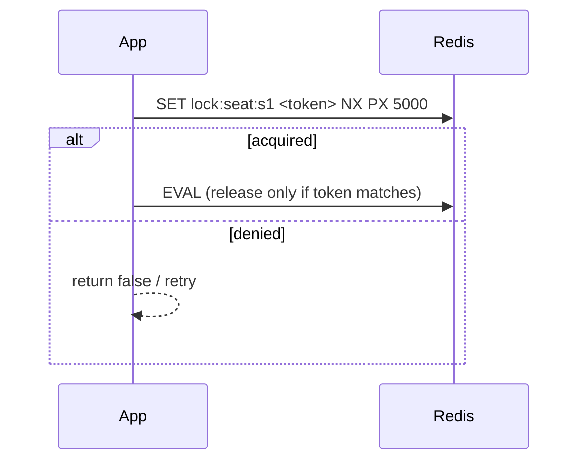
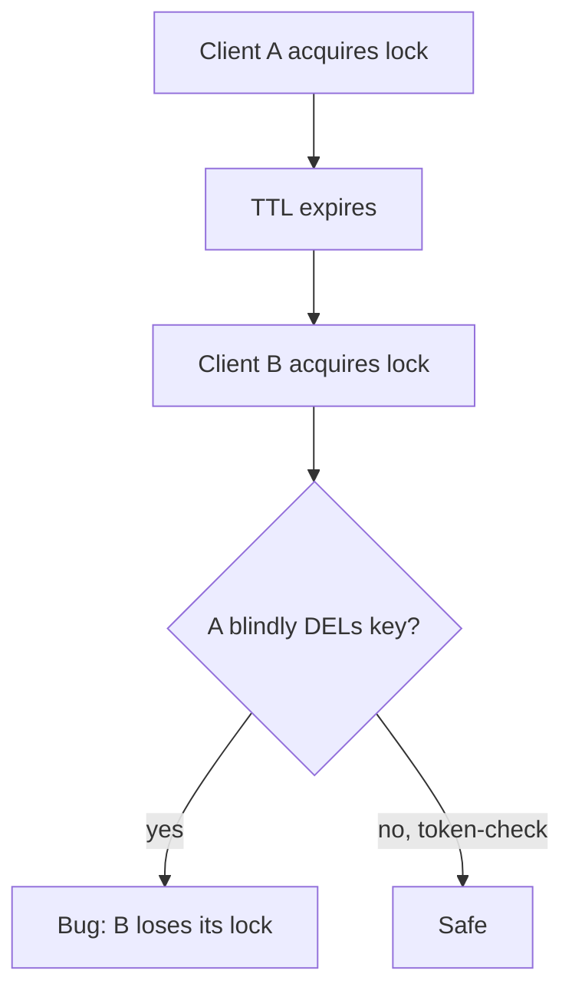

# Multi-DB (Redis lock)

Smallest possible demo of a **Redis distributed lock** for a critical section that spans multiple stores.

This example implements:
- Acquire: `SET key token NX PX ttl`
- Release: Lua script that deletes **only if** the stored token matches

## Tech choices
- Spring Boot 3.5.9 (no web server)
- Jedis
- Testcontainers Redis

## How to run

```bash
mvn test
```

## Acquire + release



## Why token-check release matters



