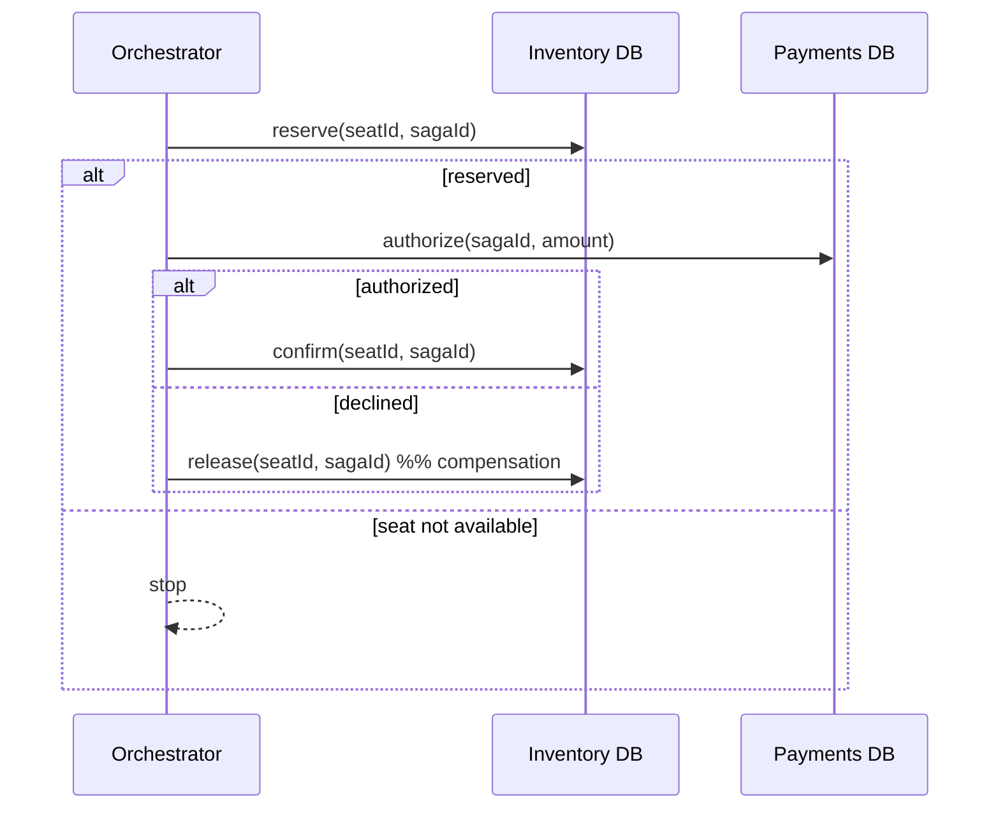

# Multi-DB (Saga)

Smallest possible demo of a **saga** when one business operation spans **two databases**.

We model a purchase as:
1) Reserve seat (Inventory DB)
2) Authorize payment (Payments DB)
3) Confirm seat (Inventory DB)

If payment fails, we run **compensation**: release the seat reservation.

## Tech choices
- Spring Boot 3.5.9 (no web server)
- Plain JDBC (no Flyway; schema created in tests)
- Testcontainers Postgres (two containers: inventory + payments)

## How to run

```bash
mvn test
```

## Saga flow


# Multi-DB (Saga)

Smallest possible demo of a **saga** when one business operation spans **two databases**.

We model a purchase as:
1) Reserve seat (Inventory DB)
2) Authorize payment (Payments DB)
3) Confirm seat (Inventory DB)

If payment fails, we run **compensation**: release the seat reservation.

## Tech choices
- Spring Boot 3.5.9 (no web server)
- Plain JDBC (no Flyway; schema created in tests)
- Testcontainers Postgres (two containers: inventory + payments)

## How to run

```bash
mvn test
```

## Saga flow



