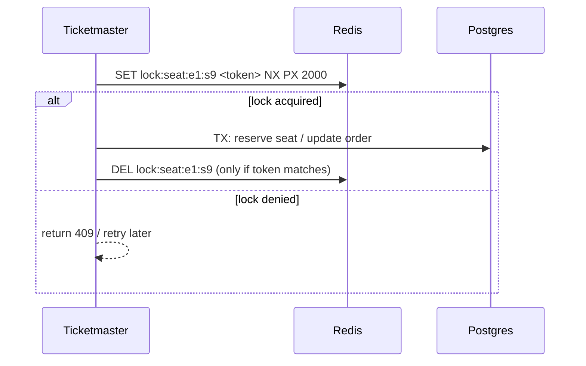
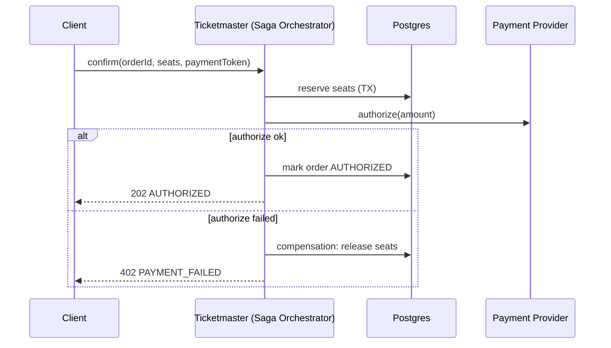
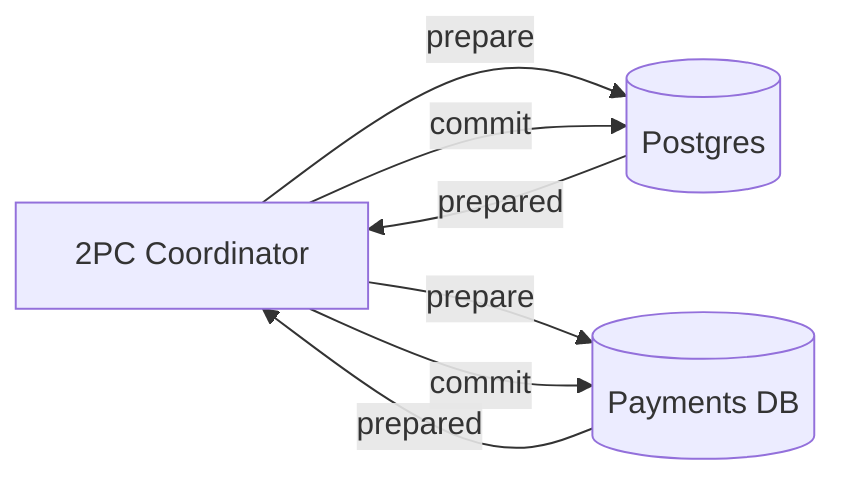
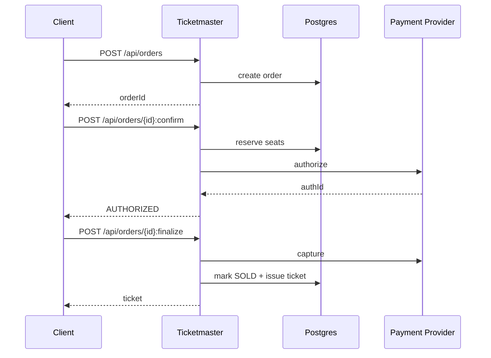

# Multi-DB workflows: Redis locks, sagas, and 2PC

When the booking state spans multiple data stores (e.g., Postgres for seats + separate payments DB + cache), you must choose a coordination strategy.

This doc shows three approaches:
1) External lock (Redis-based distributed lock)
2) Saga (orchestration + compensations)
3) Two-phase commit (2PC) (educational)

## Tech choices
- Postgres for seat inventory (example)
- Redis for distributed locks
- Payment provider is mocked

## API sketch

- `POST /api/orders` (create intent)
- `POST /api/orders/{orderId}:confirm` (reserve seats + authorize payment)
- `POST /api/orders/{orderId}:finalize` (capture + issue)

When multi-DB is involved, all these endpoints must be idempotent via `Idempotency-Key`.

## 1) Redis distributed lock (lease)

Key idea: lock on `(eventId, seatId)` with a lease and unique value.

Notes:
- Always include token-check on release (Lua script).
- Lease must be long enough for worst-case critical section or use renewal.

## 2) Saga orchestration (recommended when multi-DB)

Key idea: each step commits locally; failures trigger compensations.

## 3) Two-phase commit (2PC) (educational)

Key idea: coordinator asks each resource to "prepare" then "commit".

Why usually avoided:
- A stuck coordinator can block resources (availability impact).
- Operational complexity is high; modern systems prefer sagas + idempotency.

## End-to-end purchase diagram (multi-DB mindset)

