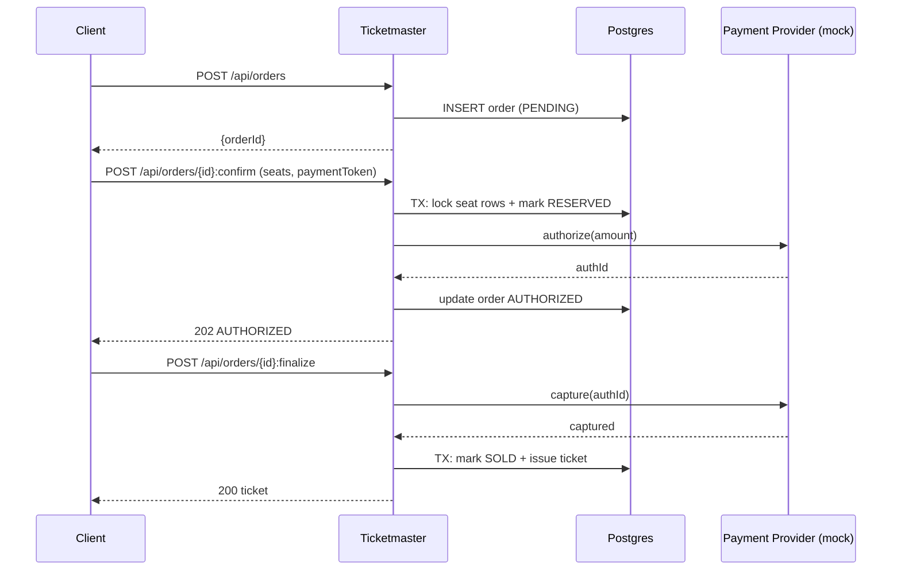

# Postgres locking (optimistic + pessimistic)

Postgres is a strong choice for Ticketmaster seat inventory because it offers straightforward transactions and mature locking primitives.

## Tech choices
- Spring MVC + Spring Data JPA
- Postgres

## Pessimistic example (row lock)

Idea: lock the seat row while deciding/reserving.

Pseudo-SQL:
```sql
BEGIN;

SELECT status, reserved_until
FROM seat_inventory
WHERE event_id = :eventId AND seat_id = :seatId
FOR UPDATE;

-- if available
UPDATE seat_inventory
SET status = 'RESERVED', reserved_until = now() + interval '2 minutes', order_id = :orderId
WHERE event_id = :eventId AND seat_id = :seatId;

COMMIT;
```

## Optimistic example (version column)

Idea: read current version, update only if version matches.

Pseudo-SQL:
```sql
UPDATE seat_inventory
SET status = 'RESERVED', version = version + 1, reserved_until = now() + interval '2 minutes'
WHERE event_id = :eventId AND seat_id = :seatId
  AND status = 'AVAILABLE'
  AND version = :expectedVersion;
```

## Diagram (reserve → authorize → capture → issue)



## Trade-offs
- Pessimistic: simpler correctness, but lower concurrency under hot rows.
- Optimistic: higher throughput, but retries under contention.
