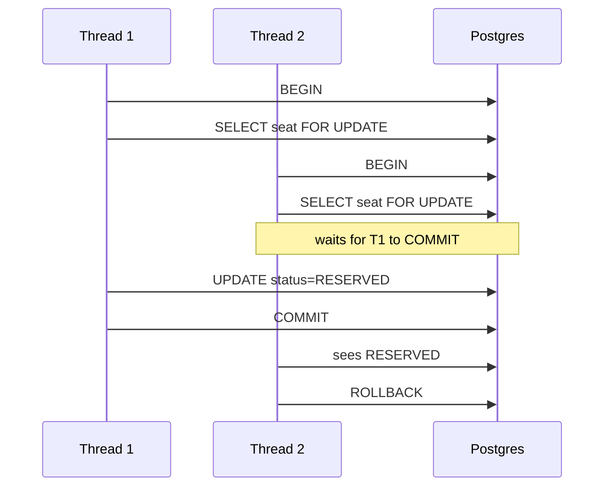
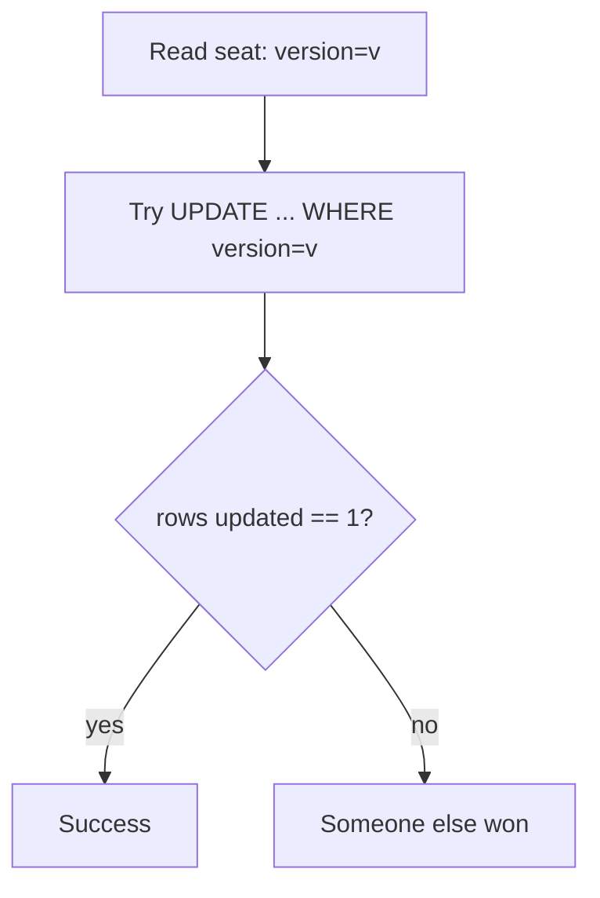

# Postgres locking (pessimistic + optimistic)

Simple demo of **how Postgres prevents double-booking**.

We model a single table `seat_inventory(event_id, seat_id, status, version)`.

## Tech choices
- Spring Boot 3.5.9 (no web server)
- Spring JDBC transactions
- Testcontainers Postgres (tests start Docker automatically)

## What this shows

1) **Pessimistic locking**: `SELECT ... FOR UPDATE` (one thread holds the row lock).

2) **Optimistic locking**: `UPDATE ... WHERE version = ?` (only one update wins).

## How to run

```bash
mvn test
```

## Pessimistic locking (row lock)



## Optimistic locking (version column)



## Trade-offs
- Pessimistic: easiest to reason about, but can block under contention.
- Optimistic: no blocking, but requires retry/"someone won" handling.
