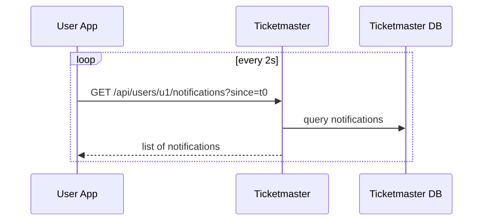

# In-app notification feed (polling)

This is the simplest operationally: Ticketmaster stores notification events; the user app **polls** for them.

## Tech choices
- Ticketmaster API: Spring MVC
- User app: Spring MVC
- Storage: Ticketmaster DB (notifications table) or Redis list (later)

## API sketch

Ticketmaster:
- `GET /api/users/{userId}/notifications?since=...`

User app:
- Scheduled poll every N seconds and display notification when a `WAITING_ROOM_ACTIVE` appears.

## Diagram

## Trade-offs
- Pros: simplest to implement and test; works behind NAT.
- Cons: polling traffic; user learns they are ACTIVE with delay up to polling interval.
