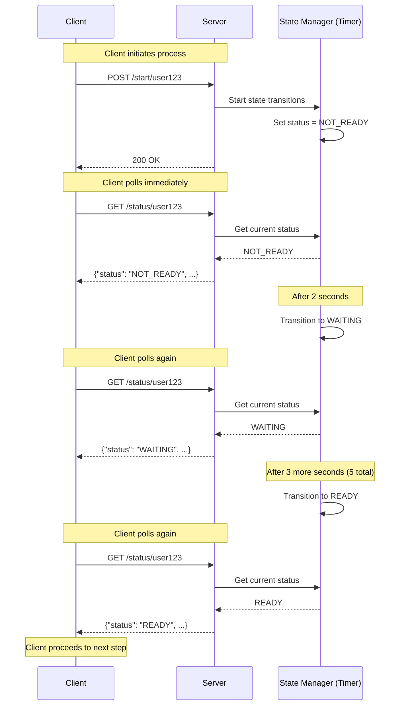

# Application Polling Notification System

This sub-project demonstrates a simple **polling-based notification system** where clients repeatedly check the server for status updates. This approach is commonly used in waiting room scenarios where users need to know when they can proceed.

## Architecture



## Polling Mechanism

### How It Works

1. **Initiation**: Client calls `POST /start/{userId}` to begin the process
2. **State Transitions**: Server automatically transitions states:
   - **NOT_READY** (initial) → 2 seconds → **WAITING** → 3 seconds → **READY**
3. **Polling**: Client periodically calls `GET /status/{userId}` (e.g., every 1 second)
4. **Detection**: Client observes state changes during polling and proceeds when `READY`

### State Transition Timeline

```
0s: NOT_READY
2s: WAITING
5s: READY
```

The timing is designed so clients polling every 1 second will observe each state at least once before the next transition.

### Advantages
- Simple to implement and understand
- No need for persistent connections
- Works with standard HTTP infrastructure
- Easy to scale horizontally
- Client controls polling frequency

### Disadvantages
- Increased server load (many repeated requests)
- Higher latency (depends on polling interval)
- Inefficient use of network resources
- Battery drain on mobile devices

## Running the Application

### Build and Run

```bash
cd ticketmaster/tech-notifications/app-notification
mvn clean package
mvn spring-boot:run
```

The application starts on port 8080.

### Run Tests

```bash
mvn test
```

## API Endpoints

### 1. Start Process

Initiates the automatic state transition process for a user.

**Request:**
```bash
curl -X POST http://localhost:8080/start/user123
```

**Response:**
```
Process started for user user123
```

### 2. Get Status (Polling Endpoint)

Client polls this endpoint to check the current status.

**Request:**
```bash
curl -X GET http://localhost:8080/status/user123
```

**Response (Not Ready):**
```json
{
  "userId": "user123",
  "status": "NOT_READY",
  "message": "Your request is being processed",
  "timestamp": 1735660800000
}
```

**Response (Waiting):**
```json
{
  "userId": "user123",
  "status": "WAITING",
  "message": "You are in the waiting room",
  "timestamp": 1735660802000
}
```

**Response (Ready):**
```json
{
  "userId": "user123",
  "status": "READY",
  "message": "You can now proceed to ticket selection",
  "timestamp": 1735660805000
}
```

**Response (Not Found):**
```json
{
  "userId": "user123",
  "status": "NOT_FOUND",
  "message": "No notification found for this user",
  "timestamp": 1735660810000
}
```

## Testing Flow

### Manual Testing with curl

```bash
# Terminal 1: Start the application
mvn spring-boot:run

# Terminal 2: Test the flow
# 1. Start the process
curl -X POST http://localhost:8080/start/alice

# 2. Immediately poll for status (should see NOT_READY)
curl -X GET http://localhost:8080/status/alice

# 3. Wait 1 second and poll again (may still be NOT_READY)
sleep 1
curl -X GET http://localhost:8080/status/alice

# 4. Wait 1 second and poll again (should see WAITING)
sleep 1
curl -X GET http://localhost:8080/status/alice

# 5. Continue polling every second until READY
sleep 1
curl -X GET http://localhost:8080/status/alice

sleep 1
curl -X GET http://localhost:8080/status/alice

sleep 1
curl -X GET http://localhost:8080/status/alice
```

### Automated Polling Loop

Use this script to observe all state transitions:

```bash
#!/bin/bash

USER_ID="user123"

# Start the process
echo "=== Starting process for $USER_ID ==="
curl -X POST http://localhost:8080/start/$USER_ID
echo -e "\n"

# Poll every 1 second for 7 seconds to catch all state transitions
echo "=== Polling for status changes ==="
for i in {1..7}; do
  echo "Poll $i (at ${i}s):"
  curl -X GET http://localhost:8080/status/$USER_ID
  echo -e "\n"
  
  # Exit if READY
  STATUS=$(curl -s http://localhost:8080/status/$USER_ID | grep -o '"status":"[^"]*"' | cut -d'"' -f4)
  if [ "$STATUS" == "READY" ]; then
    echo "User is READY! Exiting poll loop."
    break
  fi
  
  sleep 1
done
```

Expected output:
```
=== Starting process for user123 ===
Process started for user user123

=== Polling for status changes ===
Poll 1 (at 1s):
{"userId":"user123","status":"NOT_READY","message":"Your request is being processed","timestamp":...}

Poll 2 (at 2s):
{"userId":"user123","status":"NOT_READY","message":"Your request is being processed","timestamp":...}

Poll 3 (at 3s):
{"userId":"user123","status":"WAITING","message":"You are in the waiting room","timestamp":...}

Poll 4 (at 4s):
{"userId":"user123","status":"WAITING","message":"You are in the waiting room","timestamp":...}

Poll 5 (at 5s):
{"userId":"user123","status":"WAITING","message":"You are in the waiting room","timestamp":...}

Poll 6 (at 6s):
{"userId":"user123","status":"READY","message":"You can now proceed to ticket selection","timestamp":...}

User is READY! Exiting poll loop.
```

## Implementation Details

### State Management
- Uses `ConcurrentHashMap<String, String>` for thread-safe in-memory storage
- Stores user ID to status mapping
- No persistence (data lost on restart)

### Automatic State Transitions
- Uses `ScheduledExecutorService` for timer-based state changes
- **NOT_READY** → (2 seconds) → **WAITING** → (3 seconds) → **READY**
- Transitions happen automatically after client calls `/start/{userId}`
- Multiple users can have independent timers running concurrently

### Concurrency
- Service methods are thread-safe due to `ConcurrentHashMap`
- Multiple clients can poll simultaneously without issues
- Scheduled tasks check if user still exists before updating status

### Status Flow
```
NOT_FOUND → (start) → NOT_READY → (2s) → WAITING → (3s) → READY
```

## Code Structure

```
src/
├── main/
│   ├── java/com/example/ticketmaster/notification/
│   │   ├── Application.java                    # Spring Boot main class
│   │   ├── controller/
│   │   │   └── NotificationController.java     # REST endpoints (start, status)
│   │   ├── service/
│   │   │   └── NotificationService.java        # State management & timer logic
│   │   └── model/
│   │       └── NotificationStatus.java         # Response model (record)
│   └── resources/
│       └── application.properties              # Configuration
└── test/
    └── java/com/example/ticketmaster/notification/
        ├── controller/
        │   └── NotificationControllerTest.java # Controller tests
        └── service/
            └── NotificationServiceTest.java    # Service tests (timer verification)
```

## Next Steps

To improve this polling-based system, consider:

1. **Add rate limiting** to prevent abuse
2. **Implement exponential backoff** on the client side
3. **Add metrics** to monitor polling frequency
4. **Set TTL** for waiting room entries
5. **Compare with other notification patterns** (WebSocket, SSE, Long-polling)

## Related Technologies

For more efficient real-time notifications, explore:
- **Server-Sent Events (SSE)**: Server pushes updates to clients
- **WebSocket**: Bi-directional real-time communication
- **Long Polling**: Client holds connection until server has updates
- **Message Queues**: Pub/sub patterns with RabbitMQ, Kafka, etc.
