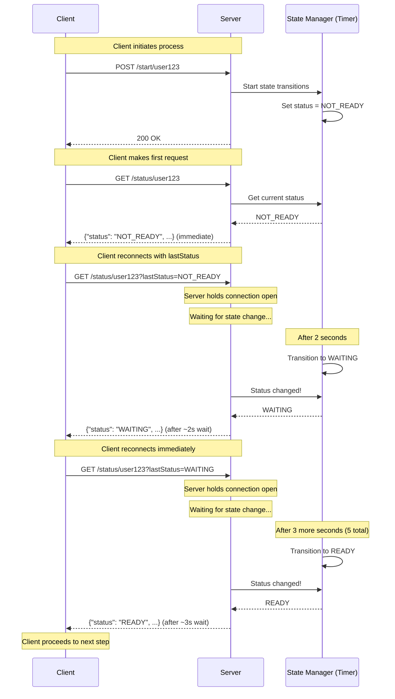

# Long-Polling Notification System

This sub-project demonstrates a **long-polling notification system** where clients make requests that the server holds open until a state change occurs or a timeout is reached. This is more efficient than regular polling while remaining simpler than WebSockets.

## Architecture



## Long-Polling Mechanism

### How It Works

1. **Initiation**: Client calls `POST /start/{userId}` to begin the process
2. **State Transitions**: Server automatically transitions states:
   - **NOT_READY** (initial) → 2 seconds → **WAITING** → 3 seconds → **READY**
3. **Long-Polling**: Client calls `GET /status/{userId}?lastStatus=<current>`
   - Server **holds the connection open** until status changes OR 30-second timeout
   - Returns immediately if status already changed
   - Client reconnects immediately after receiving response
4. **Efficiency**: Significantly fewer requests compared to regular polling (3 vs 7+ requests)

### Request Flow

```
Client Request 1: GET /status/user123
  → Server responds immediately: NOT_READY

Client Request 2: GET /status/user123?lastStatus=NOT_READY
  → Server waits ~2s until state changes
  → Server responds: WAITING

Client Request 3: GET /status/user123?lastStatus=WAITING
  → Server waits ~3s until state changes
  → Server responds: READY
```

### Advantages Over Regular Polling
- **Fewer requests**: 3 requests vs 7+ with 1-second polling interval
- **Lower latency**: Client notified immediately when status changes
- **Reduced server load**: No repeated requests during waiting periods
- **Better user experience**: Near real-time updates without WebSocket complexity

### Advantages Over WebSockets/SSE
- **Simpler**: Standard HTTP requests, no persistent connections
- **Better compatibility**: Works with all HTTP infrastructure (proxies, load balancers)
- **Easier debugging**: Standard HTTP tools (curl, browser DevTools)
- **Auto-recovery**: Client automatically reconnects if connection drops

### Trade-offs
- **Held connections**: Server holds connection open (uses thread/resources)
- **Not instant**: Small delay from status change detection (100ms polling internally)
- **Timeout handling**: Client must handle 30-second timeout responses

## Running the Application

### Build and Run

```bash
cd ticketmaster/tech-notifications/long-polling
mvn clean package
mvn spring-boot:run
```

The application starts on port 8080.

### Run Tests

```bash
mvn test
```

## API Endpoints

### 1. Start Process

Initiates the automatic state transition process for a user.

**Request:**
```bash
curl -X POST http://localhost:8080/start/user123
```

**Response:**
```
Process started for user user123
```

### 2. Get Status (Long-Polling Endpoint)

Client requests status. Server holds connection until status changes or 30-second timeout.

**First request (no lastStatus):**
```bash
curl -X GET http://localhost:8080/status/user123
```

Response (immediate):
```json
{
  "userId": "user123",
  "status": "NOT_READY",
  "message": "Your request is being processed",
  "timestamp": 1735660800000
}
```

**Subsequent requests (with lastStatus):**
```bash
curl -X GET "http://localhost:8080/status/user123?lastStatus=NOT_READY"
```

Response (after ~2 seconds when state changes):
```json
{
  "userId": "user123",
  "status": "WAITING",
  "message": "You are in the waiting room",
  "timestamp": 1735660802000
}
```

**Request when READY:**
```bash
curl -X GET "http://localhost:8080/status/user123?lastStatus=WAITING"
```

Response (after ~3 seconds when state changes):
```json
{
  "userId": "user123",
  "status": "READY",
  "message": "You can now proceed to ticket selection",
  "timestamp": 1735660805000
}
```

## Testing Flow

### Manual Testing with curl

```bash
# Terminal 1: Start the application
mvn spring-boot:run

# Terminal 2: Test the flow
# 1. Start the process
curl -X POST http://localhost:8080/start/alice

# 2. First poll (immediate response with NOT_READY)
time curl -X GET http://localhost:8080/status/alice

# 3. Long-poll with lastStatus=NOT_READY (waits ~2s for WAITING)
time curl -X GET "http://localhost:8080/status/alice?lastStatus=NOT_READY"

# 4. Long-poll with lastStatus=WAITING (waits ~3s for READY)
time curl -X GET "http://localhost:8080/status/alice?lastStatus=WAITING"
```

### Automated Long-Polling Script

Use this script to demonstrate the efficiency of long-polling:

```bash
#!/bin/bash

USER_ID="user123"

# Start the process
echo "=== Starting process for $USER_ID ==="
curl -X POST http://localhost:8080/start/$USER_ID
echo -e "\n"

# Initial call without lastStatus (should return NOT_READY immediately)
echo "=== Poll 1: Initial request (no lastStatus) ==="
RESPONSE=$(curl -s http://localhost:8080/status/$USER_ID)
echo "$RESPONSE"
STATUS=$(echo "$RESPONSE" | grep -o '"status":"[^"]*"' | cut -d'"' -f4)
echo "Status: $STATUS"
echo -e "\n"

# Long-poll with lastStatus=NOT_READY (waits for WAITING)
echo "=== Poll 2: Long-polling with lastStatus=NOT_READY (waits for WAITING) ==="
START_TIME=$(date +%s)
RESPONSE=$(curl -s "http://localhost:8080/status/$USER_ID?lastStatus=NOT_READY")
END_TIME=$(date +%s)
DURATION=$((END_TIME - START_TIME))
echo "$RESPONSE"
STATUS=$(echo "$RESPONSE" | grep -o '"status":"[^"]*"' | cut -d'"' -f4)
echo "Status: $STATUS (waited ${DURATION}s)"
echo -e "\n"

# Long-poll with lastStatus=WAITING (waits for READY)
echo "=== Poll 3: Long-polling with lastStatus=WAITING (waits for READY) ==="
START_TIME=$(date +%s)
RESPONSE=$(curl -s "http://localhost:8080/status/$USER_ID?lastStatus=WAITING")
END_TIME=$(date +%s)
DURATION=$((END_TIME - START_TIME))
echo "$RESPONSE"
STATUS=$(echo "$RESPONSE" | grep -o '"status":"[^"]*"' | cut -d'"' -f4)
echo "Status: $STATUS (waited ${DURATION}s)"
echo -e "\n"

echo "=== Test complete! ==="
echo "Expected: 3 requests instead of 7+ with regular polling"
echo "Poll 1: Immediate return with NOT_READY"
echo "Poll 2: Waited ~2s for WAITING"
echo "Poll 3: Waited ~3s for READY"
```

Run the script:
```bash
chmod +x test-long-polling.sh
./test-long-polling.sh
```

Expected output:
```
=== Starting process for user123 ===
Process started for user user123

=== Poll 1: Initial request (no lastStatus) ===
{"userId":"user123","status":"NOT_READY","message":"Your request is being processed","timestamp":...}
Status: NOT_READY

=== Poll 2: Long-polling with lastStatus=NOT_READY (waits for WAITING) ===
{"userId":"user123","status":"WAITING","message":"You are in the waiting room","timestamp":...}
Status: WAITING (waited 2s)

=== Poll 3: Long-polling with lastStatus=WAITING (waits for READY) ===
{"userId":"user123","status":"READY","message":"You can now proceed to ticket selection","timestamp":...}
Status: READY (waited 3s)

=== Test complete! ===
Expected: 3 requests instead of 7+ with regular polling
Poll 1: Immediate return with NOT_READY
Poll 2: Waited ~2s for WAITING
Poll 3: Waited ~3s for READY
```

## Implementation Details

### State Management
- Uses `ConcurrentHashMap<String, String>` for thread-safe in-memory storage
- Stores user ID to status mapping
- No persistence (data lost on restart)

### Long-Polling Logic
- Server checks status every 100ms while connection is held
- Returns immediately if status changed
- 30-second timeout to prevent indefinite connection holds
- Client provides `lastStatus` query parameter to enable waiting

### Automatic State Transitions
- Uses `ScheduledExecutorService` for timer-based state changes
- **NOT_READY** → (2 seconds) → **WAITING** → (3 seconds) → **READY**
- Transitions happen automatically after client calls `/start/{userId}`
- Multiple users can have independent timers running concurrently

### Concurrency
- Service methods are thread-safe due to `ConcurrentHashMap`
- Multiple clients can long-poll simultaneously
- Each long-poll request runs in its own thread (held connection)

### Timeout Behavior
- If no state change occurs within 30 seconds, server returns current status
- Client should reconnect immediately (treating timeout like status change)
- Prevents resource exhaustion from indefinitely held connections

### Status Flow
```
NOT_FOUND → (start) → NOT_READY → (2s) → WAITING → (3s) → READY
```

## Efficiency Comparison

### Regular Polling (1-second interval)
```
Request 1: 0s  → NOT_READY
Request 2: 1s  → NOT_READY
Request 3: 2s  → WAITING
Request 4: 3s  → WAITING
Request 5: 4s  → WAITING
Request 6: 5s  → READY
Total: 6+ requests over 5 seconds
```

### Long-Polling
```
Request 1: 0s       → NOT_READY (immediate)
Request 2: 0s-2s    → WAITING (waits 2s)
Request 3: 2s-5s    → READY (waits 3s)
Total: 3 requests over 5 seconds (50% reduction)
```

## Code Structure

```
src/
├── main/
│   ├── java/com/example/ticketmaster/longpolling/
│   │   ├── Application.java                       # Spring Boot main class
│   │   ├── controller/
│   │   │   └── LongPollingController.java         # REST endpoints (start, long-poll status)
│   │   ├── service/
│   │   │   └── LongPollingService.java            # Long-polling & timer logic
│   │   └── model/
│   │       └── NotificationStatus.java            # Response model (record)
│   └── resources/
│       └── application.properties                 # Configuration
└── test/
    └── java/com/example/ticketmaster/longpolling/
        ├── controller/
        │   └── LongPollingControllerTest.java     # Controller tests
        └── service/
            └── LongPollingServiceTest.java        # Service tests (wait verification)
```

## When to Use Long-Polling

**Use long-polling when:**
- You need near real-time updates without WebSocket complexity
- Your infrastructure doesn't support persistent connections well
- Updates are infrequent (seconds to minutes apart)
- You want standard HTTP compatibility

**Consider alternatives when:**
- Updates are very frequent (< 1 second) → Use WebSockets
- Only server needs to push → Use Server-Sent Events (SSE)
- Updates are rare (minutes to hours) → Use regular polling or webhooks

## Next Steps

To improve this long-polling system, consider:

1. **Connection pooling**: Manage thread pool size for held connections
2. **Timeout configuration**: Make timeout configurable per endpoint
3. **Metrics**: Track connection hold times and timeout rates
4. **ETag/If-None-Match**: HTTP cache headers for additional efficiency
5. **Exponential backoff**: On errors, increase retry delays

## Related Technologies

For different notification patterns, explore:
- **App Notification (Regular Polling)**: Simplest approach, client controls frequency
- **Server-Sent Events (SSE)**: Server pushes updates over persistent connection
- **WebSocket**: Bi-directional real-time communication
- **Webhooks**: Server calls client endpoint (requires public URL)
