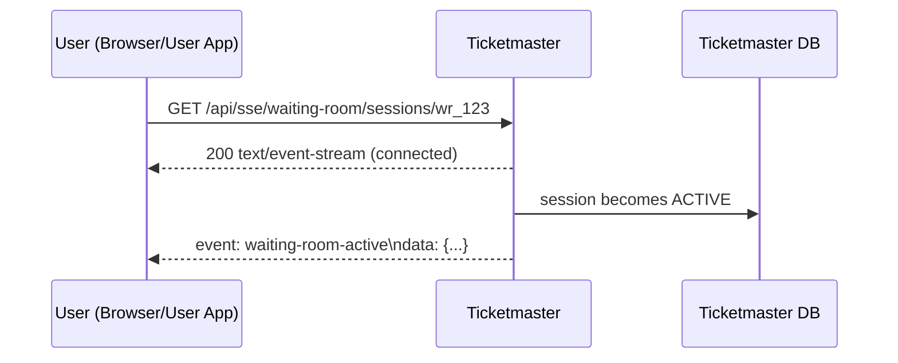

# SSE notifications (Spring MVC)

Server-Sent Events provides low-latency push updates from Ticketmaster to the client, while staying in Spring MVC via `SseEmitter`.

## Tech choices
- Ticketmaster: Spring MVC + `SseEmitter`
- User app: Spring MVC client (or browser) subscribing to SSE

## API sketch

Ticketmaster:
- `GET /api/sse/waiting-room/sessions/{sessionId}` → stream events

Event payload example:
```json
{"type":"WAITING_ROOM_ACTIVE","sessionId":"wr_123","eventId":"e_9"}
```

## Diagram



## Scale notes (keep simple)
- In production you might need sticky sessions, or a pub/sub fanout to all app instances.
- Here we keep it single instance and focus on correctness, timeouts, and reconnect.
