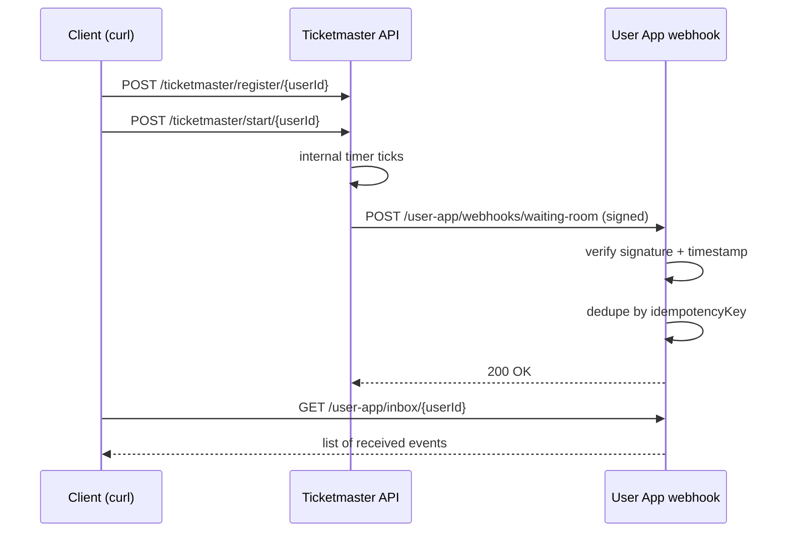

# Webhook notification

Webhook means: when the user becomes `READY` (a.k.a. “ACTIVE / out of the waiting room”), Ticketmaster calls **the user app** (the receiver) via HTTP.

This demo runs both sides in a single Spring Boot app to make the mechanics easy to observe:
- Ticketmaster API (sender-side): `/ticketmaster/**`
- User app (receiver-side): `/user-app/**`

## Why this exists
Polling/long-polling/SSE all require the client to contact the server.
Webhooks flip the direction: the server calls the client.

That comes with two practical requirements that most people *haven’t* seen until they build one:
- **Security:** the receiver must verify the callback is authentic.
- **Idempotency:** the receiver must handle retries/duplicates safely.

## What runs where (the “parts”)

**Ticketmaster side (the sender)**
- `TicketmasterWebhookController` exposes the demo API (register/start/status).
- `WebhookTicketmasterService` is the small state machine: `NOT_READY -> WAITING -> READY`.
- `WebhookSender` / `RestClientWebhookSender` performs the outgoing HTTP POST to the callback URL.

**User app side (the receiver)**
- `UserAppWebhookController` receives the webhook HTTP POST.
- `UserAppWebhookService` verifies signature + timestamp (replay protection) and dedupes events before storing them.

**Cross-cutting config**
- `WebhookSigner` implements HMAC signing (shared secret).
- `WebhookConfig` wires `RestClient`, `WebhookSigner`, and a `Clock` (Clock is injectable to make time-based checks testable).

## Endpoints

Ticketmaster:
- `POST /ticketmaster/register/{userId}` registers where to send the webhook
- `POST /ticketmaster/start/{userId}` starts the internal state machine (`NOT_READY -> WAITING -> READY`)
- `GET /ticketmaster/status/{userId}` lets you observe status changes

User app:
- `POST /user-app/webhooks/waiting-room` receives webhook callbacks
- `GET /user-app/inbox/{userId}` shows received events (what your UI/backend would act on)

## Webhook payload

```json
{
  "type": "WAITING_ROOM_ACTIVE",
  "sessionId": "wr_123",
  "userId": "alice",
  "eventId": "evt_1766600000000",
  "issuedAt": "2025-12-24T12:34:56Z",
  "idempotencyKey": "evt_wr_123_active"
}
```

## Signature headers

### Why we sign
If your callback endpoint is public, anyone could try to POST fake “ACTIVE” events.
The sender signs the request and the receiver verifies it, so the receiver can reject tampered or spoofed callbacks.

### How we sign
The sender signs a deterministic string built from:

`message = <timestampSeconds> + '.' + <idempotencyKey>`

Headers:
- `X-Signature: hmac-sha256=<hex>`
- `X-Signature-Timestamp: <epochSeconds>`

The receiver rejects callbacks that are too old/new (basic replay protection).

## Idempotency (duplicates)

### Why idempotency matters
Real webhook senders often retry (network timeouts, 5xx, load balancer hiccups, etc.).
That means the same event can be delivered multiple times.

### How this demo does it
The receiver keeps a per-user set of `idempotencyKey`s and ignores duplicates.

## Why we only send the webhook at READY
This demo models the common real-world contract: the callback is only fired when the user can proceed (ACTIVE/READY).
If you want callbacks for intermediate states too (like `WAITING`), model a different event type (for example, a generic “StatusChanged” event) and make the receiver handle multiple event kinds.

## Diagram



## Run it

From this directory:

```bash
cd ticketmaster/tech-notifications/webhook
```

```bash
mvn spring-boot:run
```

### Fast path: run the demo script

This registers the callback, starts the flow, then polls the inbox until the webhook arrives:

```bash
./test-webhook.sh
```

Register the webhook callback URL for a user:

```bash
curl -s -X POST "http://localhost:8080/ticketmaster/register/alice" \
  -H "Content-Type: application/json" \
  -d '{"callbackUrl":"http://localhost:8080/user-app/webhooks/waiting-room"}'
```

Start the flow:

```bash
curl -s -X POST "http://localhost:8080/ticketmaster/start/alice"
```

Observe Ticketmaster status transitions:

```bash
while true; do
  curl -s http://localhost:8080/ticketmaster/status/alice | cat
  sleep 0.5
done
```

Observe the user app inbox (the webhook should appear when the user becomes READY):

```bash
while true; do
  curl -s http://localhost:8080/user-app/inbox/alice | cat
  sleep 0.5
done
```

## Tests

```bash
mvn test
```

## Failure modes (notes)
- Retries: in real systems, the sender retries with backoff. This demo focuses on the receiver being safe for retries.
- Idempotency: the receiver dedupes using `idempotencyKey`.
- Security: signature + timestamp help prevent tampering and simple replay attacks.

## How you’d split this in a real system
- Ticketmaster and the user app would be separate services (separate deploys, separate base URLs).
- The shared secret would be provisioned securely (a secret store) and rotated periodically.
- The sender would retry with exponential backoff and a dead-letter strategy.
- The receiver would return `2xx` quickly and do longer work async (queue/job) after persisting the event.
