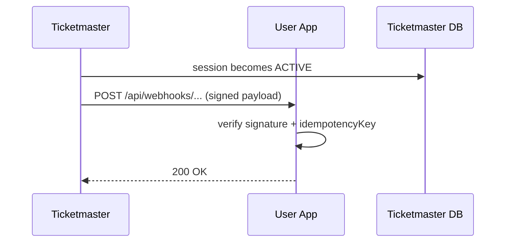

# Webhook notification (Spring MVC user app)

Webhook means: when the user becomes `ACTIVE`, Ticketmaster calls **the user app**.

## Tech choices
- Ticketmaster API: Spring MVC
- User app (receiver): Spring MVC
- HMAC signature for authenticity

## API sketch

Ticketmaster:
- `POST /api/waiting-room/sessions` → `{sessionId}`
- When session becomes ACTIVE: `POST {userWebhookUrl}` with payload

User app:
- `POST /api/webhooks/ticketmaster/waiting-room` (receives callback)

Webhook payload (example)
```json
{
  "type": "WAITING_ROOM_ACTIVE",
  "sessionId": "wr_123",
  "userId": "u_1",
  "eventId": "e_9",
  "issuedAt": "2025-12-24T12:34:56Z",
  "idempotencyKey": "evt_wr_123_active"
}
```

Headers (example)
- `X-Signature: hmac-sha256=...`
- `X-Signature-Timestamp: ...`

## Diagram



## Failure modes
- Retries: Ticketmaster retries webhook with exponential backoff.
- Idempotency: user app dedupes by `idempotencyKey`.
- Security: signature + timestamp to prevent tampering/replay.
