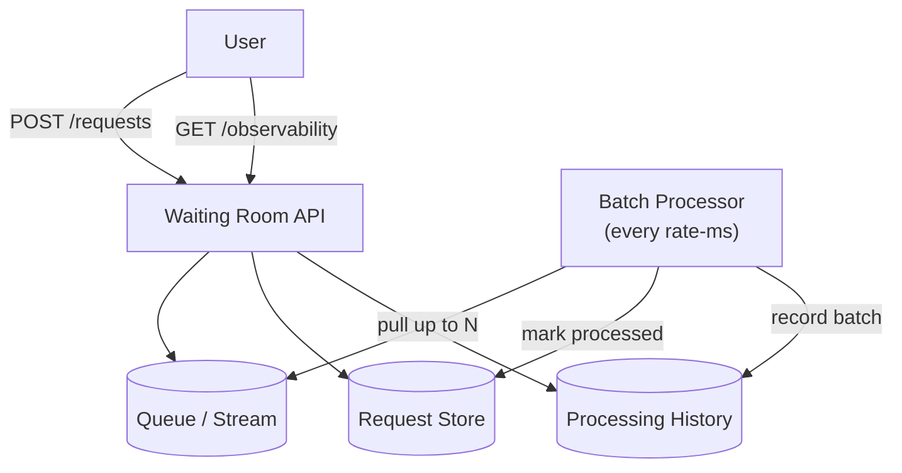
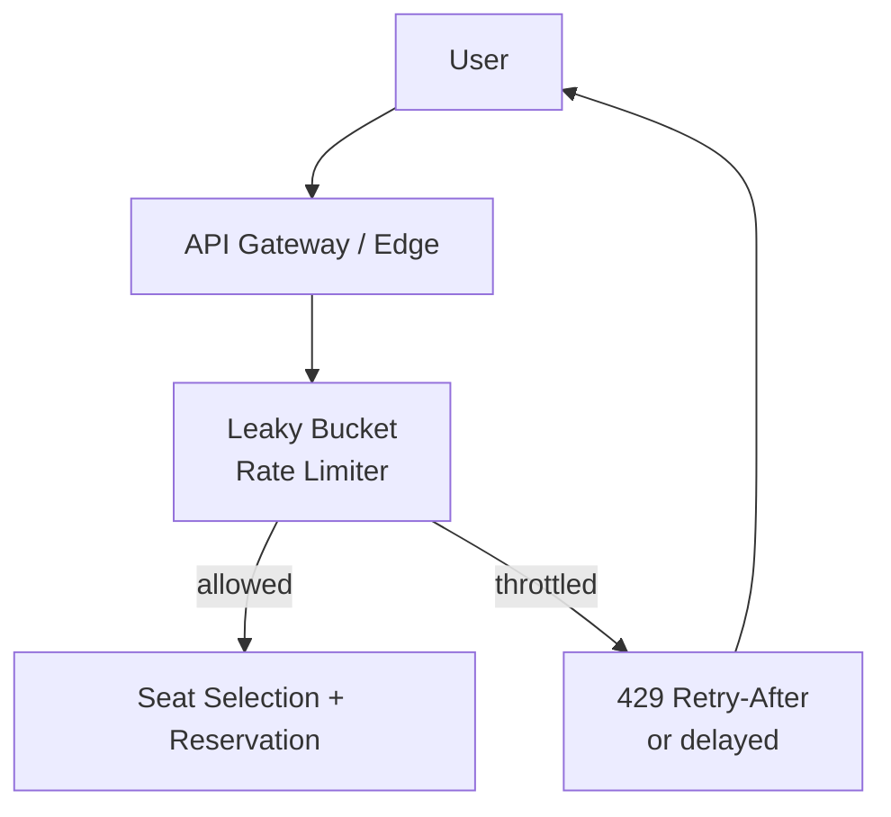
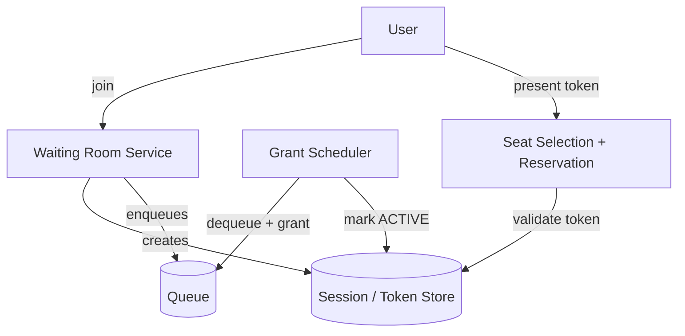
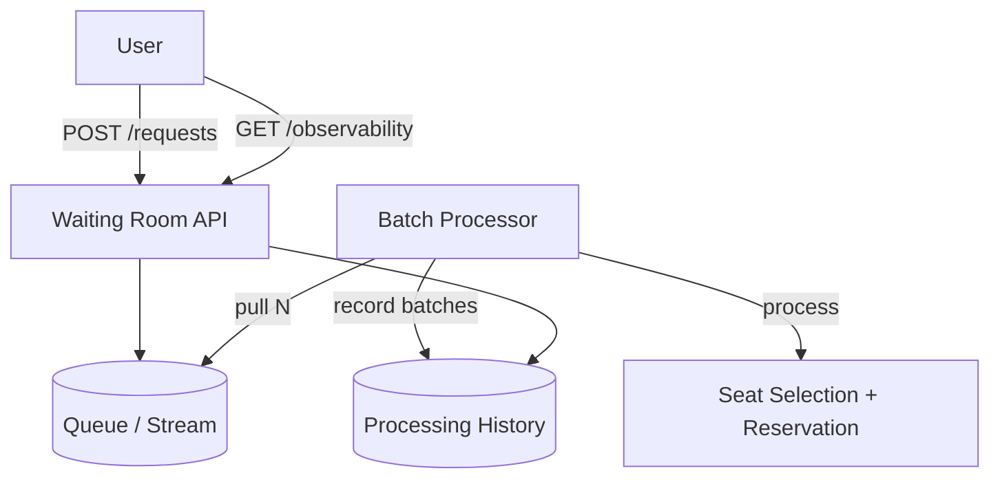
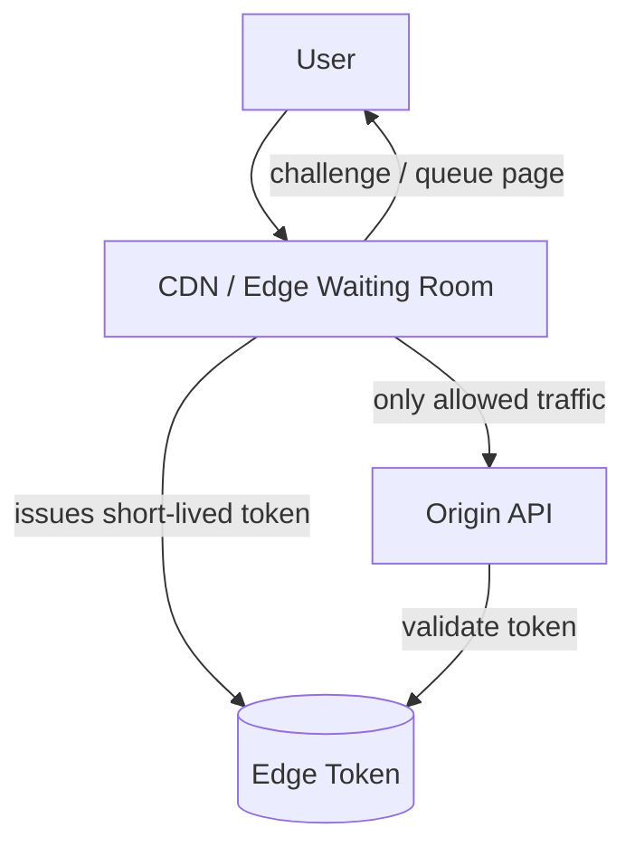

# Waiting room (queueing) — overview

This subproject is an index of different queueing technologies that can implement a Ticketmaster **waiting room**.

The waiting room goal is to **meter access** to expensive/contended operations (seat selection + reservation) during spikes.

## Why waiting rooms exist

- Without metering, popular events create a thundering herd on the seat inventory rows and payment path.
- A waiting room converts “N concurrent seat-reserve attempts” into a **controlled concurrency** (e.g., only 200 active selectors).
- This improves user experience as usually they will be able to book a seat they see, without metering, too many users try to access the same seats so a user may often try to reserve a seat only to find that it is already taken.
- The core correctness rule is still enforced elsewhere: **never double-book a seat**.

## Options compared

This folder contains one subproject per option:
- [rabbitmq/](./rabbitmq/README.md) — classic AMQP broker.
- [sqs/](./sqs/README.md) — AWS SQS style queue
- [kafka/](./kafka/README.md) — log-based broker with consumer groups.
- [redis-streams/](./redis-streams/README.md) — Redis Streams with consumer groups (chosen default for the “real implementation” in this repo).

## Trade-offs summary

| Option | Ordering | Delivery semantics | Consumer model | Replay | Ops complexity | Rough cost model | Typical fit |
|---|---:|---|---|---:|---:|---|---|
| SQS | best-effort (FIFO exists) | at-least-once | competing consumers | limited | low | pay per request (AWS-managed) | simple queueing, AWS-native |
| RabbitMQ | strong per-queue | at-least-once | queues/exchanges | limited | medium | run broker (infra cost) | work queues, routing |
| Kafka | per-partition | at-least-once (exactly-once possible) | consumer groups | yes | medium-high | run cluster (infra + ops) | streams, replay, auditing |
| Redis Streams | per-stream | at-least-once | consumer groups | limited | low-medium | piggyback on Redis | simple streams, low parts |

Notes:
- “Rough cost model” is intentionally non-numeric: exact dollars depend on traffic, retention, and ops.

## Method used in this repo

This repo uses **C. The “Buffer” approach (Asynchronous)**.

Idea:
- Every incoming request is **enqueued**.
- A background processor **pulls up to N items** (default `10`) per tick, marks them processed, and records the processed IDs in batches for observability.
- Clients do not hold “sessions” here; the API is intentionally minimal.

### API (shared)

All implementations in this folder use the same two endpoints:
- `POST /api/waiting-room/requests` → enqueue, returns `{ requestId }`
- `GET /api/waiting-room/observability` → counts + processing batches

### Flow (Buffer approach)

### Why we used this method

- **Simplest mental model**: enqueue everything, process in batches.
- **Minimal API surface**: no session lifecycle, heartbeats, expirations.
- **Technology-agnostic**: works on SQS, RabbitMQ, Kafka, Redis Streams.
- **Good observability**: batches make it easy to see progress without relying on queue-specific tooling.

Trade-offs:
- Users poll (or you later add push notifications).
- Fairness and ordering depend on the underlying queue technology.

## Other waiting room methods (alternatives)

### A. The “Leaky Bucket” (Rate Limiting)

Control *request rate* at the front door. Excess traffic is delayed or rejected (often `429` with `Retry-After`).

### B. The “Token/Session” Bucket (Stateful Queue)

Users receive a token/session when joining. The waiting room grants *active capacity* to sessions and the user must present the token to access the protected path.

Concrete example in this repo:
- [ticketmaster/tech-waiting-room-token-session/](../tech-waiting-room-token-session/README.md) — Redis Streams implementation of this pattern. This is the implementation suggested in [hellointerview - Ticketmaster - Virtual Queue](https://www.hellointerview.com/learn/system-design/problem-breakdowns/ticketmaster#3-how-will-the-system-ensure-a-good-user-experience-during-high-demand-events-with-millions-simultaneously-booking-tickets)

### C. The “Buffer” approach (Asynchronous) — used here

This is the approach described above: the queue is the buffer, processing happens in background batches, and the API stays minimal.

### D. Cloud-Edge Waiting Room

Push the waiting room closer to users (CDN/edge). Often used to protect origin during massive spikes.

## Links

- SQS implementation plan: [sqs](sqs/README.md)
- RabbitMQ implementation plan: [rabbitmq](rabbitmq/README.md)
- Kafka implementation plan: [kafka](kafka/README.md)
- Redis Streams implementation plan (default): [redis-streams](redis-streams/README.md)
- Token/Session bucket example (Redis Streams): [tech-waiting-room-token-session](../tech-waiting-room-token-session/README.md)
