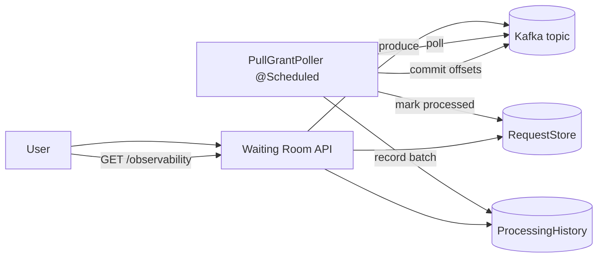

# Waiting room with Kafka (pull)

This module is a Kafka-backed waiting-room buffer that runs in **pull mode**.

Kafka is still the pipe, but the consumer work is driven by a **scheduled poll loop**:
- poll Kafka
- process up to N items
- commit offsets

## When to use this vs Kafka (push)

- Use **Kafka pull** when you want the batch processor to be the primary driver of consumption (explicit polling + explicit commits).
- Use **Kafka push** ([../kafka/](../kafka/README.md)) when you prefer the listener callback model (Spring’s listener container invokes your handler as records arrive) and you bridge into tick processing with an in-process backlog.

In both cases Kafka provides durable retention; the key difference is who drives the read loop and when offsets are committed.

## API (shared)

- `POST /api/waiting-room/requests` → `{ requestId }`
- `GET /api/waiting-room/observability` → counts + processing batches

## Flow (Kafka pull)



## Notes

- Kafka messages remain in the log for the retention period; consumers track progress via offsets.
- This demo commits offsets only for the records it processed in the current tick.

## Run tests

```bash
./test.sh
```

## Run locally

The happy path is via tests (Testcontainers). For a manual run you need a reachable Kafka broker.

```bash
./run.sh
```
