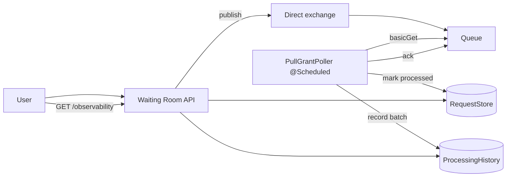

````markdown
# Waiting room with RabbitMQ (pull)

This module is a RabbitMQ-backed waiting-room buffer that runs in **pull mode**.

RabbitMQ is the pipe, but instead of `@RabbitListener`, the scheduled processor explicitly uses `basicGet`:
- pull one message at a time
- process up to N items per tick
- ack each message

## When to use this vs RabbitMQ (push)

- Use **RabbitMQ pull** when you want a single scheduled component to control how fast you drain the queue.
- Use **RabbitMQ push** ([../rabbitmq/](../rabbitmq/README.md)) when you prefer broker-driven delivery callbacks.

## API (shared)

- `POST /api/waiting-room/requests` → `{ requestId }`
- `GET /api/waiting-room/observability` → counts + processing batches

## Flow (RabbitMQ pull)



## Notes

- RabbitMQ queues do not keep messages once they are acknowledged.
- With manual ack (`basicGet(..., autoAck=false)`), a message can stay "in-flight" (unacked) until your code acknowledges it.

## Run tests

```bash
./test.sh
```

## Run locally

The happy path is via tests (Testcontainers). For a manual run you need a reachable RabbitMQ broker.

```bash
./run.sh
```
````
