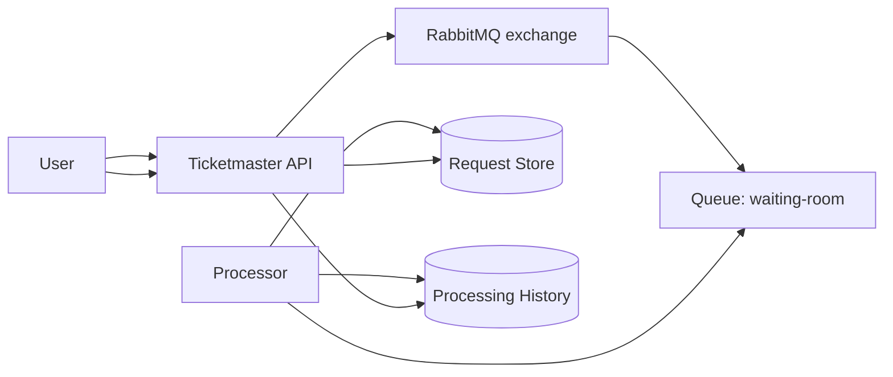
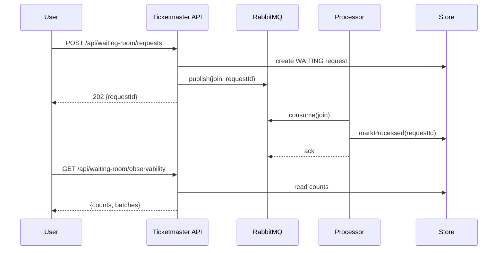

# Waiting room with RabbitMQ

RabbitMQ implements a waiting room as a classic work-queue: join requests are messages; consumers process them in batches.

## Tech choices
- Spring Boot 3.5.9 (Spring MVC), Java 21
- RabbitMQ (Testcontainers for local testing)

## Also see: RabbitMQ pull variant

This module demonstrates the “push” consumer style (listener container calling your code).

For an explicit “pull” consumer style (scheduled `basicGet` + manual ack), see:
- [../rabbitmq-pull/](../rabbitmq-pull/README.md)

## API (shared)

This module uses the shared 2-endpoint API:
- `POST /api/waiting-room/requests` → `{ requestId }`
- `GET /api/waiting-room/observability` → counts + processing batches

## Diagrams





## Trade-offs
- Pros: strong work-queue semantics; flexible routing.
- Cons: operating a broker; limited replay compared to Kafka; at-least-once delivery → need idempotent consumers.

## Run tests

```bash
./test.sh
```

## Run locally

For a manual run you need a reachable RabbitMQ broker (the tests use Testcontainers).

```bash
./run.sh
```

## Try it (curl)
Enqueue a request:

```bash
curl -s -XPOST localhost:8080/api/waiting-room/requests \
  -H 'content-type: application/json' \
  -d '{"eventId":"E1","userId":"U1"}'
```

Watch processing progress:

```bash
curl -s localhost:8080/api/waiting-room/observability
```
