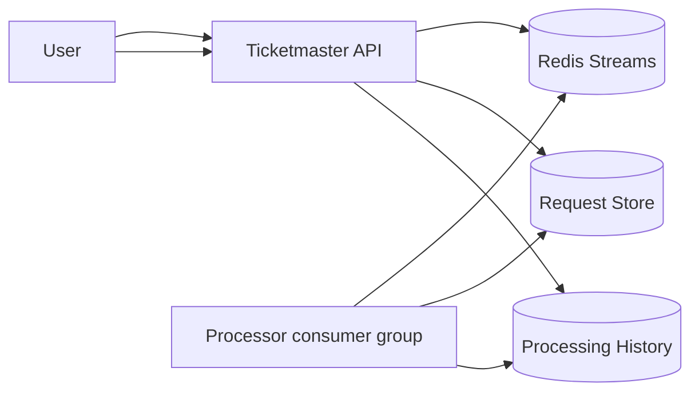
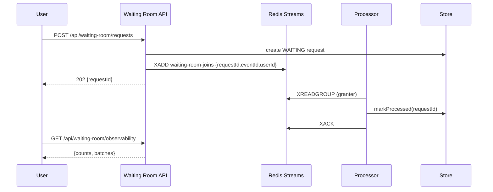

# Waiting room with Redis Streams (consumer groups)

Redis Streams provides a low-moving-parts waiting room with consumer groups, which is a good fit for this repo’s “simple but real” philosophy.

## Tech choices
- Spring Boot 3.5.9 (Spring MVC), Java 21
- Redis Streams + consumer groups

## Core idea

- Stream: `waiting-room-joins`
- Consumer group: `granter`
- Each join is an `XADD` entry containing `{requestId, eventId, userId}`.

## Redis "standard" vs "FIFO" (what that means here)

Redis doesn’t have an SQS-style “Standard vs FIFO queue” product switch, but you can choose patterns with similar trade-offs:

- **"Standard" (best-effort fanout): Redis Pub/Sub**
  - Example: publish a join event to a channel and have one or more consumers react.
  - Why use it: ultra-simple, low latency, good when you can tolerate dropped events (no persistence) and you’re not relying on strict processing order.
  - Sketch:

    ```text
    PUBLISH waiting-room-joins "{sessionId:123,eventId:E1,userId:U1}"
    SUBSCRIBE waiting-room-joins
    ```

- **"FIFO" (durable ordered processing): Redis Streams + consumer groups (this project)**
  - Example: write joins to a stream (`XADD`) and have a consumer group read them (`XREADGROUP`) and ack (`XACK`).
  - Why use it: you want durability (replayable history), backpressure, and an order-preserving log.
  - Sketch:

    ```text
    XADD waiting-room-joins * requestId 123 eventId E1 userId U1
    XGROUP CREATE waiting-room-joins granter $ MKSTREAM
    XREADGROUP GROUP granter c1 COUNT 10 STREAMS waiting-room-joins >
    XACK waiting-room-joins granter <entryId>
    ```

  ## API (shared)

  This module uses the shared 2-endpoint API:
  - `POST /api/waiting-room/requests` → `{ requestId }`
  - `GET /api/waiting-room/observability` → counts + processing batches

## Diagrams





## Trade-offs
- Pros: very simple to run locally (Redis already used in repo), consumer groups are “good enough”.
- Cons: replay/audit is weaker than Kafka; need to manage pending entries and consumer liveness.

## Run tests

```bash
./test.sh
```

## Run locally

For a manual run you need a reachable Redis instance.

```bash
./run.sh
```

## Try it (curl)

```bash
curl -s -XPOST localhost:8080/api/waiting-room/requests \
  -H 'content-type: application/json' \
  -d '{"eventId":"E1","userId":"U1"}'
```

Then observe:

```bash
curl -s localhost:8080/api/waiting-room/observability
```
