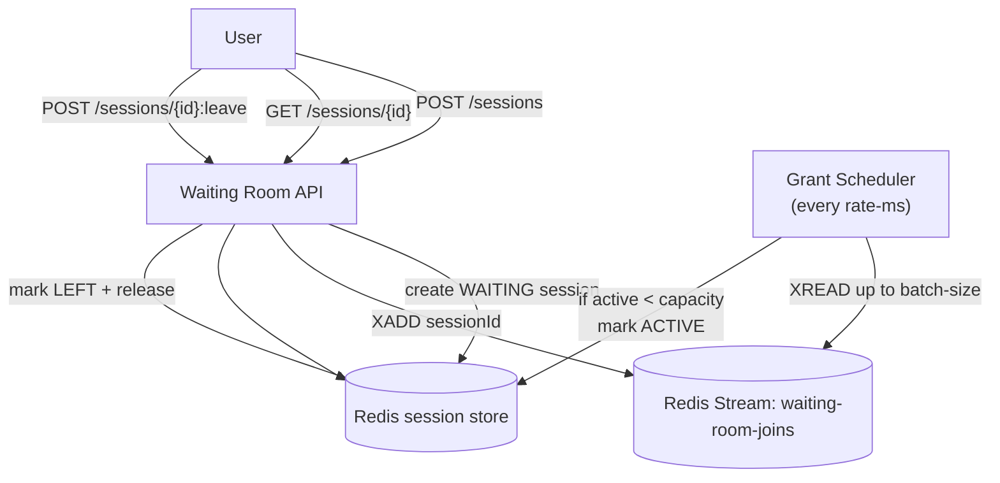

# Waiting room — Token/Session bucket (Redis Streams)

This subproject implements **B. The “Token/Session” Bucket (Stateful Queue)** using **Redis Streams**.

It is intentionally different from [ticketmaster/tech-waiting-room](../tech-waiting-room/README.md):
- [tech-waiting-room](../tech-waiting-room/README.md) shows the **Buffer approach** (enqueue + background batch processing + observability).
- This project shows a **stateful token/session** model: you get a session, wait until it becomes `ACTIVE`, and then you can access the protected flow.

## What this method is

A *token/session bucket* waiting room creates a server-side **session record** per user.

- `WAITING` sessions are queued.
- A scheduled “granter” **activates up to `capacity` sessions**.
- Users present their `sessionId` as proof they are allowed to proceed.

This is the classic “waiting room page” pattern used to protect a hot origin.

## Why/when to use it

Use this when:
- You need **hard concurrency control** (no more than `capacity` users inside seat selection/reservation).
- You want users to see clear state (`WAITING` → `ACTIVE` → `LEFT/EXPIRED`).
- You need a server-controlled “permit” that can be validated by the protected service.

Trade-offs vs the Buffer approach:
- More state: session lifecycle, expiration, leave/release.
- More moving parts: a session store + a queue + a grant scheduler.
- Better control: explicit capacity + explicit user state.

## API

- `POST /api/waiting-room/sessions` → `202 { sessionId }`
- `GET /api/waiting-room/sessions/{sessionId}` → `{ sessionId, status }`
- `POST /api/waiting-room/sessions/{sessionId}:leave` → `204` (releases capacity)

## Flow diagram



## Relationship to the Buffer approach

If you don’t need a session lifecycle, consider the simpler Buffer approach in:
- [ticketmaster/tech-waiting-room](../tech-waiting-room/README.md)

The buffer model is easier to operate and reason about when:
- You can tolerate polling an “observability/progress” endpoint instead of session state.
- You want minimal state and minimal API.

## Run tests

This project uses Testcontainers for Redis.

```bash
mvn -q test
```
