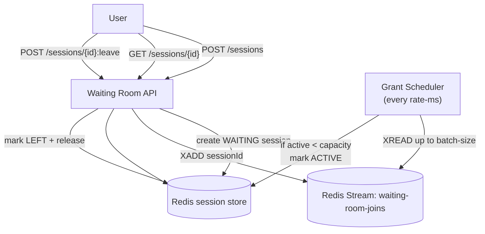
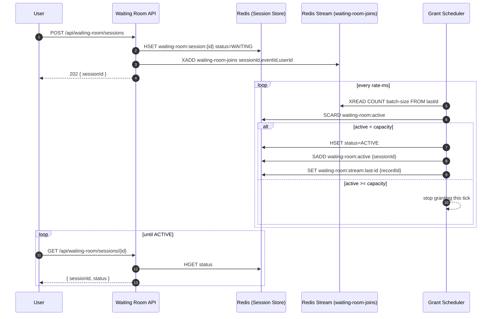

# Waiting room — Token/Session bucket (Redis Streams)

This subproject implements **B. The “Token/Session” Bucket (Stateful Queue)** using **Redis Streams**.

It is intentionally different from [ticketmaster/tech-waiting-room-buffer](../tech-waiting-room-buffer/README.md):
- [tech-waiting-room-buffer](../tech-waiting-room-buffer/README.md) shows the **Buffer approach** (enqueue + background batch processing + observability).
- This project shows a **stateful token/session** model: you get a session, wait until it becomes `ACTIVE`, and then you can access the protected flow.

## Tech choices

- Spring Boot 3.5.9 (Spring MVC), Java 21
- Redis Streams (simple cursor-based `XREAD`) + Redis hashes/sets for session state

Also see:
- [ticketmaster/tech-waiting-room-buffer/redis-streams](../tech-waiting-room-buffer/redis-streams/README.md) for the **Buffer** approach using Redis Streams.

## What this method is

A *token/session bucket* waiting room creates a server-side **session record** per user.

- `WAITING` sessions are queued.
- A scheduled “granter” **activates up to `capacity` sessions**.
- Users present their `sessionId` as proof they are allowed to proceed.

This is the classic “waiting room page” pattern used to protect a hot origin.

## Why/when to use it

Use this when:
- You need **hard concurrency control** (no more than `capacity` users inside seat selection/reservation).
- You want users to see clear state (`WAITING` → `ACTIVE` → `LEFT`).
- You need a server-controlled “permit” that can be validated by the protected service.

Trade-offs vs the Buffer approach:
- More state: session lifecycle, expiration, leave/release.
- More moving parts: a session store + a queue + a grant scheduler.
- Better control: explicit capacity + explicit user state.

## API

- `POST /api/waiting-room/sessions` → `202 { sessionId }`
- `GET /api/waiting-room/sessions/{sessionId}` → `{ sessionId, status }`
- `POST /api/waiting-room/sessions/{sessionId}:leave` → `204` (releases capacity)

## When to call which endpoint (and why)

This API models a real waiting room UX: users "join", then they poll until they are allowed in, and when they are done they "leave" so the next user can enter.

### `POST /sessions` (join)

Use when:
- A user wants to enter the protected flow (seat selection / checkout).

What it does:
- Creates a server-side session with status `WAITING`.
- Enqueues a join event into the Redis Stream so the grant scheduler can eventually activate it.

Why it returns `202`:
- Joining is accepted immediately, but becoming `ACTIVE` is asynchronous and depends on capacity.

### `GET /sessions/{id}` (poll)

Use when:
- The client needs to show progress/state (`WAITING` vs `ACTIVE`).

Typical usage:
- Poll every 250–1000ms with jitter/backoff while `WAITING`.
- Stop polling once `ACTIVE` or `LEFT`.

Why polling exists:
- It keeps the teaching example simple; you could later replace it with SSE/websockets/notifications.

### `POST /sessions/{id}:leave` (release capacity)

Use when:
- The user is done with the protected flow (they purchased, abandoned, navigated away, or timed out).

Why `leave` is important:
- The waiting room enforces a hard limit: **only `capacity` sessions may be `ACTIVE` at once**.
- Without a `leave`, capacity can get "stuck" on users who already left (zombie sessions), and the queue stops making progress.
- `leave` is the explicit, low-latency way to release capacity immediately instead of waiting for background cleanup.

What it does:
- Marks the session `LEFT` and removes it from the Redis `waiting-room:active` set.

Notes:
- In a production system you usually also add session expiration (TTL) as a safety net for clients that never call `leave`.
- This repo keeps expiration out on purpose so the core idea is easy to see.

## Typical client flow

1. Call `POST /sessions` to join.
2. Poll `GET /sessions/{id}` until status is `ACTIVE`.
3. Proceed into the protected flow.
4. Call `POST /sessions/{id}:leave` when finished (success or abandon).

## Flow diagram



## Sequence (join → grant → poll)

This shows the happy path: a user joins, the scheduler grants capacity when available, and the user polls until `ACTIVE`.



## Redis data model

For teaching/debugging, the data model is intentionally explicit:

- `waiting-room:session:{sessionId}` (hash)
  - `status` = `WAITING|ACTIVE|LEFT`
  - `eventId`, `userId`
- `waiting-room-joins` (stream)
  - entries contain `sessionId`, `eventId`, `userId`
- `waiting-room:active` (set)
  - members are currently `ACTIVE` session IDs
- `waiting-room:stream:last-id` (string)
  - the last processed stream entry ID

## Configuration

Configuration is in `application.yml` under the `waitingroom.*` prefix:

- `waitingroom.processing.capacity` — maximum concurrent `ACTIVE` sessions
- `waitingroom.processing.batch-size` — maximum grants per scheduler tick
- `waitingroom.processing.rate-ms` — scheduler tick interval
- `waitingroom.redis.stream` — stream name to enqueue into

## Trade-offs

- Pros: explicit capacity control; simple user-visible state machine; easy to validate a session before letting a user proceed.
- Cons: more state and lifecycle than the Buffer approach; Redis keys need cleanup strategy if you add long-lived sessions; stream cursor approach is intentionally minimal (no consumer-group PEL recovery).

## Relationship to the Buffer approach

If you don’t need a session lifecycle, consider the simpler Buffer approach in:
- [ticketmaster/tech-waiting-room-buffer](../tech-waiting-room-buffer/README.md)

The buffer model is easier to operate and reason about when:
- You can tolerate polling an “observability/progress” endpoint instead of session state.
- You want minimal state and minimal API.

## Run tests

This project uses Testcontainers for Redis.

```bash
./test.sh
```

## Run locally

You need a Redis instance. The simplest option is Docker:

```bash
docker run --rm -p 6379:6379 redis:7.4.2
```

Start the service:

```bash
./run.sh
```

Create a session:

```bash
curl -i -X POST http://localhost:8080/api/waiting-room/sessions \
  -H 'Content-Type: application/json' \
  -d '{"eventId":"E1","userId":"U1"}'
```

Poll status:

```bash
curl -s http://localhost:8080/api/waiting-room/sessions/{sessionId}
```

Leave (releases capacity):

```bash
curl -i -X POST http://localhost:8080/api/waiting-room/sessions/{sessionId}:leave
```
