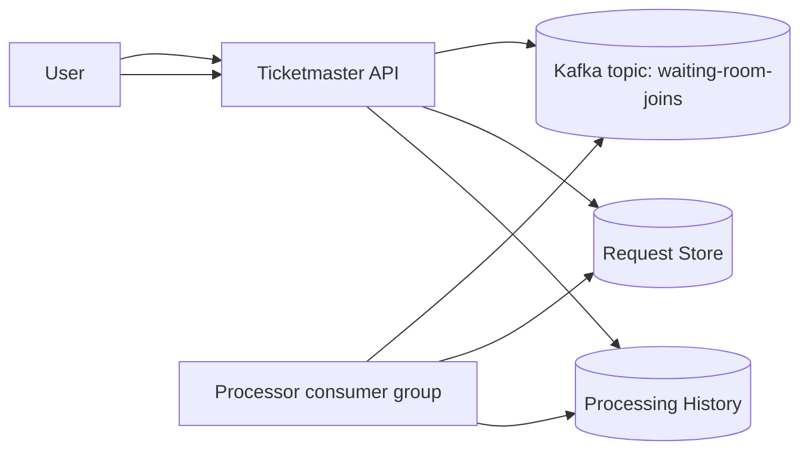
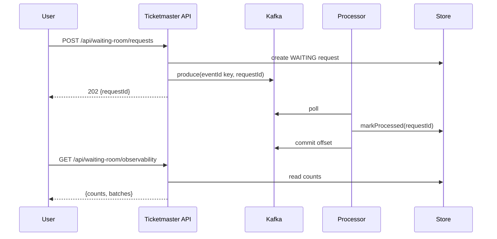

# Waiting room with Kafka

Kafka supports a waiting room as a stream where consumers process requests. Kafka shines when you want **replay**, auditability, and multiple independent consumers.

## Tech choices
- Spring Boot 3.5.9 (Spring MVC), Java 21
- Kafka (Testcontainers)

## Core idea

- Topic: `waiting-room-joins`
- Key: `eventId` (keeps an event’s joins ordered per partition)
- Consumer group: `waiting-room-granter`

## API (shared)

This module uses the shared 2-endpoint API:
- `POST /api/waiting-room/requests` → `{ requestId }`
- `GET /api/waiting-room/observability` → counts + processing batches

## Diagrams





## Trade-offs
- Pros: replay, multiple consumers, strong per-partition ordering.
- Cons: heavier ops than Redis Streams; more concepts (partitions, offsets) for a simple waiting room.

## Run tests

```bash
./test.sh
```

## Run locally

This project’s “happy path” is via tests (it uses Testcontainers). For a manual run you need a reachable Kafka broker.

```bash
./run.sh
```

## Try it (curl)
Enqueue a request:

```bash
curl -s -XPOST localhost:8080/api/waiting-room/requests \
  -H 'content-type: application/json' \
  -d '{"eventId":"E1","userId":"U1"}'
```

Watch processing progress:

```bash
curl -s localhost:8080/api/waiting-room/observability
```
