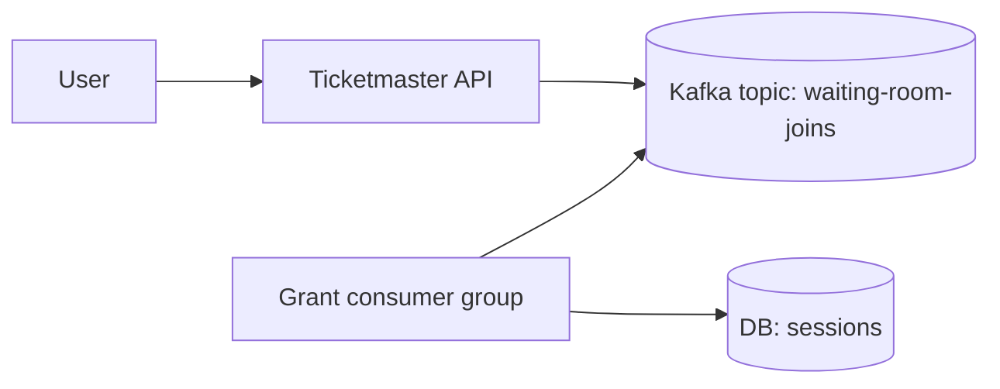
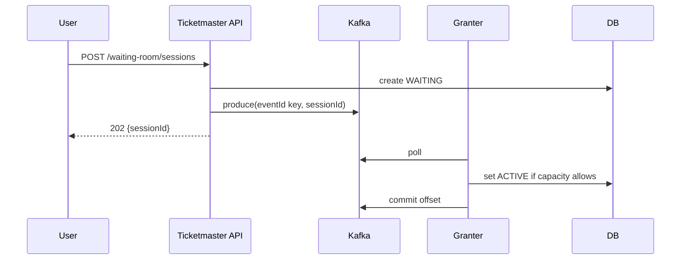

# Waiting room with Kafka

Kafka supports a waiting room as a stream where consumers grant permits. Kafka shines when you want **replay**, auditability, and multiple independent consumers.

## Tech choices
- Spring Boot 3.5.9 (Spring MVC), Java 21
- Kafka (Testcontainers)

## Core idea

- Topic: `waiting-room-joins`
- Key: `eventId` (keeps an event’s joins ordered per partition)
- Consumer group: `waiting-room-granter`

## API sketch

- `POST /api/waiting-room/sessions` → `{sessionId}`
- `GET /api/waiting-room/sessions/{id}` → `{status}`

## Diagrams

## Trade-offs
- Pros: replay, multiple consumers, strong per-partition ordering.
- Cons: heavier ops than Redis Streams; more concepts (partitions, offsets) for a simple waiting room.
